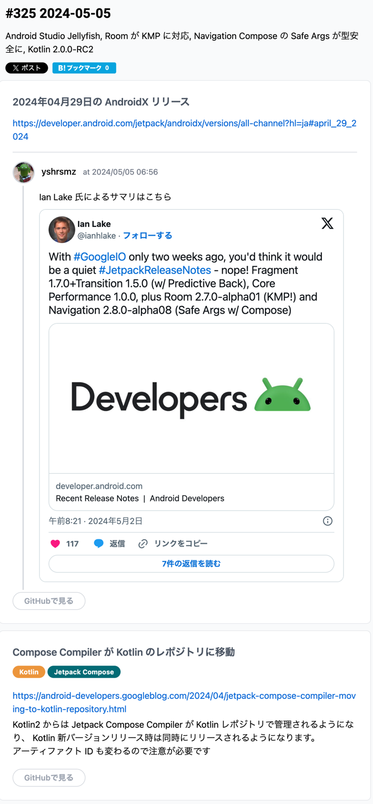
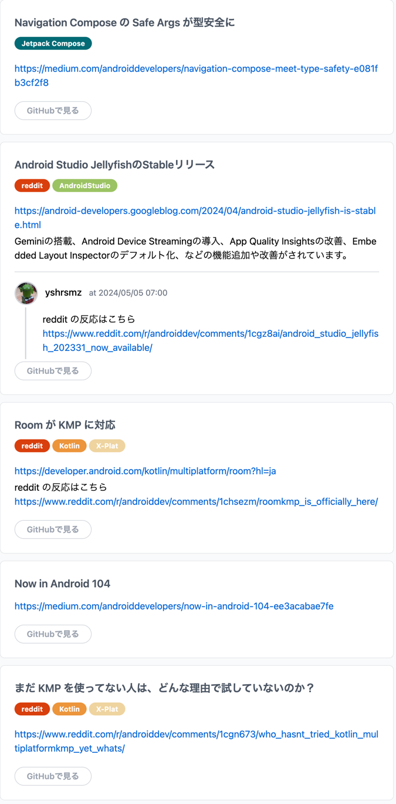
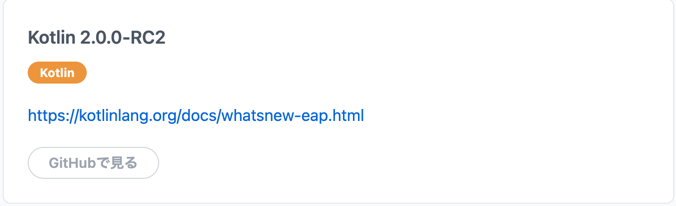

今回は盛りだくさんだな

# 2024年04月29日の AndroidX リリース

Google IO が 2週間後にあるから release note 静かになるんじゃない？と思いきや、色々リリースされたよと
```text
With #GoogleIO only two weeks ago, 
you'd think it would be a quiet #JetpackReleaseNotes - nope! 
Fragment 1.7.0+Transition 1.5.0 (w/ Predictive Back), Core Performance 1.0.0, plus Room 2.7.0-alpha01 (KMP!) and Navigation 2.8.0-alpha08 (Safe Args w/ Compose)
```

後でも触れるけど、Room に KMP 導入された話だね、ん、逆か？

# Compose Compiler が Kotlin のレポジトリに移動
```text
Kotlin2 からは Jetpack Compose Compiler が Kotlin レポジトリで管理されるようになり、 
Kotlin 新バージョンリリース時は同時にリリースされるようになります。
⚠️ アーティファクト ID も変わるので注意が必要です <-- ここが重要
```

# Navigation Compose の Safe Args が型安全に
疲れてるのでちょっと後で読む

# Android Studio JellyfishのStableリリース
ホイホイ、Gemini がくっついたよと

# Room が KMP に対応
へええ、iOS はどうするんだろうねえ。。iOS の DB って何？

# Now in Android 104
- Jellyfish が出た
- 消費電力の A/B テストする方法！
- Android X のリリース
以上！

# まだ KMP を使ってない人は、どんな理由で試していないのか？
試すからちょっと待ってくれ。

# Kotlin 2.0.0-RC2
K2 コンパイラーがくるぞお、以上。