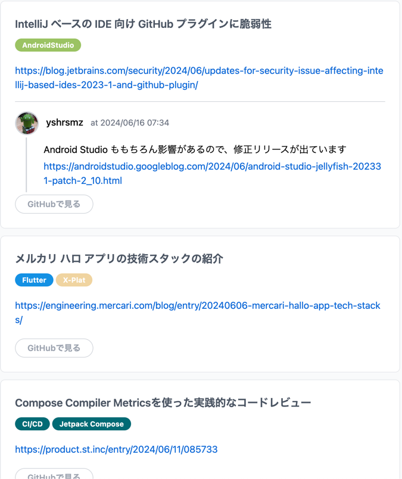
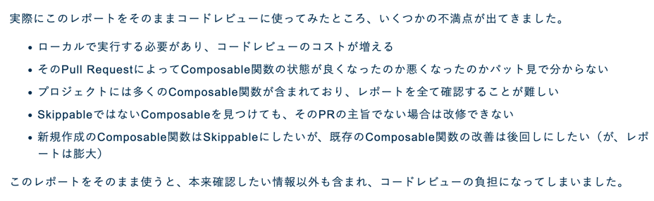

## Composeサンプルを様々なForm Factorに対応
- ComposeサンプルのJetcasterがTV、Wear、Widgetに対応しました。どのように対応したのかを簡単に紹介してる
- [android/compose-samples](https://github.com/android/compose-samples) を落としたのでちゃんとみておく
- 

## [dexの比較をするライブラリ](https://github.com/theapache64/dex-diff)
- R8のfullModeなどの効果を確認する時に便利に使うことが出来る
- R8 とは
  - [R8 full mode](https://r8.googlesource.com/r8/+/refs/heads/master/compatibility-faq.md#:~:text=performed%20by%20R8.-,R8%20full%20mode,fullMode%3Dtrue%20in%20the%20gradle.)
  - Proguard と同様にアプリの圧縮、難読か、最適化を行うライブラリかな

## [Now in Android 107](https://medium.com/androiddevelopers/now-in-android-107-d334239c7c5b)
- KotlinConf は 5 月 22 日に開催されました。Kotlin の発表を見逃しましたか?
- Muratのブログ投稿「Google @ KotlinConf 2024: KMP を使用したマルチプラットフォーム開発の内部を覗く」などをご覧ください。この投稿では、Jetpack ライブラリのサポート、ツール、そして最も重要な Kotlin Multiplatform など、Kotlin エコシステムに対する Google の最近の貢献について取り上げています。また、学んだ教訓や、Google Workspace の進行中の KMP への移行の現状についても知ることができます。
- いい加減、サイコロのやつを見る！

## IntelliJ ベースの IDE 向け GitHub プラグインに脆弱性
- [Android Studio ももちろん脆弱性がまずい](https://androidstudio.googleblog.com/2024/06/android-studio-jellyfish-202331-patch-2_10.html)ので修正リリースが出ているよと

## [メルカリ ハロ アプリの技術スタックの紹介](https://engineering.mercari.com/blog/entry/20240606-mercari-hallo-app-tech-stacks/)
- 
- Flutter 使っとる
- Flutter CLI: Flutter のコマンドラインツールの一つに Melos ってのがあるみたい
- 通信: GraphQL 
  - Retrofit みたいなもんかね
- 状態管理
  - Ephemeral state (一時的な状態管理)
  - App state (サーバリクエストとレスポンスデータ/グローバルステート)
- UI
  - Widgetbook

- 結論
  - プロジェクト紹介と技術スタックのお話、以上

## [Compose Compiler Metricsを使った実践的なコードレビュー](https://product.st.inc/entry/2024/06/11/085733)
- Jetpack Composeでパフォーマンスが良い実装とはどのようなものでしょうか？
  - 無駄な再描画を抑える、つまりできるだけRecompositionを抑えることがポイント
  - その通り
  - Recompositionを抑えるためには、Composable関数をできる限り Skippable にする必要がある
- どのComposable関数がSkippableなのか
  - Composable関数をSkippableにするために重要になるのが、型が安定しているかどうか
  - 公式ドキュメントには「安定している」条件が記載されている
  - [入力が変化していない場合にスキップする](https://developer.android.com/develop/ui/compose/lifecycle?hl=ja#skipping)
- Strong Skipping Modeを使えば型の不安定は関係ない？
  - [Strong Skipping Mode](https://developer.android.com/develop/ui/compose/performance/stability/strongskipping?hl=ja) というモードが公開
  - これにより再描画を抑えられるので、パフォーマンスは向上するように思いますが、今度は値が変わったにもかかわらず再描画されないリスクを抱えるようになるため、信頼しすぎるのもよくない
  - その通り
- Compose Compiler Metrics
  - それでは、型の安定性に対してどのように向き合えばよいでしょうか？
  - 実は [Compose Compiler Metrics](https://github.com/JetBrains/kotlin/blob/abdfc8964f17749080cec551a1ab1afe508f57a9/plugins/compose/design/compiler-metrics.md) というものがあり、
  - Compose Compilerが、Composable関数ごとに `Skippable` かどうか、使用しているパラメータの型が安定しているかどうかをレポートしてくれる
- 実際にコードレビューに使えるのか
  - 
  - 結論、コードレビューの負担になる
- 本当にほしかったものを技術で解決する
  - Danger を使って CI に Compose Compiler Metrics を組み込んじゃったよって話しだ
  - なるほどね