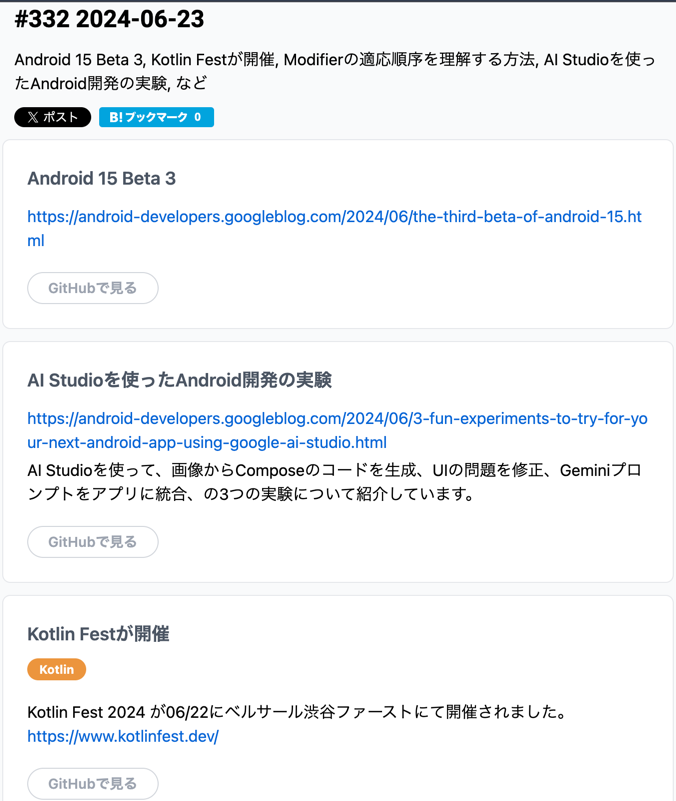
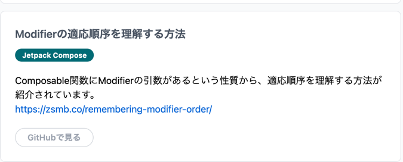

## Android 15 Beta 3
ベータ3が出たよ、以上

## AI Studioを使ったAndroid開発の実験
`AI Studioを使って、画像からComposeのコードを生成、UIの問題を修正、Geminiプロンプトをアプリに統合、の3つの実験について紹介しています。`

## Kotlin Festが開催
いきたかったけど、、別用あったからな。。。
個人的に、もくもく会でお会いした Mori さんのライトニングみたかった。。
https://fortee.jp/kotlin-fest-2024/proposal/c4510d9d-93c3-45d5-ab8d-51fa54504a80

JUnit 使ってるわけじゃないけど、kotest もみたい。
[Kotest を使って 快適にテストを書こう - KotlinFest 2024](https://www.slideshare.net/slideshow/kotest-kotlinfest-2024/269819350)

## [Modifierの適応順序を理解する方法](https://zsmb.co/remembering-modifier-order/)
`Composable関数にModifierの引数があるという性質から、適応順序を理解する方法が紹介されています。`

これは気になるのでちゃんとアウトプットする

`長い間、私は「Modifier の順序付けがどのように機能するかはわからないが、とりあえず 1 つの方法を試してみて、うまくいかなければ逆にする」クラブの誇り高いメンバーでした。`
これは俺だけじゃなかった。。

この人のブログはよくみておく、てか感性が似ている気がするので別ディレクトリでまとめる