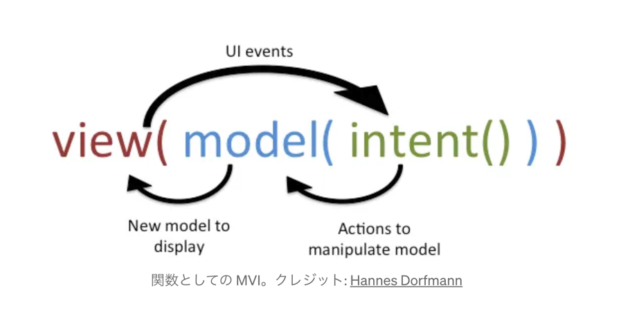

# [Kotlinに導入検討されているUnion型について](https://kt.academy/article/union-types-into)

### 型システムにおけるユニオン型の問題
- Kotlin にユニオン型が登場！ただし、限定的な形で
- 最初はその理由が理解できませんでしたが、いくつかの講演や議論を経て、これは非常に賢い動きだとわかりました。それでは、全体像をお見せします

#### ユニオン型
- Int | String みたいな共用型に筆者は感心している
- 表現力がさらに高まる？って言ってる
- なぜ Kotlin にはこれがなかったのか？ということは別の言語ではすでに存在しているんだね
- まず、共用型の優れているところ
  - 変数が Int または String だとする
  - まあこう書くことができると？
  - 
  - Either や Result の代わりに Union 型を渡すこともできる
  - 
  - 見た目はクールですが、これが型システムにどれほどの複雑さをもたらすかを考える
  - 次の例を考えてみましょう。List<Cat>との結果はどのような型になるか？
  - 難しいねこれ、読んでもよくわからないかも

#### Either 型ってなんだっけ？
- 弊社凄腕の[ブログ](https://techblog.glpgs.com/entry/2022/01/17/173111)ヒットした
- 2つの型のうち、どちらかを返す、もの
- こういうこと↓やな、エラーハンドリングで使えるみたいやな
```kotlin
val a: Either<HogeException, Int> = Right(123)
val b: Either<HogeException, Int> = Left(HogeException())
```
- Either では右が正しいものとする慣習がある
```kotlin
val a: Either<HogeException, Int> = Right(123)

when(a) {
    is Right -> println(a.value)
    is Left  -> println(a.value)
}
```
- こんな感じでダウンキャストしてエラーハンドリングする
- コンパイル時にどのようなエラーを catch したいのか、を型として表現できることが try-catch よりいいのね、なるほど
- まあとはいえ、Arrow みたいなでかいライブラリを使うしか現状方法がないので個人的にはうーんというところかも。。
- 可能な限り言語標準な機能を使うべき派なので。
- [Kotlin で Either が欲しくなったときに考えること](https://inside.luchegroup.com/entry/2023/03/13/123322) も非常に参考になる

#### Result について
- Kotlin 1.5 から導入されているやつ、Either と同じとはいえないが、思想は同じようなやつと一旦理解しておく

#### Either を読んだ上で
- `Either` または `Result` の代わりにエラーのある共用体型を使用する利点は何？
- まあとはいえまだ名前の議論をしている最中だそうで
- https://youtrack.jetbrains.com/issue/KT-68296/Union-Types-for-Errors#focus=Comments-27-9899473.0-0
- うーん、読んだけどむずいねえ

### [Jetpack Compose による堅牢な MVI 実装](https://proandroiddev.com/a-robust-mvi-with-jetpack-compose-e08882d2c4ff)
MVI ってなんだよ

#### Why?
  - 筆者(以降は私)は学習曲線が小さく、すべての開発者が理解できる堅牢なアーキテクチャの開発に取り組んできた、非常にいいね
  - 目的は、プロジェクトに依存しないものにすること
  - 簡単に言うと、すべての開発者がアーキテクチャに慣れ、必要に応じて他のプロジェクト（詳細を知っているかどうかは関係ありません）に簡単に貢献できるようにしたいと考えた
  - アーキテクチャの構築には時間がかかる
  - 私はその時間のほとんどを、 Android エコシステムとそのベスト プラクティスの学習、および以前の推奨事項から次のような新しい推奨事項への移行に費やしてきた

#### How? どうやってやる？
  - 
  - MVIはModel-View-Intentの略
  - このアーキテクチャはMVVMなどとともにMV*ファミリーの一部
  - その背後にあるコア原理は、入力Intentを受け取り、基礎となるUIを表すView Stateを生成するステートマシン
  -  MVIは、ソット(Single Source of Truth) 原則は、その兄貴分である MVVM とは異なる
  - 

#### ターゲット行動
  - now in android app でお試しをやるよと
  - 最初のスクリーンショット ( ForYouScreen ) のみに焦点を当てる
  - ここで、 MVIのコアコンセプトである Reducerについて説明する
  - Reducer は、ある意味ではUIとViewModel間の契約
  - こんな interface を定義する、画面で表示する状態(State), イベント(ViewEvent)、効果(ViewEffect)、そして reduce 関数を用意する
```kotlin
interface Reducer<State : Reducer.ViewState, Event : Reducer.ViewEvent, Effect : Reducer.ViewEffect> {
    interface ViewState

    interface ViewEvent

    interface ViewEffect

    fun reduce(previousState: State, event: Event): Pair<State, Effect?>
}
```

#### ViewState
- UIの表現
- これにはCompose画面に表示する必要があるすべてのものが含まれている必要がある
- これにより、画面の異なる状態を表す複数のプレビューを簡単に作成できるという利点も

#### ViewEvent
- これは、すべてのユーザー操作 (およびそれ以上) を保持するMVIの中核
- ViewModelによって状態の変更をトリガーするために使用される

#### ViewEffect
- これは特別な種類のViewEvent
- その役割は、 ViewModelによってUIに publish されること
- ナビゲーションやSnackbar / Toastの表示など

#### reduce function
- reduce 関数は、ViewState と ViewEvent を受け取り、新しい ViewState と、提供されたイベントにリンクされた ViewEffect を生成する
- Reducerができたので、すべてのViewModelに実装されるBaseViewModelを定義する必要がある
```kotlin
abstract class BaseViewModel<State : Reducer.ViewState, Event : Reducer.ViewEvent, Effect : Reducer.ViewEffect>(
    initialState: State,
    private val reducer: Reducer<State, Event, Effect>
) : ViewModel() {
    private val _state: MutableStateFlow<State> = MutableStateFlow(initialState)
    val state: StateFlow<State>
        get() = _state.asStateFlow()

    private val _event: MutableSharedFlow<Event> = MutableSharedFlow()
    val event: SharedFlow<Event>
        get() = _event.asSharedFlow()

    private val _effects = Channel<Effect>(capacity = Channel.CONFLATED)
    val effect = _effects.receiveAsFlow()

    val timeCapsule: TimeCapsule<State> = TimeTravelCapsule { storedState ->
        _state.tryEmit(storedState)
    }

    init {
        timeCapsule.addState(initialState)
    }

    fun sendEffect(effect: Effect) {
        _effects.trySend(effect)
    }

    fun sendEvent(event: Event) {
        val (newState, _) = reducer.reduce(_state.value, event)

        val success = _state.tryEmit(newState)

        if (success) {
            timeCapsule.addState(newState)
        }
    }

    fun sendEventForEffect(event: Event) {
        val (newState, effect) = reducer.reduce(_state.value, event)

        val success = _state.tryEmit(newState)

        if (success) {
            timeCapsule.addState(newState)
        }

        effect?.let {
            sendEffect(it)
        }
    }
}
```

#### Implementation
- これで基本構造が設定され、利用可能になったので、実際にこれを画面に実装する

#### reducer
- ViewState を定義して、いくつかのイベントを簡単に識別
```kotlin
@Immutable
data class ForYouState(
    val topicsLoading: Boolean, // Whether the topics section is in the loading state
    val newsLoading: Boolean, // Whether the news section is in the loading state
    val topicsVisible: Boolean, // Whether the topics section is visible
    val topics: List<FollowableTopic>, // The list of topics to display
    val news: List<UserNewsResource> // The list of news to display
) : Reducer.ViewState
```
- これでViewStateができたので、ユーザー操作を処理し、それに応じて状態を更新するViewEventを定義、イベントの interface.
```kotlin
@Immutable
sealed class ForYouEvent : Reducer.ViewEvent {
    data class UpdateTopicsLoading(val isLoading: Boolean) : ForYouEvent()
    data class UpdateTopics(val topics: List<FollowableTopic>) : ForYouEvent()
    data class UpdateNewsLoading(val isLoading: Boolean) : ForYouEvent()
    data class UpdateNews(val news: List<UserNewsResource>) : ForYouEvent()
    data class UpdateTopicsVisible(val isVisible: Boolean) : ForYouEvent()
    data class UpdateTopicIsFollowed(val topicId: String, val isFollowed: Boolean) : ForYouEvent()
    data class UpdateNewsIsSaved(val newsId: String, val isSaved: Boolean) : ForYouEvent()
    data class UpdateNewsIsViewed(val newsId: String, val isViewed: Boolean) : ForYouEvent()
}
```
- 最後の三つの class は画面上のクリック可能な要素にリンクされる
- 
- ここで、MVI アーキテクチャの最後の部分であるViewEffectを定義する必要がある
- 幸いなことに、この画面では、可能な効果は 2 つだけなので、比較的簡単
```kotlin
@Immutable
sealed class ForYouEffect : Reducer.ViewEffect {
    data class NavigateToTopic(val topicId: String) : ForYouEffect()
    data class NavigateToNews(val newsUrl: String) : ForYouEffect()
}
view rawMVIForYouViewEffect.kt hosted with ❤ by GitHub
```

```kotlin
override fun reduce(
    previousState: ForYouState,
    event: ForYouEvent
): Pair<ForYouState, ForYouEffect?> {
    return when (event) {
        // An Event that has NO associated Effect
        is ForYouEvent.UpdateTopicsLoading -> {
            previousState.copy(
                topicsLoading = event.isLoading
            ) to null
        }

        // An Event that has an associated Effect
        is ForYouEvent.UpdateNewsIsViewed -> {
            val updatedNews = previousState.news.map { news ->
                if (news.id == event.newsId) {
                    news.copy(hasBeenViewed = event.isViewed)
                } else {
                    news
                }
            }
            previousState.copy(
                news = updatedNews
            ) to ForYouEffect.NavigateToNews(updatedNews.first { it.id == event.newsId }.url)
        }
        
        // All other Events go here
    }
}
```
- ここで注意すべき重要な点の1 つは (特に最後の 3 つのViewEventの場合)、実際の運用アプリケーションでは、Reducerで直接表示される実際のデータを変更することはほとんどない
- ⚠️
- 


#### ViewModel
- これでReducerができました。次は、次のようにViewModelでもこれを使用する必要がある
```kotlin

@HiltViewModel
class ForYouViewModel @Inject constructor(
    private val getTopicsUseCase: GetTopicsUseCase,
    private val getNewsUseCase: GetNewsUseCase
) : BaseViewModel<ForYouState, ForYouEvent, ForYouEffect>(
    initialState = ForYouState.initial(),
    reducer = ForYouScreenReducer()
) {
    init {
        // Get data via UseCases
    }
    
    fun onTopicClick(topicId: String) {
        sendEffect(
            effect = ForYouEffect.NavigateToTopic(
                topicId = topicId
            )
        )
    }
}
```
- ViewModel にはコードがほとんど含まれていないことに気づく
- これは、使用する主な関数が含まれているBaseViewModelを使用しているため


#### Ui
- これらすべてを画面に挿入して、 UIでさまざまなケースを処理するのがいかに簡単かを確認

```kotlin

@Composable
fun ForYouScreen(
    modifier: Modifier = Modifier,
    viewModel: ForYouViewModel = hiltViewModel()
) {
    val state = viewModel.state.collectAsStateWithLifecycle()
    val effect = rememberFlowWithLifecycle(viewModel.effect)
    val context = LocalContext.current
    val backgroundColor = MaterialTheme.colorScheme.background.toArgb()

    LaunchedEffect(effect) {
        effect.collect { action ->
            when (action) {
                is ForYouEffect.NavigateToTopic -> {
                    // This effect would result in a navigation to another screen of the application
                    // with the topicId as a parameter.
                    Log.d("ForYouScreen", "Navigate to topic with id: ${action.topicId}")
                }

                is ForYouEffect.NavigateToNews -> launchCustomChromeTab(
                    context,
                    Uri.parse(action.newsUrl),
                    backgroundColor
                )
            }
        }
    }

    ForYouScreenContent(
        modifier = modifier,
        topicsLoading = state.value.topicsLoading,
        topics = state.value.topics,
        topicsVisible = state.value.topicsVisible,
        newsLoading = state.value.newsLoading,
        news = state.value.news,
        onTopicCheckedChanged = { topicId, isChecked ->
            viewModel.sendEvent(
                event = ForYouScreenReducer.ForYouEvent.UpdateTopicIsFollowed(
                    topicId = topicId,
                    isFollowed = isChecked,
                )
            )
        },
        onTopicClick = viewModel::onTopicClick,
        saveFollowedTopics = {
            viewModel.sendEvent(
                event = ForYouScreenReducer.ForYouEvent.UpdateTopicsVisible(
                    isVisible = false
                )
            )
        },
        onNewsResourcesCheckedChanged = { newsResourceId, isChecked ->
            viewModel.sendEvent(
                event = ForYouScreenReducer.ForYouEvent.UpdateNewsIsSaved(
                    newsId = newsResourceId,
                    isSaved = isChecked,
                )
            )
        },
        onNewsResourceViewed = { newsResourceId ->
            viewModel.sendEvent(
                event = ForYouScreenReducer.ForYouEvent.UpdateNewsIsViewed(
                    newsId = newsResourceId,
                    isViewed = true,
                )
            )
        },
    )
}

@Composable
fun ForYouScreenContent(
    topicsLoading: Boolean,
    topics: List<FollowableTopic>,
    topicsVisible: Boolean,
    newsLoading: Boolean,
    news: List<UserNewsResource>,
    onTopicCheckedChanged: (String, Boolean) -> Unit,
    onTopicClick: (String) -> Unit,
    saveFollowedTopics: () -> Unit,
    onNewsResourcesCheckedChanged: (String, Boolean) -> Unit,
    onNewsResourceViewed: (String) -> Unit,
    modifier: Modifier = Modifier,
) {
    // The actual implementation is omitted as it adds no value here
}
```

MVI っておもろいし便利だなという気はする、検索してみると iOS の TCA とかとも似た概念な感じあるね。
https://github.com/worldline/Compose-MVI/tree/MVI?source=post_page-----e08882d2c4ff-------------------------------- これちゃんとみてみよう。


## [Compose MultiplatformでクロスプラットフォームUI開発の可能性を探る](https://proandroiddev.com/exploring-the-viability-of-cross-platform-ui-development-with-compose-multiplatform-c5be0608b69d)
- Spotify でみる、swift ui と Compose Multiplatform の比較
- 
- Compose Multiplatform すごいね
- それぞれ、Github/android, ios ディレクトリにメオを作ったのでそちらで読んで概要を把握しよう

## Google Play Billing Library 7 で queryPurchaseHistory が非推奨になる
- queryPurchaseHistory() の廃止を発表
- 使ってなかった気がするな、飛ばしていいかもな
- にしても、reddit の罵詈雑言がすごいな
- 購入履歴を管理したい場合は、アプリ側が個別にバックエンドを用意する必要があるそう、らしい
- ベイクルーズはそういうことやってないので関係ない、アプリに決済が入っているならって話しだもんね

## Now in Android 108
- Android 15 ベータ 3 がリリースされ、Android 15 がプラットフォーム安定版になりました
  - ユーザーが顔認識、指紋、または画面ロックを使用して、パスキーを使用して Android 15 を対象とするアプリに 1 ステップでサインインできるようになる方法が強調
  - WebView 内の WebSQL に使用されていた WebSettings DatabaseEnabled ゲッターとセッターが非推奨になった理由についても説明

## Android Studio Koala | 2024.1.2 Canary 8
- koara のカナリーが出たにゃ