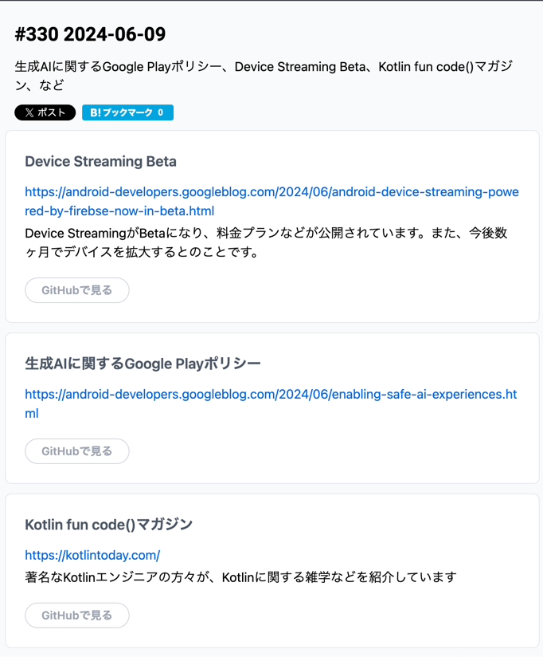
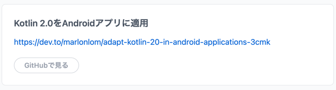

## [Android Device Streaming, powered by Firebase, is now in Beta](https://android-developers.googleblog.com/2024/06/android-device-streaming-powered-by-firebse-now-in-beta.html)
- ふーん

## [Enabling safe AI experiences on Google Play](https://android-developers.googleblog.com/2024/06/enabling-safe-ai-experiences.html)
- ふーん

## Kotlin fun code()マガジン
https://kotlintoday.com/

- ふーん

## [Adapt Kotlin 2.0 in Android applications](https://dev.to/marlonlom/adapt-kotlin-20-in-android-applications-3cmk)
- ふーん