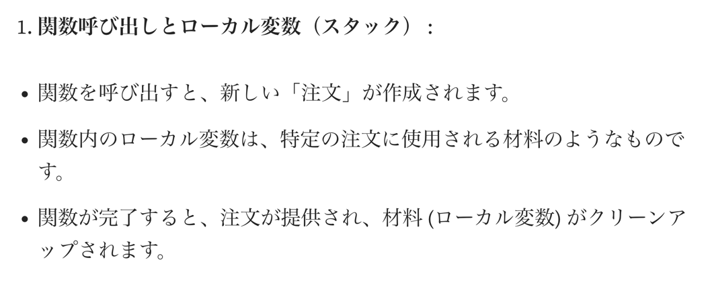

## [ジャンプTOON Flutter アプリの全体像](https://developers.cyberagent.co.jp/blog/archives/48761/)


### SDK・ツール管理
- [asdf](https://asdf-vm.com/)
- vs fvm だけど以下観点から asdf を採用
- 
- [mise](https://mise.jdx.dev/) もいいらしい、バージョン切り替えが高速らしい
- チーム開発で使用するツール(ライブラリのことかな？)は npm レジストリで公開されているから、package manager としては [bun](https://bun.sh/) を使っている
  - bun は、npm package との互換性が高く、実行速度が速いという利点あり
- 

### プロジェクト管理・タスクランナー
- 私たちの Flutter プロジェクトは、app と vrt_snapshot の 2 つの package で構成されている
  - モジュールってことだよね

うーん、そこまで興味のある内容じゃないので流し読みした、時間があれば戻ってこよう


## [Composeの安定性を最適化する新しい方法](https://medium.com/androiddevelopers/new-ways-of-optimizing-stability-in-jetpack-compose-038106c283cc)
`Strong Skipping Modeと安定性を最適化するための新しい方法について解説しています。`

- Jetpack Compose のクラス安定性を制御するための新しい強力なスキップ モードにより、アプリの再コンポジションを最適化する方法が変わる
- このブログ投稿では、このモードで解決できるケースと手動で制御する必要があるケースについて説明
- また、ラムダ関数を記憶する必要があるかどうか、kotlinx不変コレクションが必要かどうか、すべてのドメイン モデル クラスを安定させる方法など、よくある質問についても説明
- 安定性がわからない場合は、概念について[ドキュメント](https://developer.android.com/develop/ui/compose/performance/stability?hl=ja)を参照して

#### [Compose の安定性](https://developer.android.com/develop/ui/compose/performance/stability?hl=ja)
- 不安定とは？
  - 再コンポーズ間で値が変更されたかどうかを Compose が認識できない場合、型は不安定

### [不変オブジェクト](https://developer.android.com/develop/ui/compose/performance/stability?hl=ja#immutable-objects)
```kotlin
data class Contact(val name: String, val number: String)

@Composable
fun ContactRow(contact: Contact, modifier: Modifier = Modifier) {
   var selected by remember { mutableStateOf(false) }

   Row(modifier) {
      ContactDetails(contact)
      ToggleButton(selected, onToggled = { selected = !selected })
   }
}
```
- Contact は不変のデータクラスであるため、Compose は ContactDetails の引数が一切変更されていないことを確認して、ContactDetail をスキップして再コンポーズしない

### [変更可能なオブジェクト](https://developer.android.com/develop/ui/compose/performance/stability?hl=ja#mutable-objects)
```kotlin
data class Contact(var name: String, var number: String)
```
- Contact の各パラメータが var になったため、クラスは不変ではない
- プロパティが変更されても、Compose は認識しない
- これは、Compose が Compose の State オブジェクトに対する変更のみを追跡するため
- Compose は、そのようなクラスを不安定であると見なす
- Compose は、不安定なクラス(state オブジェクト)の再コンポーズをスキップしない
- そのため、Contact がこの方法で定義されている場合、前の例の ContactRow は、selected が変更されるたびに再コンポーズする

### [Compose での実装](https://developer.android.com/develop/ui/compose/performance/stability?hl=ja#implementation-compose)
- 以前見た、Stores さんのブログの話と同じ `@Skippable` のやつね

### 強いスキップモード前の安定性
- Compose コンパイラがクラスを不安定なものとして扱う理由はいくつかある 
- 実際にやってみたほうが早いので、codelab ディレクトリを作った
- 行っていることは何となくわかったけど、コードベースで理解したいのでそこで適当にやっていく

## [Compose Multiplatformでプレゼンテーションが作れるツールCuP](https://github.com/KodeinKoders/CuP)
- READMEの下の方のWeb slidesからサンプルのスライドが確認できます。
- https://github.com/KodeinKoders/CuP
- https://kodein.net/ すげえなこれ
- [How to Use](https://kodeinkoders.github.io/CuP/CuP/1.0/getting-started.html)


## [Stack と Heap - Kotlin のメモリ管理を理解する](https://proandroiddev.com/stack-vs-heap-in-kotlin-understanding-memory-5fc08e975ef2)
- Kotlin でメモリ割り当てがどのように機能するか疑問に思ったことはありませんか？
- スタックメモリとは何ですか?
  - サンドイッチのお店にいるところを想像して
  - サンドイッチを注文すると、シェフが目の前でサンドイッチを作る
  - サンドイッチは素早く作られ、すぐに提供され、すぐに食べられる
  - シェフはサンドイッチの在庫を抱えておらず、すべて注文に応じて作りたてだ
  - `Kotlin では、スタック メモリはこのサンドイッチショップのようなものである`
  - 次の目的で使用されます
  - 
  - 例
```kotlin
fun  makeSandwich (type: String ) : String {
     val sandwich = "Here's your $type sandwich!"  // ローカル変数。スタック上に割り当てます。
    return sandwich
}
 fun  main () {
     val myLunch = makeSandwich( "turkey" ) // 関数呼び出し。スタック上に割り当てます。
     println(myLunch)
}
``` 
  - ここで、sandwichと は、myLunchオーダーメイドのサンドイッチのようなもの
  - これらは、それぞれの関数の範囲内でのみ存在し、関数が完了するとすぐにクリーンアップされる

- ヒープメモリとは何ですか?
  - さて、長期間アイテムを保管できる大きな倉庫を想像してみる
  - そこに物を置いて、後で取り出し、取り出すまでそのままにしておくことができる
  - この倉庫は大きく、たくさんの物を保管できますが、物を見つけるのに時間がかかる可能性があり、すべての物がどこにあるかを把握しておく必要がある
  - `Kotlin では、ヒープ メモリはこの倉庫のようなもの`
  - 次の目的で使用されます --> オブジェクト(インスタンス)とグローバル変数
  - 
  - 例
```kotlin
class  Sandwich ( val type: String, val ingredients: List<String>) 

fun  main () { 
    val mySandwich = Sandwich( "turkey" , listOf( "turkey" , "lettuce" , "tomato" )) // オブジェクト、ヒープ上に割り当て
    println( " ${mySandwich.type}サンドイッチを${mySandwich.ingredients}で作りました。" ) 
}
```
  - この場合、mySandwichオブジェクトはヒープ内に格納される
  - 必要な限りそこに保存され、プログラムのさまざまな部分からアクセスできる

- 詳しく見る: スタック vs. ヒープ
  - vs で語ることなのか？あと、オブジェクトに書いてある関数を呼び出すときはどっちに当たるんだ？
    - 後者に関してはヒープでいいんだと思う
  - 関数呼び出しとローカル変数 (スタック)
  - 
  - オブジェクトとグローバル変数 (ヒープ)
  - 

- なぜそれが重要なのか?
  - スタックとヒープメモリの違いを理解すると、より効率的で効果的な Kotlin コードを書くのに役立つ
  - これにより、リソースをより適切に管理し、メモリリークを回避し、パフォーマンスを最適化できる
  - 例
  - スタック
```kotlin
fun  prepareOrder (order: String ) : String {
     val preparedOrder = "Order: $order is ready!"  // ローカル変数、スタック
    return preparedOrder
}
 fun  main () {
     val myOrder = prepareOrder( "turkey sandish" ) // 関数呼び出し、スタック
    println(myOrder)
}
```
  - ヒープ
```kotlin
class  WarehouseItem ( val name: String, val quantity: Int ) 
fun  main () { 
    val item = WarehouseItem( "Laptop" , 50 ) // Object, heap
     println( "倉庫に${item.quantity} 個の ${item.name}が保管されました。" ) 
}
```

- 最終的に
  - というわけで、ここまで
  - スタック メモリはクイック サービスのサンドイッチ ショップのようなもので、注文 (関数呼び出し) と材料 (ローカル変数) をその場で処理する
  - ヒープ メモリは広々とした倉庫のようなもので、オブジェクトとグローバル変数を必要な期間だけ保存する
  - 次回 Kotlin でコーディングするときは、これらの楽しいアナロジーを思い出して、メモリ管理を最大限に活用してね

## Kotlin 2.0.10-RC
- 2.0.10 が出たよ、早くね