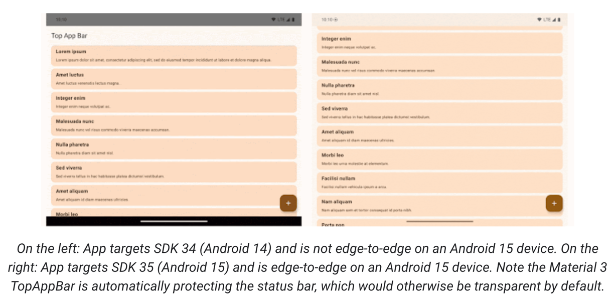
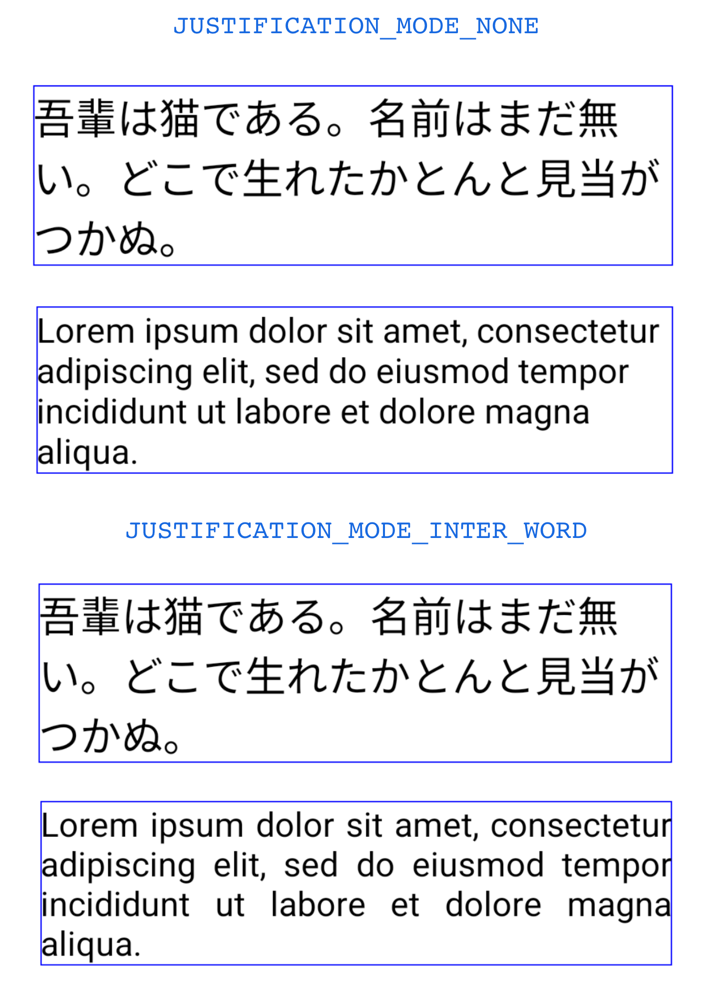
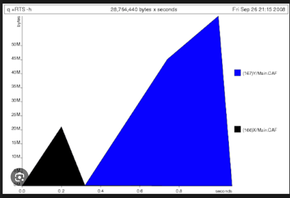
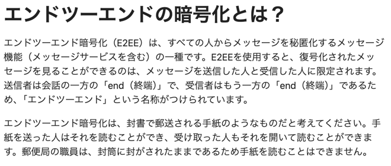

# The First Beta of Android 15

Android 15 beta が出たよ
15 の機能紹介

### Edge To Edge

targetSdkVersion で 15 を指定した場合、デフォルトで Edge to Edge が有効になる
具体的には、TopBar(ToolBar もかな)が List の下スクロールとかで隠れるようになるよ


### Smoother NFC experiences - part 2

指紋の話かな、使ったことあんまりないからようわからんね

### Inter-character justification

JUSTIFICATION_MODE_INTER_CHARACTER プロパティが新しく追加されたよ、
これで日本語の両端揃えができるようになったよ

Before


After


### App Archive

アーカイブのやつ。容量を空けたいってやつだね。
- `REQUEST_DELETE_PACKAGES`パーミッションを付与して
- `PackageInstaller requestArchive`メソッドを呼び出すと、アプリパッケージのアーカイブを要求できる
- そうすると、LauncherApps API を通じて表示可能なアプリとして返され、ユーザーがそれらアプリがアーカイブされていることを強調する UI 処理を見ることができる。
- ユーザーがアーカイブアプリをタップすると、担当のインストーラがアーカイブ解除リクエストを取得し、ACTION_PACKAGE_ADDEDブロードキャストによって復元プロセスを監視できます。
実装するメリットはあれだな、アーカイブしたアプリをちゃんと再インストールしてもらうことだな。。
とういことは、アーカイブ機能が要件に入っているかどうかで対応するかどうかが別れるな。保留。

### App-managed profiling

```text
Android 15には、アプリ内からプロファイリング情報を収集できる、
まったく新しいProfilingManagerクラスが含まれています。
プロファイリング要求の作成を簡素化するAndroid Jetpack APIでこれをラッピングする予定ですが、
コアAPIはヒープダンプ、ヒーププロファイル、スタックサンプリングなどの収集を可能にします。
このAPIは、出力ファイルを識別するために提供されるタグを使用して、アプリにコールバックを提供し、アプリのファイル・ディレクトリに配信される。このAPIは、パフォーマンスへの影響を最小限に抑えるためにレート制限を行います。
```

ヒープダンプとは？
```text

ヒープダンプとは、ある特定の時刻に Java Virtual Machine (JVM) ヒープ内に含まれていたすべてのオブジェクトのスナップショットのことです。
JVM ソフトウェアは、すべてのクラスインスタンスと配列用のオブジェクトのメモリーを、ヒープから割り当てます。
```


こんな感じのやつ。

ヒーププロファイルとは？

こんな感じのやつのことで、メモリ使用状況のプロファイルを取ってくれるものみたい。
あれだな、Mac のアクティビティモニターと同じだな多分



上記のプロファイルを、
[ProfilingManager](https://developer.android.com/reference/android/os/ProfilingManager)を使えばアプリの挙動を観測してくれるよってやつ。

### Better Braille
点字について。必要になったら。

[TalkBack
](https://developer.android.com/guide/topics/ui/accessibility/testing?hl=ja#talkback)

### Key management for end-to-end encryption

E2eeContactKeysManagerを導入し、暗号化公開鍵を保存するためのOSレベルのAPIを提供する。これによって、Androidアプリのエンドツーエンド暗号化（E2EE）が容易になる。

E2EE って何？ってレベルなのつらみ。。

メッセージの転送中の安全を確保するのが目的の技術みたい。。
メッセージとは？っていうのが気になるね、

[Cloud Flare ](https://www.cloudflare.com/ja-jp/learning/privacy/what-is-end-to-end-encryption/)
Cloud Flare によれば下記。




### Secured background activity launches

バックグラウンドアプリが他のアプリをフォアグラウンドに移動させたり、権限昇格させたり、ユーザー操作の悪用を防ぐ変更が適応されたってさ。

バックグラウンドアプリが　Intent を送れないようにする、みたいな話かな。。


# [Compose の DI](https://medium.com/androiddevelopers/dependency-injection-in-compose-a2db897e6f11)

なんやようわからんので、推奨だけみた

```kotlin
@HiltViewModel
class CheckoutViewModel @Inject constructor(
    private val savedStateHandle: SavedStateHandle,
    private val paymentApi: PaymentApi // example dependency
) : ViewModel() {

    fun submitPayment(...) {
        paymentApi.submitPayment(...)
    }
}

@Composable
fun CheckoutScreen(
    viewModel: CheckoutViewModel = hiltViewModel()
) {
    // ...
    Button(
        onClick = { viewModel.submitPayment(...) }
    ) {
        Text("Submit")
    }
}
```

```text
hiltViewModel()関数は、ViewModelを保持できる、最も近い適切な所有者（通常はアクティビティやフラグメント）を探します。
しかし、Composeを中心に構築されたアプリでは、Activityが1つしかなく、Fragmentを持たないものが増えています。
アクティビティが唯一の所有者である場合、すべての ViewModel（および注入されたオブジェクト）は、そのアクティビティが生きている限り保持されます。
```

なるほどな、HiltViewModel アノテーションつけたらええねんな
そんで Screen のコンストラクタで　ViewModel 作るときに hiltViewModel っていうのを呼んであげると、
CheckoutViewModel のインスタンスをくれるんやな。
んで、呼べばええんやなと

ほんで、やっぱり Compose を導入するとなると、シングルアクティビティが基本になるわけやな。
遷移を iOS に揃えたいとかはまあ別にして。

うーん、Dagger Hilt をちゃんと理解してないからそっちを理解してからじゃないとちょっと厳しいや。。。


# LazyList の新しいアニメーションAPI

変更前の挙動

https://medium.com/@gregkorossy/animating-lazylist-items-in-jetpack-compose-6b40f94aaa1a

追加とRemove のアニメーションが抜けてたよと、これを追加したよ。

[画面収録 2024-04-22 17.27.44.mov](..%2F..%2F..%2F..%2F..%2F..%2F..%2F..%2F..%2F..%2FDesktop%2F%E7%94%BB%E9%9D%A2%E5%8F%8E%E9%8C%B2%202024-04-22%2017.27.44.mov)

```text
バージョン1.7.0-alpha06のCompose Foundationライブラリから、アイテムの配置（通常はほとんど並び替えを意味する）だけでなく、
出現や消滅のアニメーションもできるようになりました。
本稿執筆時点では、これらの新しいアニメーションはフェードインとフェードアウトのトランジションでのみ動作しますが、
このコンセプトは、トランジションがどのようなものであっても（例えば、スライドインとスライドアウトを考えてみてください）、
将来のアップデートの基礎を築くものです。
```

サンプル

```kotlin
    LazyColumn {
        items(
            items = items,
            key = { it } // important to specify keys
        ) {
            Card(
                modifier = Modifier.animateItem() // apply item animations
            ) {
                Text(text = "Item #$it")
            }
        }
    }
```

