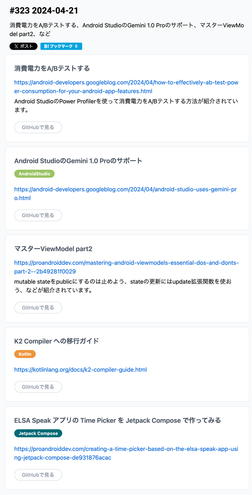

# 消費電力をABテストする

ぶっちゃけ、今日日はみんなモバイルバッテリー持ってるじゃん？で解決したい

気になるなら読めばいいかな
https://android-developers.googleblog.com/2024/04/how-to-effectively-ab-test-power-consumption-for-your-android-app-features.html

# Android StudioのGemini 1.0 Proのサポート

生成AI の Gemini を試してみてねってやつか。
ジェリーフィッシュ入れたので試せるかな。

適当にやってみたけど便利だわこれ。

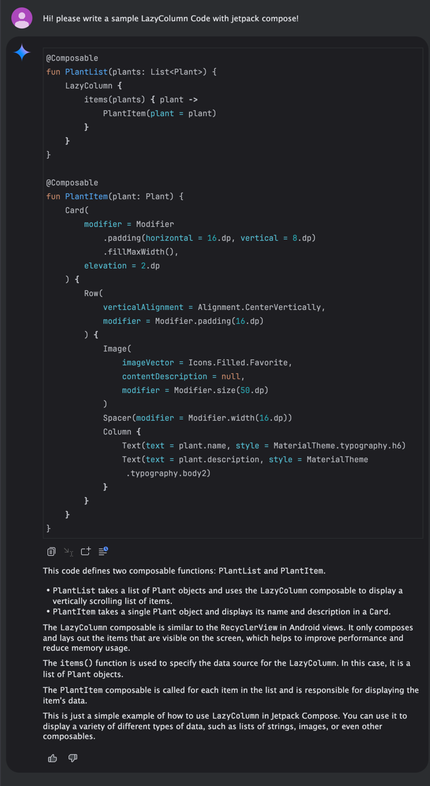

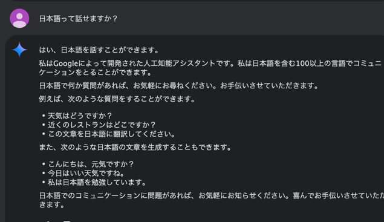

日本語も話せるじゃん、神かよ。
そんでもうエンジニア要らないやんこれ・・・
俺の存在意義ないやん・・・
やっぱ、エンジニアリングがわかるプロダクト志向へ行かないとだめだな。

嘘だろ。。

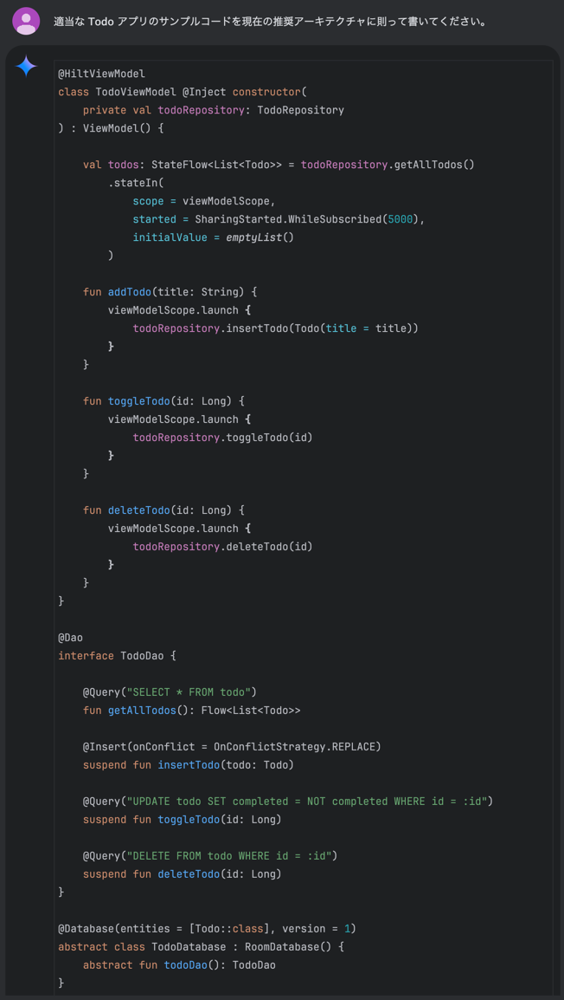

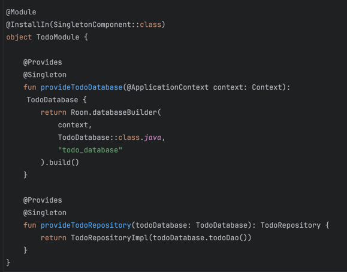


# マスターViewModel part2

```text
mutable stateをpublicにするのは止めよう、stateの更新にはupdate拡張関数を使おう、
などが紹介されています。
```

```text
概要

これまで、効率的なアプリ開発に欠かせない高度なテクニックを明らかにしてきた。
ViewModelsからミュータブルなステートを直接公開することの落とし穴を強調し、関連するリスクについて説明しました。
これらの課題に対処するために、読み取り専用の状態を採用したり、より安全な状態更新のために update{} 関数を活用するなどの解決策を推奨し、
コードベースの堅牢性と保守性を確保しました。
```

- NG
  - 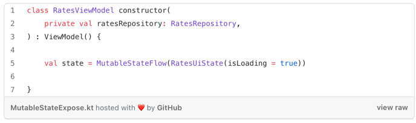
- OK
  - 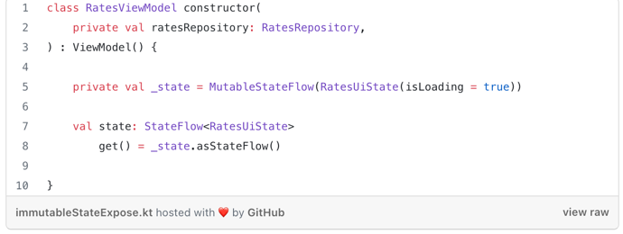


- Not Recommendation
  - 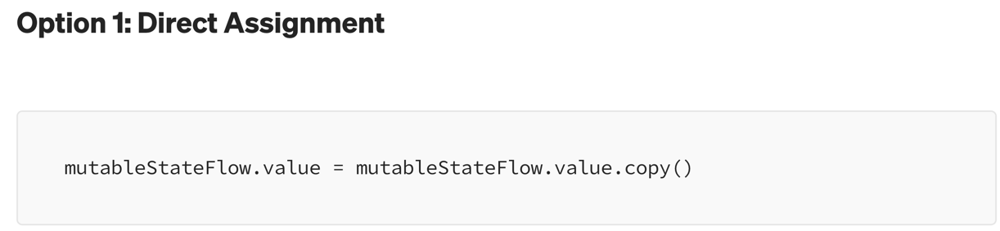
    - 理由: スレッドセーフにならず、競合する可能性があるから。
    - まあでも、State を変更するメソッドが一つしかないのであれば、これでもよくね？そもそも競合しないしね
  - 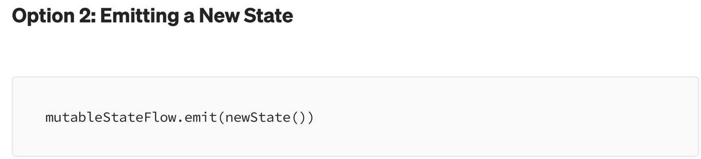
    - スレッドセーフなので同時変更に使用できる
    - Coroutine Scope 内で実行しないといけないので、ステートが消費されるのを待つ必要がある状況向けに設計されている。
    - 非同期処理実行時、ステート更新に使う場合に適しているよってことだね
- Recommendation
  - 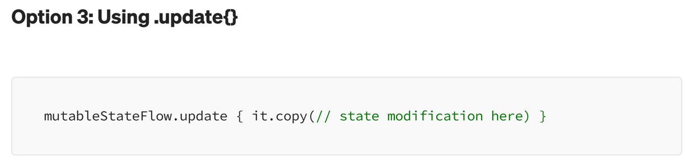
  - アトミック性: これはよくわからんが、各更新が最新の状態に基づいて適用されることを保証していて、同時更新間の競合を回避できる
  - スレッドセーフなので、別スレッドで更新される際の同期を心配する必要がない
  - 子ルーチンを管理するオーバーヘッドなしに、状態を更新できる

Example Usage

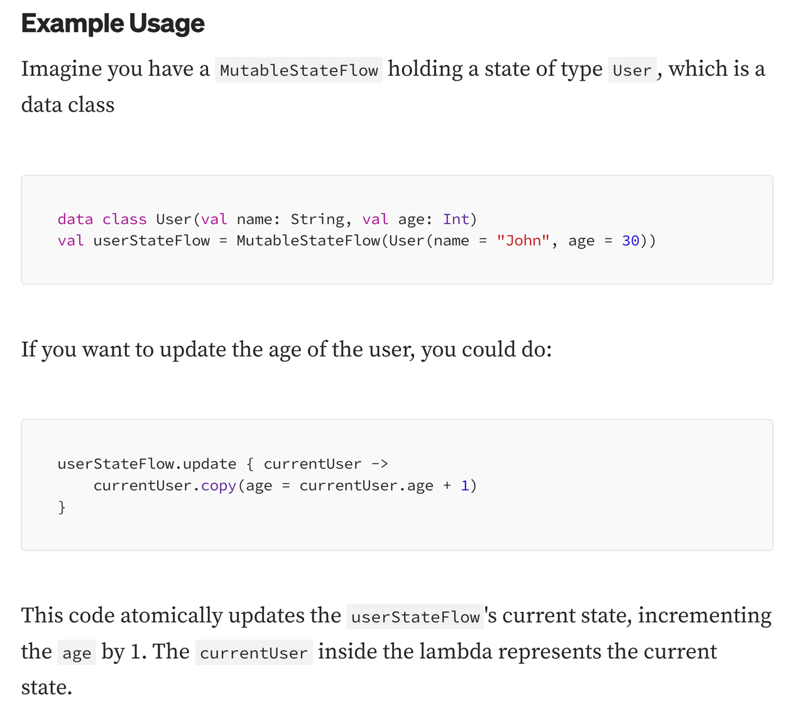

# K2 Compiler への移行ガイド

ぶっちゃけ、コンパイラのバージョンがどうとかあんまり意識したことないんだよな。。
ちゃんとみた方がいいものなのかわからん。。

# ELSA Speak アプリの Time Picker を Jetpack Compose で作ってみる

[Glovo animation](https://proandroiddev.com/how-to-create-glovo-like-main-screen-animation-using-jetpack-compose-part-2-15c2f3bea505) っていうのがあるらしい

すげえ頑張ってガシガシ作ってるんだけど、こんなの必要かねえ？
標準コンポーネントかつシンプルUIでよくない？面倒だよこれ。って思う

まあすごい UI だなとは思うんだけどね。。