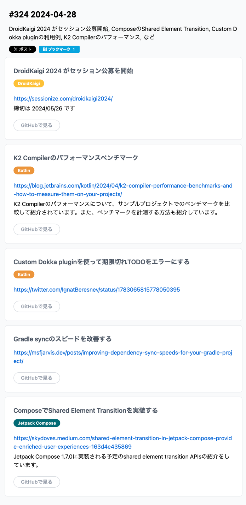
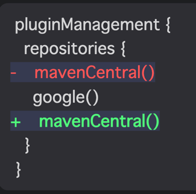
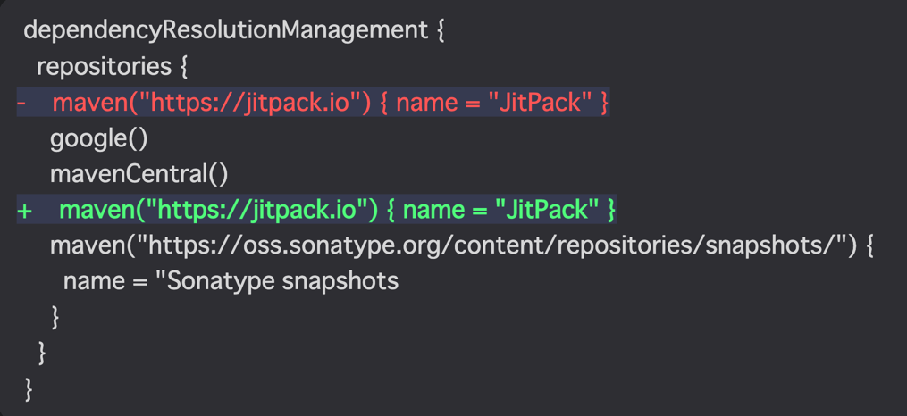
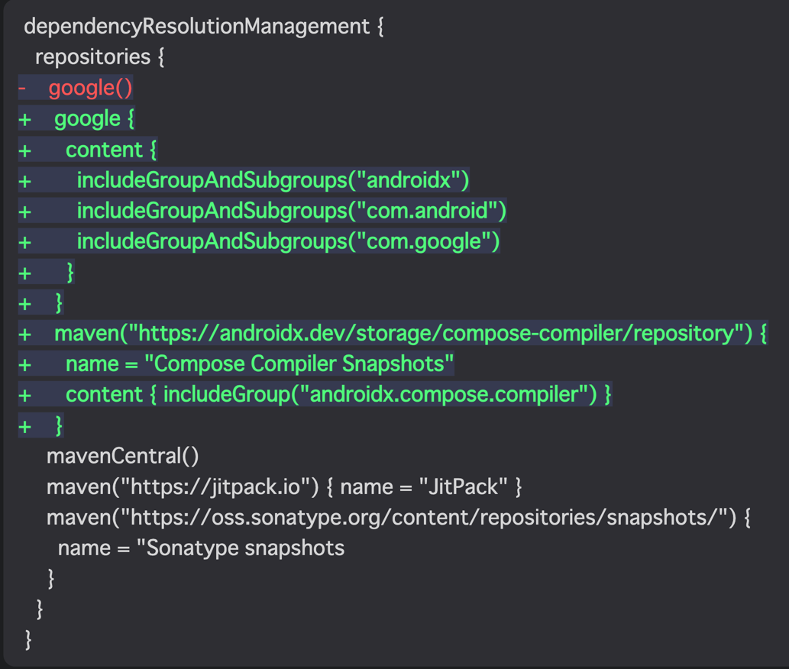
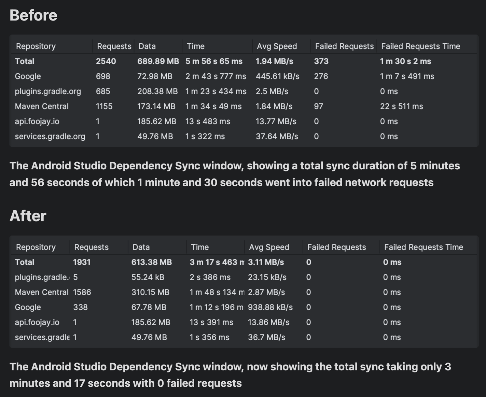
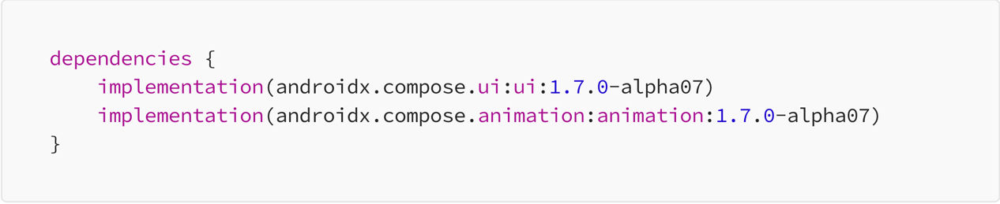

# DroidKaigi 2024 がセッション公募を開始
ほい

# K2 Compiler のパフォーマンスベンチマーク
```text
K2 Compilerのパフォーマンスについて、サンプルプロジェクトでのベンチマークを比較して紹介されています。
また、ベンチマークを計測する方法も紹介しています。
```

- Kotlin 2.0.0 から使える
- まだアルファ版なので対応してない IDE がある(IntelliJ で使えるなら Android Studio もいけるやん)
- そもそもなんでコンパイラを作り直したの？
  - KMM が目的ってことっぽい

### Key performance improvements
3つ
1. コンパイル速度の上昇
   - The K2 compiler brings up to 94% compilation speed gains.
2. 初期化速度の上昇
   - The K2 compiler brings up to 94% compilation speed gains.
3. 解析フェーズで3倍くらい速度上昇

このベンチマークとってもね、うん。
何に使うかが思いつかない

# Custom Dokka pluginを使って期限切れTODOをエラーにする


日付を超えた場合、Exception で落とせるようになった

# Gradle syncのスピードを改善する
なるほど、、なんとなくのイメージだけど、dependencies に書いてあるライブラリ情報を、
```kotlin
// settings.gradle.kts
pluginManagement {
  repositories {
    mavenCentral()
    google()
  }
}

dependencyResolutionManagement {
  repositories {
    maven("https://jitpack.io") { name = "JitPack" }
    google()
    mavenCentral()
    maven("https://oss.sonatype.org/content/repositories/snapshots/") {
      name = "Sonatype snapshots
    }
  }
}

```

ここに書いてある順に探しに行くってことなのね。
ライブラリのサーチをかける時に多分線形処理でやっていて、2重ループみたいになるのをやめようねってことかな

```kotlin
for (dependence in dependencies) {
    for (repository in repositories) {
        
    }
}
```

こういう感じで探索しているので、`maven("https://jitpack.io") { name = "JitPack" }`とかを一発目に書くと、
当然ほとんどのライブラリがこのリンク先に依存しているわけではないので無駄な探索が走る。
これを回避するために以下のように最適化しようという話。



あとは google, Maven とかのライブラリ置き場に対して、さらに詳細な設定をして計算量を減らそう！という意図でこういうふうに書くものもあるね


### 結論
著者プロジェクト環境でざっくり 2分の短縮になったそうです


# ComposeでShared Element Transitionを実装する

何これ
概要: Jetpack Compose 1.7.0に実装される予定のshared element transition APIsの紹介

新しいアニメーション API の紹介ね！



リストからの詳細表示で使えそうなアニメーション
[shared_element_transition.mov](shared_element_transition.mov)

実際に使用例は[ここ](https://github.com/skydoves/Pokedex)を参考

これポケモンの API 叩く練習になるから適当に作るなら参考にしよう
https://github.com/skydoves/Pokedex