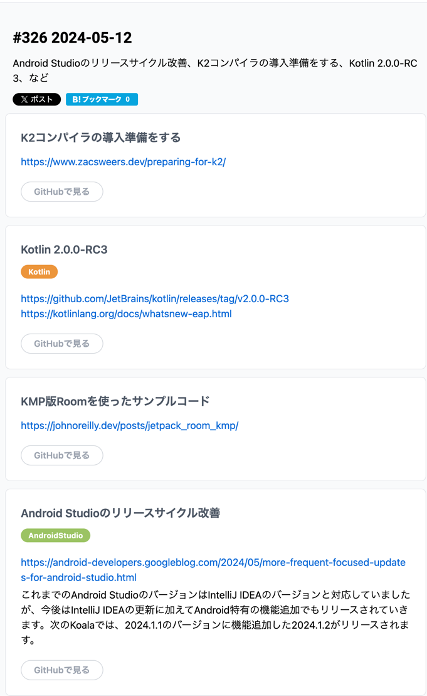

# [K2コンパイラの導入準備をする](https://www.zacsweers.dev/preparing-for-k2/)

準備するよと。

```text
Performance
K2 promises a significant improvement to compiler and IDE plugin performance. 
At the time of writing however, the results on projects I've tested have been mixed. 
Anecdotally, others in the community have reported modest improvements in the compiler, but usually only around ~10%. Far from the 2x+ improvements that were advertised up to this point.

At Slack, our benchmarks actually show a ~17% slowdown (still using KSP 1 though). In CatchUp on the other hand, I've found significant improvements. 
In Circuit, I found similar slowdowns again. 
It seems to vary widely depending on the repo, and I would highly recommend doing your own measurements using the helpful post/repo JetBrains has put together.

Note that at the time of writing, I've not successfully been able to run the Kotlin Notebook in that repo.
```

ワロチ、現状だとそこまで騒がれていたほどの改善が見込めてないと

# [Kotlin 2.0.0-RC3](https://github.com/JetBrains/kotlin/releases/tag/v2.0.0-RC3)
新しいのが出たよ

# [KMP版Roomを使ったサンプルコード](https://johnoreilly.dev/posts/jetpack_room_kmp/)
作るなら参考にしてみようねと

# [Android Studioのリリースサイクル改善](https://android-developers.googleblog.com/2024/05/more-frequent-focused-updates-for-android-studio.html)
コアラ以降は Intelli J と足並みを揃えずに Android Studio 特有の機能もつけてリリースしていくよと。