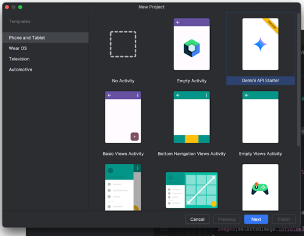

Google I/O があったからな、長いぞ。。！


# [Google I/O 2024で発表されたAndroid Studioの新機能](https://android-developers.googleblog.com/2024/05/google-io-2024-whats-new-in-android-development-tools.html)
```text
Google I/O 2024にて発表されたAndroid Studioの新機能について紹介しています。
Geminiサポート、Device Streaming、デバイスのUI設定のショートカット、Screenshot test plugin、など多くの機能について紹介しています。
```

### はいつよい


### クラッシュレポートで gemini の insights を見れるよと


### Gemini API 搭載のアプリを最初から作れるよ



### Gemini 1.5 Pro coming to Android Studio
ふーん

### USB ケーブル
端末がどの USB に対応しているか判断してくれて、もっといい USB ケーブル使ってねって警告くれるよ


### QA で便利


### Watch のやつ、しばらく関わらないかな多分


### Wear OS のデバックができるよ


### Compose Glance widget previews
Koala から、開発プロセスの早い段階でウィジェットの外観を微調整できる

### Live Edit for Compose enabled by default
コードの変更をエミュレータや物理デバイス上の実行中のアプリケーションに自動的にデプロイできる
ふーん
UX要素の更新がアプリ全体のエクスペリエンスに与える影響を確認するのに役立つ
ふーん

### IntelliJ Platform Update (2024.1)
見ればいいや

### さまりー


# Google I/O 2024で発表されたComposeの新機能

### Shared element transitions
別アプリへの共有動作がなんか良くなったらしいよ

```kotlin
Modifier.sharedElement()
Modifier.sharedBounds()
```

SharedTransitionLayoutでAnimatedContentのコンポーザブルをラップし、画面間で共有したいコンテンツにModifier.sharedElement()またはModifier.sharedBounds()を追加します

ふーん

### Lazy list item animations
遅延行と列に、項目の挿入、削除、並び替えを自動的にアニメーション化する機能が追加されました。
リストアイテムにModifier.animateItem()を追加するだけで、変更が自動的にアニメーションします。
また、さまざまなアニメーションの仕様を指定して、アニメーションをカスタマイズすることもできます。

詳しくは[ドキュメント](https://developer.android.com/reference/kotlin/androidx/compose/foundation/lazy/LazyItemScope#(androidx.compose.ui.Modifier).animateItem(androidx.compose.animation.core.FiniteAnimationSpec,androidx.compose.animation.core.FiniteAnimationSpec,androidx.compose.animation.core.FiniteAnimationSpec))

## Jetpack Libraries
### Type safe navigation in Navigation Compose

Jetpack Navigation 2.8.0-alpha08の時点で、
Navigation ComponentはKotlin DSLを使用する際にナビゲーショングラフを定義するためのKotlinシリアライゼーションに基づいた完全なタイプセーフシステムを備えており、
Navigation Composeのような統合と最適に動作するように設計されています。

こっち見たほうが早い


要するに、NavHost composable で遷移を定義するときに、なんか便利で安全になった！ってことやな

### CameraX Compose
新しいコンポーズ専用のCameraXアーティファクト「camera-viewfinder-compose」をリリース
色々(タップフォーカス、ピンチズーム)簡単に実装できる

# [AndroidがKotlin Multiplatformを公式サポート](https://android-developers.googleblog.com/2024/05/android-support-for-kotlin-multiplatform-to-share-business-logic-across-mobile-web-server-desktop.html)


ふーんくらいでいいかな

# [Android 15 Beta 2](https://android-developers.googleblog.com/2024/05/the-second-beta-of-android-15.html)
- アプリ隠せるようになるんだね
- また写真周りの権限が変わるんかい
- URL のアプリ起動時に権限チェックできるようになるってことかね
- 悪意あるバックグラウンド起動を伏せ魚とかその辺だね、
  - 
  - アプリ全体に設定、ディープリンクをハンドリングする Activity とかは例外、みたいな設定ができるっちゅうこと
- Safer Intents
  - アクティビティ、サービスあたりを起動できる Intent になんか安全なやつがついたよってやつ
    - Strict Mode ってなに？
    - 
  - どうなんだろうねえ
- Increased minimum target SDK version from 23 to 24
- Improved large screen multitasking
  - ふーん
- Picture-in-Picture
  - 動画系は大事だねこれ
- Richer Widget Previews with Generated Previews
  - Preview がリッチだよと
- Predictive Back
  - 戻るが iPhone Like になったってこと？！
- Set VibrationEffect for notification channels
  - 着信でリッチバイブレーションが設定できるってさ
  - お、おうって感じ
- New data types for Health Connect
  - 体温とか取れるみたいだね
- "Choose how you're addressed" system preference
  - 言語における男性と女性に対応できるよ
  - 今まではフランス語に対応していたよ
- CJK Variable Font
  - 日本語韓国語中国語に対応した fontweight が出たよ
- New Japanese Hentaigana Font
  - あ〜
  - 
  - 鰻屋さんとかね、飲食店系のアプリは使おうって感じだね
- Avoiding clipped text
  - 
- App compatibility
  - ベータで試してね期間