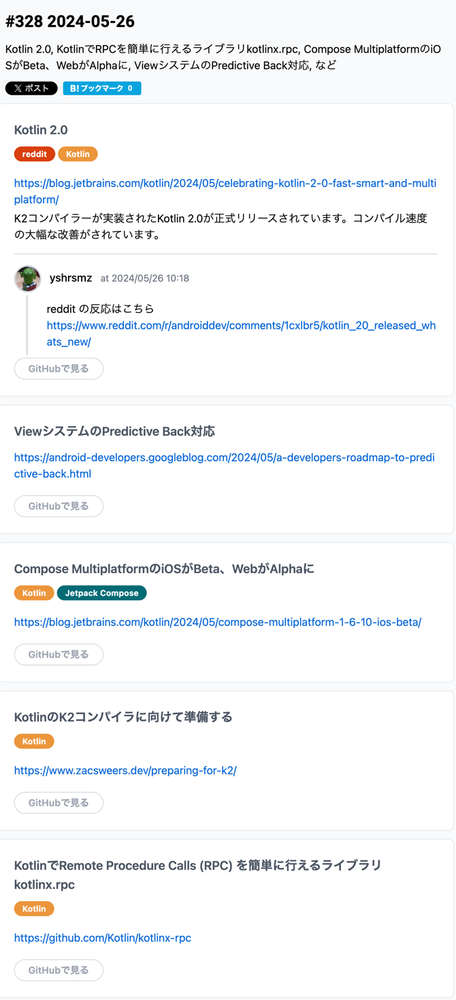
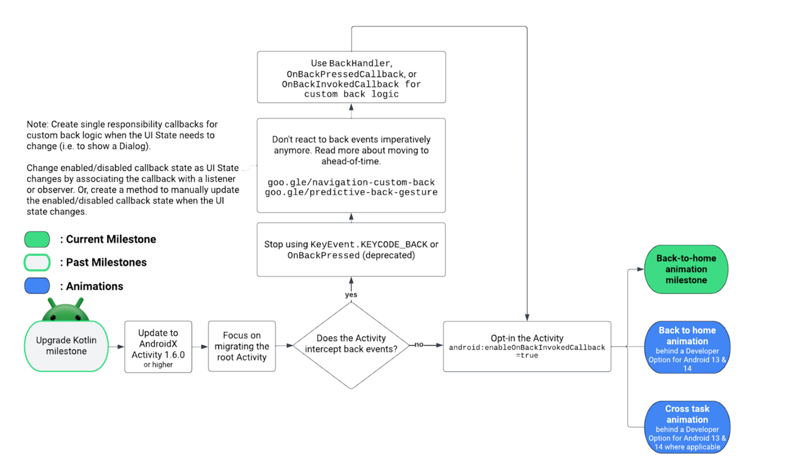
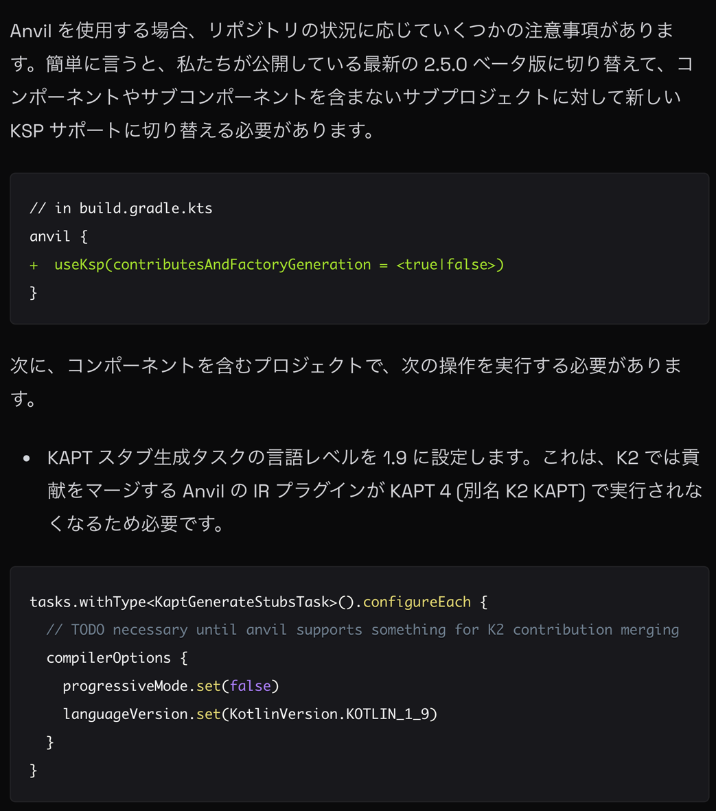
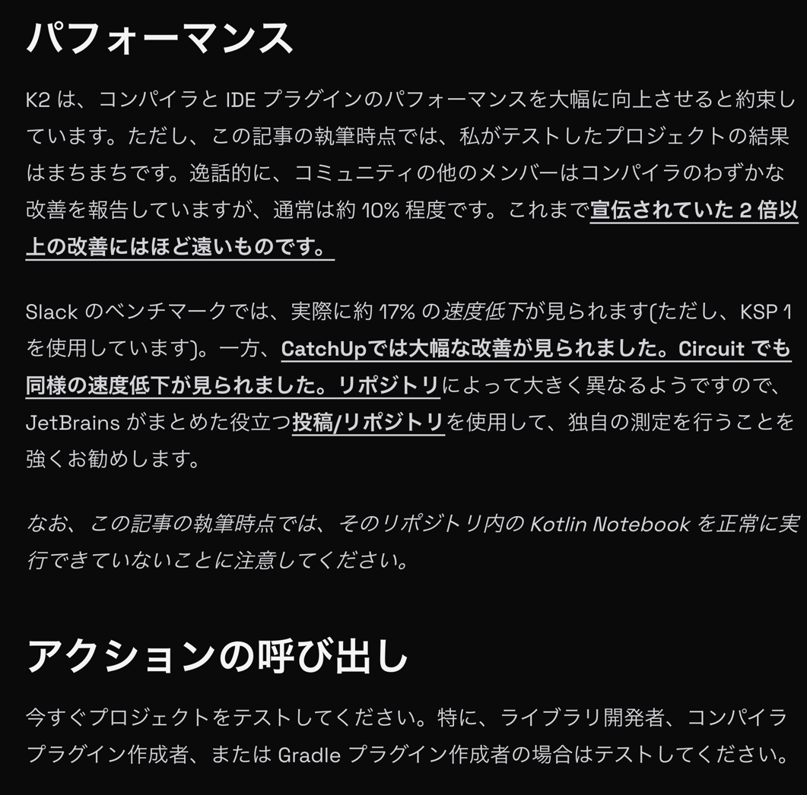
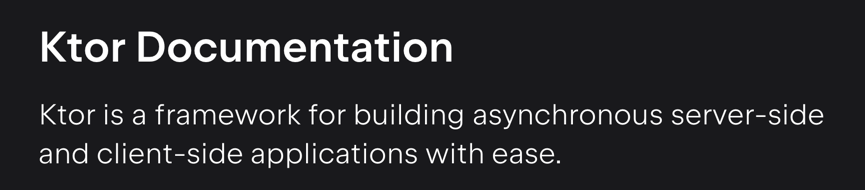

## [Celebrating Kotlin 2.0: Fast, Smart, and Multiplatform](https://blog.jetbrains.com/kotlin/2024/05/celebrating-kotlin-2-0-fast-smart-and-multiplatform/)
- reddit の反応を見ると。。
  - コンパイラ速度はあがった
  - Function3 の様な方の変更によって、クラスキャストクラッシュが一部発生
  - いくつかのテストでモックに問題あり、mockk を使用して拡張関数を mock してるところで、実行時にmock した返却値がない、的なエラーが出ているっぽい

## [ViewシステムのPredictive Back対応)](https://android-developers.googleblog.com/2024/05/a-developers-roadmap-to-predictive-back.html)

- iOS Like な左スワイプでホーム画面へ戻るジェスチャー実装のためのマイルストーン紹介やな
- Activity, Fragment, Material Component あたりへの適用方法やな
- ベットこの辺参考
  - https://developer.android.com/guide/navigation/custom-back/support-animations?hl=ja

## Compose MultiplatformのiOSがBeta、WebがAlphaに
- ほう

## [KotlinのK2コンパイラに向けて準備する](https://www.zacsweers.dev/preparing-for-k2/)
- K2コンパイラは
  - ほぼ完成
  - スマートキャストで新規機能あり
  - mockito を使用する場合、スタブ化されていないコルーチン関数が以上な方法で爆発する？可能性がある、どゆこと？
    - 自分が作って無い型をモックすな
      - 例えば子ルーチン内部でライブラリの内部についていくつかの過程があるが、mockito でこれが破綻する
    - suspend 関数などの言語機能をモックするな
      - そんなことできるん？
  - kotlinc がジェネリック型の推論に関してより厳格であり、ソースで明示的に宣言する必要がある場合がある
  - Gradle プラグインで Kotlin を使用する場合、古い動作を強制するため Serializable にアノテーションする @JvmSerializableLamda を渡さない限り、2.0 のラムダが自動的に実行されない
    - 何言ってんねんこれ

- Gradle
  - まだいくつか問題あり

- K2 IDE プラグインモード
  - 読んでもようわからんな、、現時点でもリリース時もあんまり使える様なものでは無いみたい

- コンパイラプラグイン
  - まだ安定した API ではありませんが、多くのプロジェクトでは何らかの形のコンパイラ プラグインを使用している
  - 一般的な例としては、Compose、kotlinx-serialization、zipline など
  - これらのほとんどすべてについて、K2 をテストするには 2.0 互換のリリースを見つける必要がある
  - コンパイラ API がリリース間で頻繁に変更され、その上に構築されたプラグインの新しいビルドが必要になるため

- Compose
  - Compose のコンパイラは K2 の Kotlin モノレボに移行していて、Kotlin と同時にリリースできる

- マルチプラットフォームで Parcelize
  - これまで、KMP で Parcelable を使用する場合は、ソース@CommonParcelizeに配置できる注釈を作成しcommonMain、それに応じてexpect/actualするというトリックを実行する必要があった
  - K2 では、これはもう必要ありません。K2 では、メンバーとスーパータイプのスーパーセットを使用して実体化できるようになっただけでなく、Parcelize プラグインが更新され、カスタム マーカー注釈を指定できるようになった
  - 何言ってんだこれ

- kAPT
  - アノテーション処理ツール
  - Dagger, AutoValue などの人気プロセッサは Kotlin プロジェクトで動作するため、今でもこのツールに依存している
  - KAPT はバージョン管理されていることはご存じないかもしれません
  - ほとんどの期間、私たちは KAPT 3 を使用してきました
  - これは、K1 コンパイラ フロントエンドの と呼ばれる API の上にある
  - この API は K2 では廃止されたため、KAPT を K2 で動作するように再実装する必要があった
  - そのため、現在は KAPT 4 になっている
  - KGP では、これは正式には「K2 KAPT」と呼ばれている
  - KAPT 4 はまだプレビュー段階

- KSP2
  - KSP は、ほとんどのユースケースで KAPT を置き換えることを目的とした Kotlin ファーストの注釈処理ツール
  - ぶっちゃけわからんよ、読んでも。。辛い

- Kotlin メタデータ
  - kotlinx-metadata-jvmKotlin アノテーションを効率的に読み書きするための API 
  - 多くの Java アノテーション処理および静的解析ツールは、処理/解析しているバイトコードに関する Kotlin 言語機能を理解するためにこの API を使用
  - K2 では、この API が安定化され、アーティファクトの下ですべての Kotlin リリースで公開

- Android リント
  - Android Lint の分析コアには新しい K2 UAST 実装がありますが、まだ実験段階であり、K2 リリース後しばらくはデフォルトで有効にならない可能性がある
  - 試してみて、うまく機能する場合は使用
  - Android チームは、提出された問題に非常に迅速に対応し、多くの場合、リリース内で修正を行う
  - KSP2 と同様に、これも K2 の新しい分析 API 上に構築

- Anvil
  - なんやこれ
  - 

- パフォーマンス
  - 
  - そんなにビルド速度が上がったわけでは無いらしい

## [Kotlin で　Remote Procedure Calls を簡単に行えるライブラリ](https://github.com/Kotlin/kotlinx-rpc)
- RPC ってなんやねん
  - [RPC](https://www.ntt-west.co.jp/business/glossary/words-00229.html)
    - ネットワーク上で接続された他のコンピュータプログラムを呼び出して実行させるための技術、そのためのプロトコルのこと
    - RPC は日本語で遠隔手続き呼び出しと訳される
- RPC できるやつができたってことなので、Android というよりは Kotlin サーバーサイドの方で使えたりするんじゃ無いのかね？
  - 
  - やっぱそうやん、だから Android 端末から Kotlin で書かれたサーバーサイドと連携して処理したい時とかに橋渡しとして使えるってことやんな