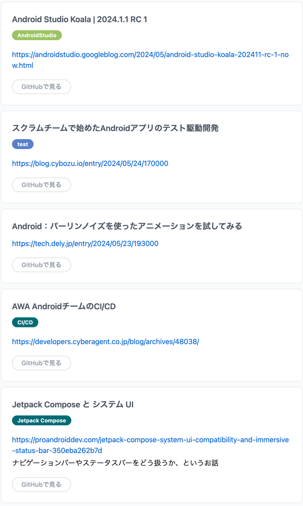
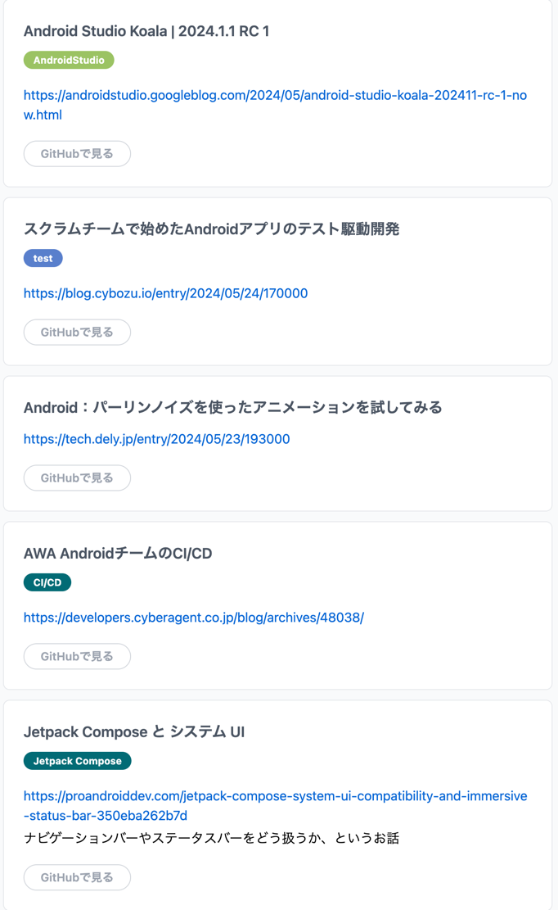
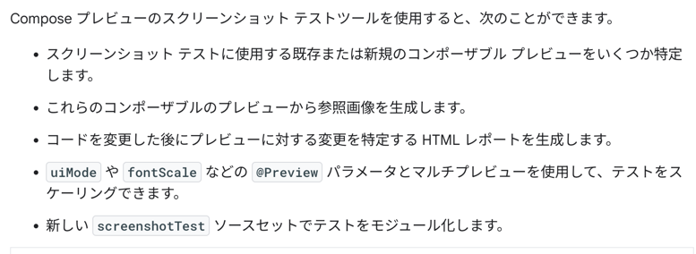

## [公式からスクリーンショットテストライブラリがリリース](https://developer.android.com/studio/preview/compose-screenshot-testing?hl=ja)
- 

## [Now in Android 106](https://medium.com/androiddevelopers/now-in-android-106-1b72759c5f0c)
- Compose プレビュー スクリーンショット テストツールの最初のアルファ バージョンもリリース
- 開発者向けプレビューでまったく新しい Play ストア サーフェスを公開
- Jetpack Compose の新機能として、 2024 年 6 月に予定されている Jetpack Compose のリリースを発表し、Android デバイスのエコシステム全体にわたる Compose サポートの拡張を発表
- Wear OS の新機能として、 Wear OS 5 の開発者プレビュー、Wear OS 5 を使用したウォッチフェイス フォーマットの次のイテレーション、およびツールとライブラリのアップデートをリリースしたことを発表
- 新しいパスウェイ「Android アプリのユーザー エクスペリエンスの向上」をご覧ください
  - 気になる
  - https://developer.android.com/courses/pathways/improve-user-experience?hl=ja
  - これはやっておきたい
- Android X release
  - Camera Viewfinder Compose バージョン 1.0.0-alpha01がリリース
    - CameraX および Camera2 で使用できる Compose ネイティブ Viewfinder コンポーザブルを導入
  - VectorDrawable-Seekable バージョン 1.0.0がリリース
  - ViewPager2 バージョン 1.1.0がリリース
  - フラグメント バージョン 1.7.0がリリース
  - Transition バージョン 1.5.0がリリース
  - Webkit バージョン 1.11.0がリリース

## Android Studio Koala | 2024.1.1 RC 1
- Koala が出たよ

## [スクラムチームで始めたAndroidアプリのテスト駆動開発](https://blog.cybozu.io/entry/2024/05/24/170000)
- `私たちは、顧客にとって価値が高く、手動で試験するとコストが高いテストを優先して自動化したい` これが本質
- `実装に自信を持ちやすい`

## Android：パーリンノイズを使ったアニメーションを試してみる
- 今はあんま参考にならないかも

## [AWA AndroidチームのCI/CD](https://developers.cyberagent.co.jp/blog/archives/48038/)
- CI
  - KtLint、Lint、Unit Test
- CD
  - Github Actions
- この辺、作る段階で触ったことがないのでふーんという感じ

## [Jetpack Compose: System UI Compatibility and Immersive Status Bar](https://proandroiddev.com/jetpack-compose-system-ui-compatibility-and-immersive-status-bar-350eba262b7d)
- 最新の仕様に従って没入型ステータス バーを設定すると非常に便利になり、Compose の多くのコンポーネントによって作業が大幅に節約される
- 特殊なケースに遭遇した場合でも、簡潔な対処方法がある
- [Compose のウィンドウ インセット](https://developer.android.google.cn/develop/ui/compose/layouts/insets?hl=ja) をみた方がわかりいいね