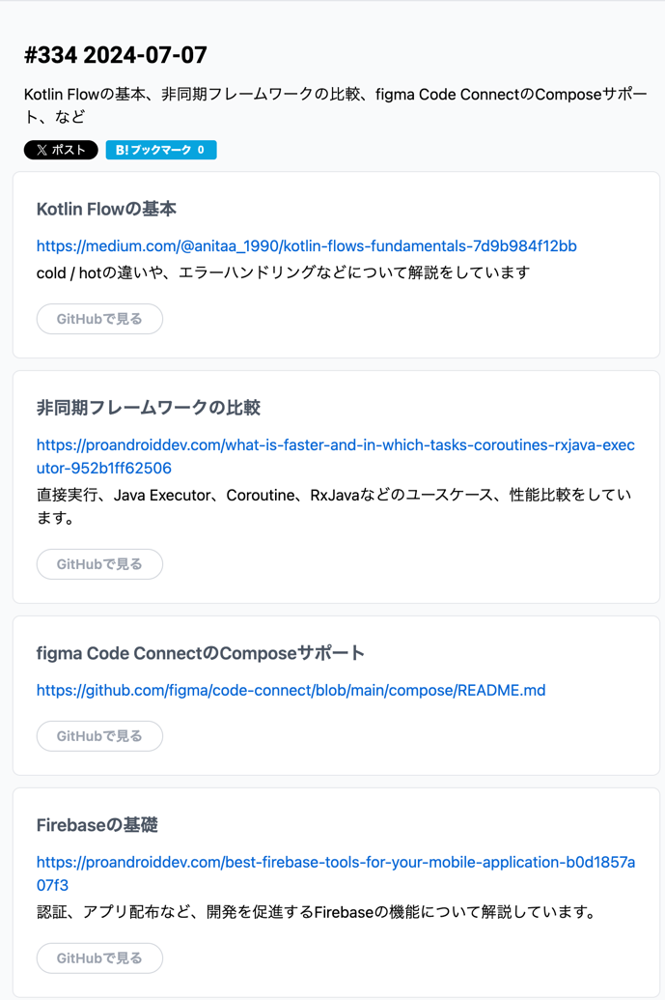

## [Kotlin Flowの基本](https://medium.com/@anitaa_1990/kotlin-flows-fundamentals-7d9b984f12bb)
- タイミングがちょうど良すぎてラッキー

### Flow とは？
- 非同期に計算できるデータストリームのこと
- LiveData, RxJava と同様にオブザーバーパターンを実装できる
- オブザーバー パターンは、オブザーバー (コレクター) と呼ばれる依存関係のリストを保持し、状態の変化を自動的に通知するオブジェクト (ソース) で構成されるソフトウェア設計パターン
- フローでは、中断関数を使用して、値を非同期に生成および消費する
- 例
- publish
```kotlin
val randomFlow: Flow<Int> = flow {
    repeat(10) { it ->
        emit(it+1) //Emits the result of the request to the flow
        delay(1000) // Suspends the coroutine for 1 sec
    }
}
```
- observe
```kotlin
lifecycleScope.launch {
    viewModel.uiStateFlow.collect { it ->
        binding.uiText.text = it.toString()
    }
}
```

### cold flow について
- 値の収集を開始するまで、値は生成されない。 加入者は1人のみで、データを保存しない

```kotlin
// Regular Flow example
    val coldFlow = flow {
         emit(0) 
         emit(1)
         emit(2)
   }

    launch { // Calling collect the first time
        coldFlow.collect { value ->
            println("cold flow collector 1 received: $value")
        }

        delay(2500)
       
      // Calling collect a second time
      coldFlow.collect { value ->
            println("cold flow collector 2 received: $value")
        }
    }


// RESULT
// Both the collectors will get all the values from the beginning. 
// For both collectors, the corresponding Flow starts from the beginning.
flow collector 1 received: [0, 1, 2]
flow collector 1 received: [0, 1, 2]
```

### hot flow について
- 誰もその値を収集していなくても、値を生成する。 複数の加入者を持つことができ、データを保存することができる

```kotlin
// SharedFlow example
    val sharedFlow = MutableSharedFlow<Int>()

    sharedFlow.emit(0)
    sharedFlow.emit(1)
    sharedFlow.emit(2)
    sharedFlow.emit(3)
    sharedFlow.emit(4)

    launch {
        sharedFlow.collect { value ->
            println("SharedFlow collector 1 received: $value")
        }

        delay(2500)
       
      // Calling collect a second time
      sharedFlow.collect { value ->
            println("SharedFlow collector 2 received: $value")
        }
    }

// RESULT 
// The collectors will get the values from where they have started collecting. 
// Here the 1st collector gets all the values. But the 2nd collector gets 
// only those values that got emitted after 2500 milliseconds as it started 
// collecting after 2500 milliseconds.
SharedFlow collector 1 received: [0,1,2,3,4]
SharedFlow collector 2 received: [2,3,4]
```
- それぞれstateIn()演算子とshareIn()演算子を使えば、コールドフローをホットフローに変換できる。


### SharedFlow & StateFlow
- StateFlowは、一度に一つの値を保持する状態を表すHotFlow
- 新しい値が発行されると、最新の値が保持され、新しいコレクターに直ちに発行される
- これは、ある状態の単一の真実のソースを維持し、すべてのコレクタを最新の状態で自動的に更新する必要がある場合に便利
- 常に初期値を持ち、最新の放出された値のみを格納

- SharedFlowは複数のコレクターを持つことができるHotFlow
- コレクタから独立して値を発行でき、複数のコレクタがフローから同じ値を収集できる
- 複数のコレクターに値をブロードキャストする必要がある場合や、同じデータストリームに複数のサブスクライバーを持たせたい場合に便利
- 初期値を持たず、新しいコレクターのために、以前に発行された値を一定数保存するように再生キャッシュを設定できる

### Exception Handling in Flows
- try-catch
```kotlin
flow {
    try {
        emit(productsService.fetchProducts())
    } catch (e: Exception) {
        emitError(e)
    }
}
```

- catch Operator
```kotlin
flow {
    emit(productsService.fetchProducts())
}.catch { e ->
    emitError(e)
}
```

- onCompletion Operator
```kotlin
flow {
    emit(productsService.fetchProducts())
}.onCompletion { cause ->
    if (cause != null) {
        emitError(cause)
    }
}
```

- Custom Error Handling
```kotlin
fun <T> Flow<T>.sampleErrorHandler(): Flow<Result<T>> = transform { value ->
    try {
        emit(Result.Success(value))
    } catch (e: Exception) {
        emit(Result.Error(e))
    }
}
```

### Flows vs LiveData
- LiveDataはライフサイクルを意識してるが flow はしてない
- collectLatest() or collectAsStateWithLifecycle() 関数を使用して flow から情報収集できる

- Flow は柔軟性があり、より複雑な非同期データ操作に適しているが、LiveData は通常、より単純な UI 更新に使用される

- Flow は backpressure を考慮？してデータ放出と処理の速度を制御できるが、LiveData にそれはない

BackPressure ってなんだよ、ということで medium ディレクトリに作ってあるので参照のほど

- Flowは逐次処理と構造化処理のための豊富な演算子セットを提供し、LiveDataはオブザーバーに最新データを配信することに重点を置いている


つまり、`単純な UI 更新なら LiveData`、 `複雑なことがしたい or EventBus みたく使いたい or DBを常に監視したいなら Flow` がいいよってことだね

## 非同期フレームワークの比較
`直接実行、Java Executor、Coroutine、RxJavaなどのユースケース、性能比較`

### Why?
- まず、なぜこれを行ったのか
- 単純なタスクに直面していた
- 数百のコールバックを呼び出すシステムがあった
- すべてのコールバックはできるだけ早く完了する必要がある

- 各コールバックにかかる複雑さや時間は不明
- コールバックはオブジェクトを作成したり、サーバーやデータベースに長いリクエストを送信したりすることがある
- この場合、データベースやサーバーへのリクエストのため、マルチスレッドを使用する必要があった
- この問題を解決しようとしているときに、どのマルチスレッド フレームワークがどの状況でより高速であるかがわからないことに気付いた

### 何で計測する？
- Android デバイスでコードのパフォーマンスをテストするために使用できる[Jetpack Microbenchmark](https://developer.android.com/topic/performance/benchmarking/microbenchmark-overview)ツールがあるよ

### 計測コード
長え

### 結論
- どれも大差ないって話だね
- ご覧のとおり、ファイルシステムやネットワークを操作する場合、マルチスレッドの役割はほとんどない
- マルチスレッドの用途のほとんどは、IO 操作
- したがって、パフォーマンスに基づいてマルチスレッド フレームワークを選択するのは奇妙

### [figma Code ConnectのComposeサポート](https://github.com/figma/code-connect/blob/main/compose/README.md)
- ふーん、Figma でデザイン書いてるプロジェクトならここをみてセッティングしてみたいね

### Firebaseの基礎
```text
認証、アプリ配布など、開発を促進するFirebaseの機能について解説しています。
```

- リアルタイム DB
- クラッシュリティクス
- アプリ配布
- パフォーマンス監視
この辺の知っている話だった

新知識は
- [Gemini Api](https://extensions.dev/extensions/googlecloud/firestore-genai-chatbot) の話、チャットボットを作れるってさ
