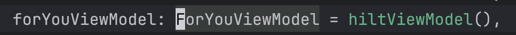
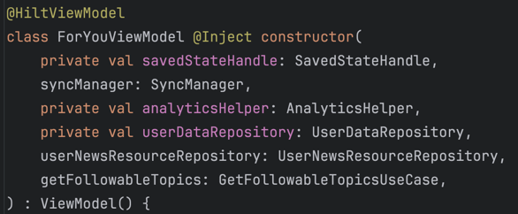

# やること

[Dagger-Hilt](https://developer.android.com/codelabs/android-hilt?hl=ja#0) の学習

## はじめに



## 前提条件


# プロジェクトへの hilt の追加
- 開始用コードを見ると、ServiceLocator クラスのインスタンスが LogApplication クラスに格納されていることがわかる
```kotlin
class LogApplication : Application() {

    lateinit var serviceLocator: ServiceLocator

    override fun onCreate() {
        super.onCreate()
        serviceLocator = ServiceLocator(applicationContext)
    }
}
```
- ServiceLocator は、それを必要とするクラスによってオンデマンドで取得される依存関係を作成して格納する
- このクラスは、依存関係のコンテナと考えることができる
- このコンテナは、アプリの破棄に伴って破棄されるため、アプリのライフサイクルにアタッチされる
  
- サービス ロケータは、最初は比較的少量のボイラープレート コードから始められますが、スケーリングへの対応力は不十分
- Hilt では、手動で作成する必要のあったコード（ServiceLocator クラスのコードなど）が生成され、
- Android アプリで手動による DI またはサービスロケータパターンを使用する際に必要なボイラープレートが不要になる

何を言っているのかっていうとね、
`LogApplication` がありますと


これを様々な画面(Fragment) から参照して、画面が初期化された時の Log を DB(Room) に保存してますよと。


onAttach で db の設定をコンテナから呼んで、onViewCreated でそれぞれログを保存してますよと

### プロジェクトでの Hilt

```kotlin
buildscript {
    ...
    ext.hilt_version = '2.28-alpha'
    dependencies {
        ...
        classpath "com.google.dagger:hilt-android-gradle-plugin:$hilt_version"
    }
}
```

## アプリでの Hilt
アプリのライフサイクルにアタッチされたコンテナを追加するには、Application クラスに @HiltAndroidApp アノテーションを付ける必要がある
```kotlin
@HiltAndroidApp
class LogApplication : Application() {
    ...
}
```


## 5. Hilt を使用したフィールド注入

フィールド注入について！


lateinit 修飾子つけて、onAttach とかで 初期化しているコードについてはこれでフィールド注入すればわざわざ書かなくていいよ！便利だね！

ちなみにその時は、Hilt に対して注入するクラスを教えてあげないといけないので、


こんな感じで、
```kotlin
class class名 @Inject constructor() {}
```
をつけてあげないといけないので注意してね！

## 6. インスタンスのスコープのコンテナに対する設定

```text
インスタンスのスコープをアプリケーション コンテナに設定するアノテーションは @Singleton です。
このアノテーションを使用すれば、その型が別の型の依存関係として使用されているかどうか、フィールド注入が必要かどうかにかかわらず、
アプリケーション コンテナは常に同じインスタンスを提供します。
```

だそうです。ふーん。Dagger Hilt のイメージがいまいち掴めないんだよなあ。。

結局のところ、Compose の方と組み合わせるのであれば Compose に ViewModel を渡すところくらいでしか使えないのでは？と思ってしまう
Repository を引数に入れるためにFactory パターンで実装するところを、@HiltViewModel アノテーションで実装するっていう形にするくらいじゃないか？

ぶっちゃけ面倒なので Dagger Hilt っていうのはこういうことだよっていう現在のイメージだけ残して終わる

```kotlin
class TekitouRepositoryImpl(private val todoDao: ToDoDao)
```
みたいな形のものがあった時に、呼び出しがわで ToDoDao のインスタンスを生成して渡すのではなく、勝手にやってもらおうという発想。

```kotlin
class TekitouRepositoryImpl @Injection constructor(private val todoDao: ToDoDao)
```

こんな感じでやってあげると、 todoDao 変数を勝手に注入してくれるよって話し。
ToDoDao が class の場合であればいいけど、じゃあたとえば abstract class や interface とかだったらどうするの？というのが @Bind とか @Module とかの話っぽいね

https://www.youtube.com/watch?v=2-B-X0NwrEM
すごい参考になった

## ViewModel のボイラープレートコードを減らしたい！！

Now in Android から引用
ForyouViewModel を持ってくる時に、@HiltViewModel で持ってくると Factory パターンのボイラープレートコードが不要になるよ
この際に、Repository とかの interface は @Injection アノテーションは不要みたい。

呼び出し側


ViewModel のコンストラクタ

