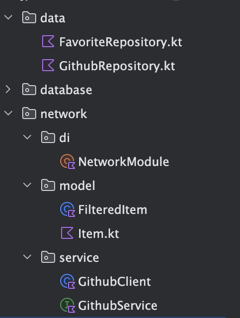

## ディレクトリ構成はこんな感じ



## di の定義

やることはシンプルで、通信のために必要なセットアップをシングルトンで全て行うこと。
この設定を ViewModel から利用してあげるイメージ

```kotlin
package jp.co.uniaim.android.code_check.network.di

import com.jakewharton.retrofit2.converter.kotlinx.serialization.asConverterFactory
import dagger.Module
import dagger.Provides
import dagger.hilt.InstallIn
import dagger.hilt.components.SingletonComponent
import jp.co.uniaim.android.code_check.data.GithubRepository
import jp.co.uniaim.android.code_check.data.GithubRepositoryImpl
import jp.co.uniaim.android.code_check.network.service.GithubClient
import jp.co.uniaim.android.code_check.network.service.GithubService
import kotlinx.serialization.json.Json
import okhttp3.MediaType.Companion.toMediaType
import retrofit2.Retrofit
import javax.inject.Singleton

@Module
@InstallIn(SingletonComponent::class)
/// internal: 同一モジュールからアクセス可能修飾子
internal object NetworkModule {

    @Provides
    @Singleton
    fun provideRetrofit(): Retrofit {
        val json = Json {
            ignoreUnknownKeys = true
        }
        return Retrofit.Builder()
            .baseUrl("https://api.github.com/")
            .addConverterFactory(json.asConverterFactory("application/json".toMediaType()))
            .build()
    }

    @Provides
    @Singleton
    fun provideGithubService(retrofit: Retrofit): GithubService {
        return retrofit.create(GithubService::class.java)
    }

    @Provides
    @Singleton
    fun provideGithubClient(githubService: GithubService): GithubClient {
        return GithubClient(githubService)
    }

    @Provides
    @Singleton
    fun provideGithubRepository(githubClient: GithubClient): GithubRepository {
        return GithubRepositoryImpl(githubClient)
    }
}
```

- Service クラスの定義

```kotlin
package jp.co.uniaim.android.code_check.network.service

import jp.co.uniaim.android.code_check.network.model.GithubResponse
import jp.co.uniaim.android.code_check.network.model.Item
import retrofit2.Response
import retrofit2.http.GET
import retrofit2.http.Header
import retrofit2.http.Query

interface GithubService {
    @GET("search/repositories")
    suspend fun fetchGithubRepositoryList(
        @Header("Accept") accept: String,
        @Query("q") searchText: String
    ): Response<GithubResponse>
}
```

- Client クラスの定義
⚠️今回は Api 通信時に Header の設定があったので、噛ませとして入れたけど不要な場合もあるよ

```kotlin
package jp.co.uniaim.android.code_check.network.service

import jp.co.uniaim.android.code_check.network.model.GithubResponse
import jp.co.uniaim.android.code_check.network.model.Item
import retrofit2.Response
import javax.inject.Inject

class GithubClient @Inject constructor(
    private val githubService: GithubService
) {

    suspend fun fetchGithubRepositoryList(searchText: String): Response<GithubResponse> =
        githubService.fetchGithubRepositoryList(
            accept = ACCEPT,
            searchText = searchText
        )

    companion object {
        private const val ACCEPT = "application/vnd.github.v3+json"
    }
}
```

- Repository クラスの定義

```kotlin
package jp.co.uniaim.android.code_check.data

import jp.co.uniaim.android.code_check.network.model.GithubResponse
import jp.co.uniaim.android.code_check.network.service.GithubClient
import jp.co.uniaim.android.code_check.network.model.Item
import retrofit2.Response
import javax.inject.Inject

interface GithubRepository {
    suspend fun fetchGithubRepository(
        searchText: String
    ): Response<GithubResponse>
}

class GithubRepositoryImpl @Inject constructor(
    private val githubClient: GithubClient
) : GithubRepository {

    override suspend fun fetchGithubRepository(searchText: String): Response<GithubResponse> =
        githubClient.fetchGithubRepositoryList(
            searchText = searchText
        )
}
```

- ViewModel の定義

```kotlin
@HiltViewModel
class SearchFragmentViewModel @Inject constructor(
    private val repository: GithubRepository,
    private val favoriteRepository: FavoriteRepository
) : ViewModel() {}
```

あとは Viewmodel の中で勝手に使ってくださいみたいなイメージで良いかね