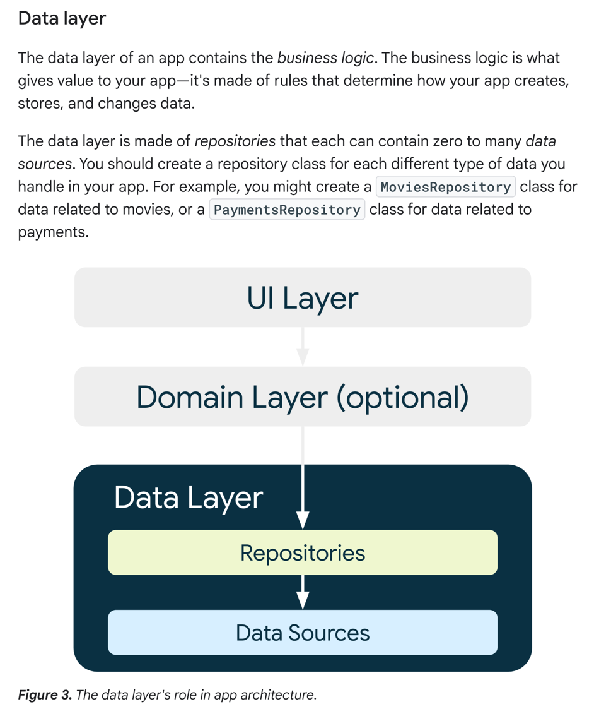
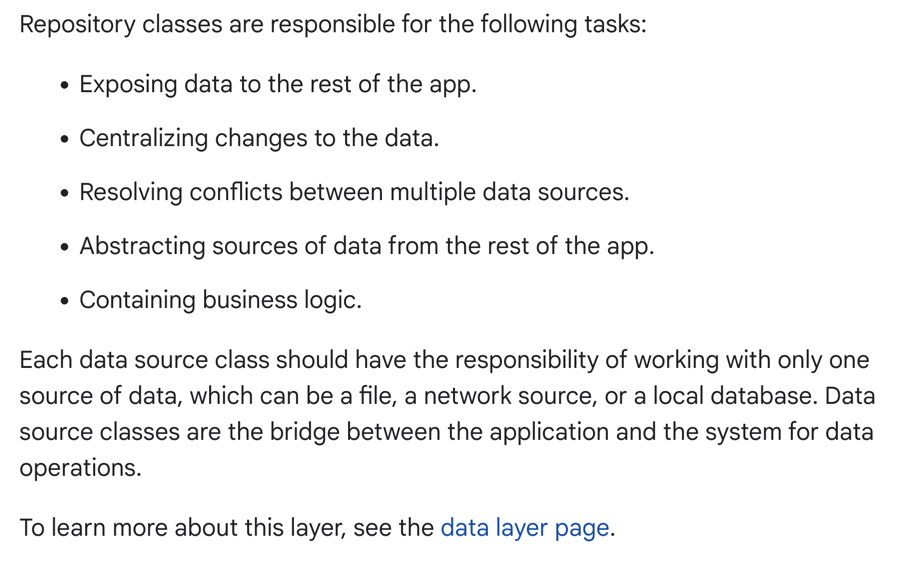

## やること

DB, API 通信時の一般的なコードをまとめておけばおけ。





```text
アプリのデータレイヤーにはビジネスロジックが含まれます。ビジネスロジックはアプリに価値を与えるもので、アプリがどのようにデータを作成、保存、変更するかを決定するルールで構成されています。

データレイヤーはリポジトリで構成され、それぞれがゼロから多数のデータソースを含むことができます。アプリで扱うデータの種類ごとにリポジトリクラスを作成する必要があります。例えば、映画に関するデータにはMoviesRepositoryクラスを、支払いに関するデータにはPaymentsRepositoryクラスを作成します。

リポジトリ・クラスは以下のタスクを担当する：

アプリの残りの部分にデータを公開する。
データの変更を一元管理する。
複数のデータソース間の競合を解決する。
アプリの残りの部分からデータソースを抽象化する。
ビジネス・ロジックを含む。
各データ・ソース・クラスは、ファイル、ネットワーク・ソース、ローカル・データベースのいずれか1つのデータ・ソースのみを扱う責任を持つ必要があります。データ・ソース・クラスは、アプリケーションとシステム間のデータ操作の橋渡しをします。

このレイヤーの詳細については、データレイヤーのページを参照してください。
```