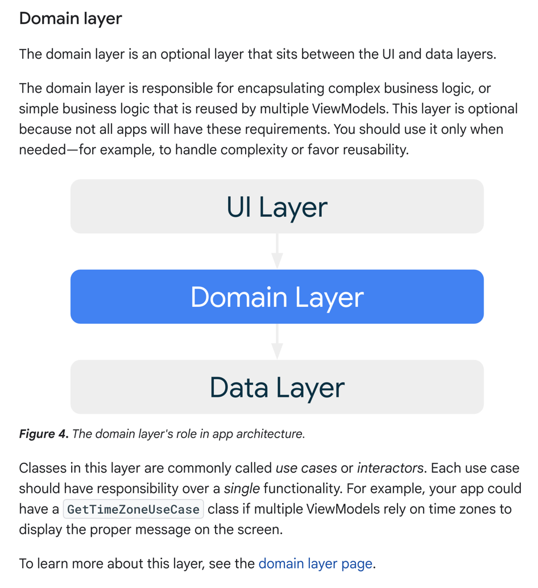

## やること

複数のViewModel に共通して存在するような処理を切り分けるためにある layer.
UseCase みたいなディレクトリで管理されがちだった気がする。



```text
ドメインレイヤー
ドメインレイヤーは、UIレイヤーとデータレイヤーの間に位置するオプションレイヤーである。

ドメインレイヤーは、複雑なビジネスロジックや、複数のViewModelで再利用される単純なビジネスロジックのカプセル化を担当します。
すべてのアプリにこのような要件があるわけではないので、このレイヤーはオプションです。例えば、複雑さを処理する場合や、再利用性を高める場合などです。

このレイヤーのクラスは一般的にユースケースまたはインタラクターと呼ばれる。各ユースケースは、単一の機能に責任を持つ必要があります。例えば、画面に適切なメッセージを表示するために、複数の ViewModel がタイムゾーンに依存している場合、アプリは GetTimeZoneUseCase クラスを持つことができます。

このレイヤーの詳細については、ドメインレイヤーのページを参照してください。

```