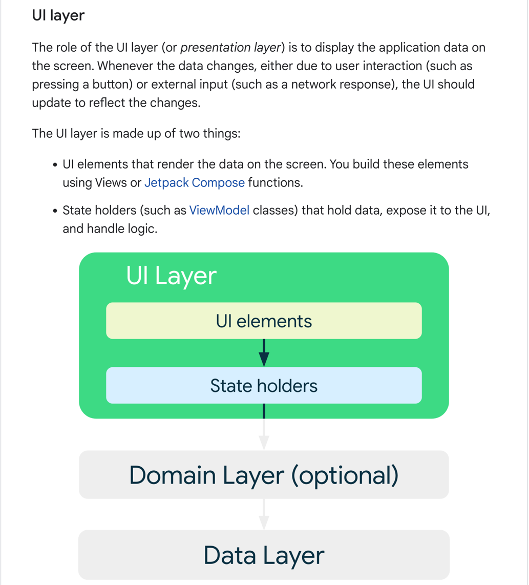

## やること

実務で実装をするにあたり、これってどうやるんだったっけ？のメモ帳
特に(頑張って対応するであろう) UI レイヤーのメモを残したい、場合によっては ViewModel も。
ViewModel ではどちらかというと Kotlin コレクションと Coroutine(Flow, MutableFlow) 周りを操作するロジックのメモが多くなる、、はず。



```text
UIレイヤー（またはプレゼンテーションレイヤー）の役割は、アプリケーションデータを画面に表示することです。ユーザーのインタラクション（ボタンを押すなど）や外部からの入力（ネットワーク応答など）によってデータが変更されるたびに、UIはその変更を反映するために更新されなければなりません。

UIレイヤーは2つのもので構成されています：

画面上にデータをレンダリングするUI要素。これらの要素は、ViewsやJetpack Compose関数を使って構築します。
データを保持し、UIに公開し、ロジックを処理するステートホルダー（ViewModelクラスなど）。


```