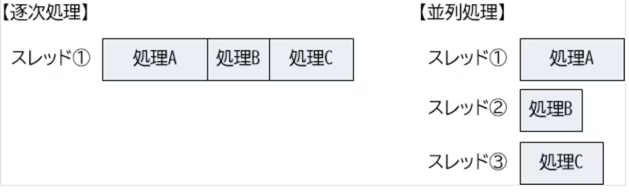
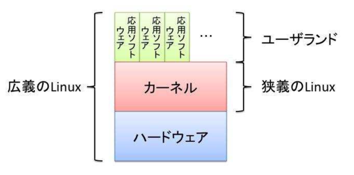

## 第一章 Linux とは

### 1.1 基本ソフトウェアと応用ソフトウェア 
コンピュータ = ハードウェア + ソフトウェア
ハードウェア = 筐体(Play Station, Switch)
ソフトウェア = 筐体で動くプログラム(ゲームソフト)

ソフトウェア = 基本ソフトウェア + 応用ソフトウェア
基本ソフトウェア = OS
応用ソフトウェア = OS 上で動作するアプリケーション

#### 1.1.1 基本ソフトウェア(OS)の役割
- 応用ソフトウェアが動作する際に必要な部品の提供
- ハードウェア(資源)の管理
  - スレッドの管理も含む
  - 

つまり、OS は各アプリケーションが共通して使用する部品(メソッド)と、部品を使用するときの順序やタイミング(スレッドと読み替えて良い)を管理する。

### 1.2 UNIX
Unix 誕生の説明

#### 1.2.1 UNIX の誕生
1960年に誕生
ベル研究所でつくってた MULTICS OS 開発プロジェクトが、高機能かつ多機能だったため頓挫
この OS を Ken Thompson 氏が自分の作ったプログラムに取り入れたのが UNIX の原型
当時はフリーだった

#### 1.2.2 さまざまな分離・統合
UNIX はフリーだったので、メンテナーが自由に改造しちゃった。。
その結果、ユニークなUNIXが誕生してまとまらなくなっちゃった
そのため、AT&T がライセンス契約をするようになって管理し始めた
んで、ライセンス契約結んだ組織が自社で作った OS を UNIX と宣言できるようになった
反対に、契約結んでない組織が出した OS は UNIX 互換 OS って呼ぶよ

#### 1.2.3 派生 UNIX
こうして互換性 OS も含め、色々な UNIX が広がっていった
その中で特筆すべきがバークレー版 UNIX だった
バークレー版 UNIX は、UNIX の開発者である Ken Thompson 氏がカリフォルニア大学バークレー校にいたときに作成した派生 OS
最大の特徴として、当時アメリカ軍内部の通信方式として採用された、IP(インターネット プロトコル) の実装が行われた
UNIX がインターネットに強いと言われている のはこの経緯によるもの

#### 1.2.4 Linux の誕生
Linus Torvalds が UNIX っぽい OS 作ったよ
それが Linux になったよん
特徴的なところはライセンスだよ
Linux のプログラムには GPL というライセンス形式が採用されてるよ、この形式の特徴は以下
- プログラム実行の自由
- ソース改変の自由
- 利用再配布の自由
- 改良したプログラムをリリースする権利

これのおかげで、多くのディストリビューターがついてユーザーが増えたよ
無料で自由に利用改変再配布できるライセンス体系を採用したからね

全利用者が恩恵を受けることができたよ。個人だけの手に収まらなかったよ。

### 1.3 Linux の特徴
仕組みの解説

#### 1.3.1 カーネルとユーザランド
復習: ソフトウェア = 基本ソフトウェア(OS) + 応用ソフトウェア(アプリ)

基本ソフトウェア(OS) = カーネル + ユーザランド

カーネル: OS の中核で、ハードと直接やり取りをする最も中心的な機能を受け持つ部分。カーネルはハードウェアの違いを吸収し、プログラムがどのようなハードウェア上でも同じように動作する役割がある。
ユーザーランド: OS が動作するのに必要なカーネル以外の部分のこと。ファイルシステムやファイル操作コマンド、シェルなどの基本的なソフトウェア群を指す。

#### 1.3.2 Linux を使う
Linux は基本的にコマンドで操作するよ
コマンドはユーザランドで動作するよ
Linux に X Window System, GNOME, kDE, Xfce などのデスクトップ環境を導入すれば、Windows や Mac のようにマウス入力操作ができるよ

#### 1.3.3 シェル
Linux にはシェルという対話型コマンド入力環境があるよ
シェルは入力されたコマンドを理解して実行するよ

シェル自体には以下の2つの機能があるよ
1. コマンド入力を受ける蹴ること
2. シェルスクリプトの実行
   3. シェルスクリプト: コマンド入力の自動化
   4. クーロンとかね

#### 1.3.4 ログイン
Linux は利用開始時にユーザー名とパスワードを要求するよ。
Unix 系統の Mac Book も同じだね

### 1.4 ディストリビューション
#### 1.4.1 ディストリビューションの誕生 
ダウンロードが面倒だったから、手軽にインストールできるようにしたのがディストリビューションの始まり。
Linux の有名なディストリビューターは Red Hat, Debian Project, Ubuntu を開発してる Canonical などがあるよ。
様々な団体が Linux をリリースしているよ

#### 1.4.2 パッケージ
Linux に対して追加機能を提供するものだよ
従来、応用ソフトウェア(アプリケーション)の実行を Linux 上で行うためにはソースをダウンロードして自らビルドする必要があった
めっちゃ時間かかるから、これを解決するためにディストリビューターの手によってビルドして応用ソフトウェアを簡単に導入できるようにするため、
パッケージが作られたよ

#### 1.4.3 パッケージマネージャ
応用ソフトウェア(アプリケーション)導入には複数の応用ソフトウェアやこの動作を補足するライブラリが必要な場合があるよね
依存するプログラムがさらに別のプログラムを依存していたら、それらを正しい場所に正しい順序でインストールしないといけないね

開発が盛んなプログラムはバグの修正や機能改善、セキュリティ脆弱性の修正など常に更新されてるよ
新しいプログラムをインストールするときは稼働している古いプログラムをきれいに削除してインストールしないといけないよね？
削除も手間なのよ。。。

そこで、パッケ０じを簡単にインストールしたりアップデートするパッケージマネージャっていうものが標準で用意されたよ
Linux ディストリビューションには何らかのパッケージマネージャが必ず用意されていて、インターネットに接続されていれば、
最新のパッケージ(と、依存するパッケージやライブラリ)を導入、更新することが簡単にできるよ

### 1.5 章末テスト
(1) 基本ソフトウェアとして適切なものを選びなさい。
基本ソフトウェアは OS のことなので、4

(2) 応用ソフトウェアとして適切なものを選びなさい。
応用ソフトウェアは OS 上で動作するアプリケーションのことなので、1,2

(3)Operating System の役割として適切なものを 2 つあげなさい。
カーネル + ユーザランド
カーネル: ハードウェアと直接やり取りをする最も中心的な役割をする部分
ユーザランド: カーネル以外の全て。シェル、ファイル操作、ファイル群等を指す
  シェル: 対話型コマンド入力環境 (= bash, zash)

(4)Linux について正しく述べているものを選びなさい。
3. Linux はカーネルとユーザランドによって成り立つ。

(5) パッケージを使って応用ソフトウェアを導入する利点を説明しなさい。
パッケージマネージャを使うことができる
元のパッケージを削除を簡単にし、依存関係のあるパッケージ、ライブラリを適切な場所に導入できる