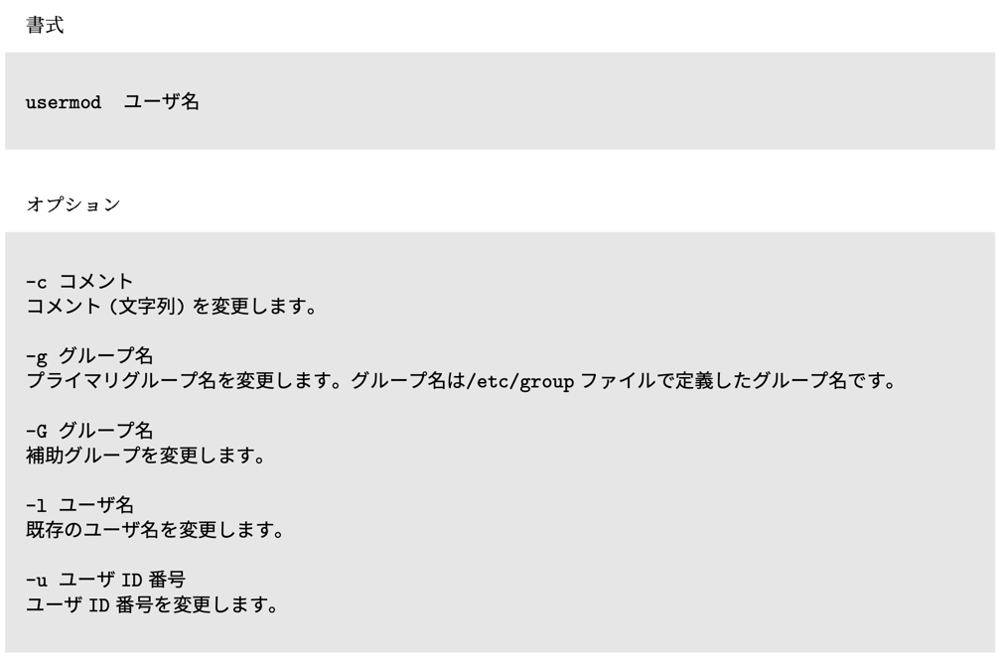
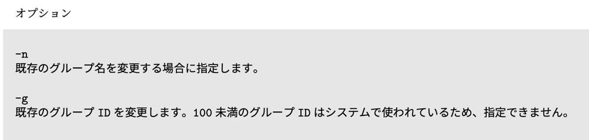
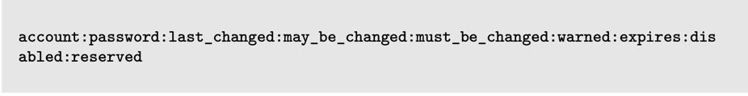
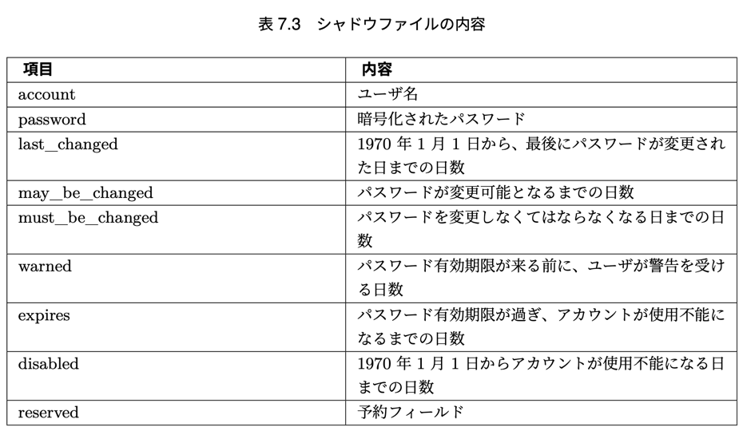

# 第一章 Linux とは

## 1.1 基本ソフトウェアと応用ソフトウェア 
コンピュータ = ハードウェア + ソフトウェア
ハードウェア = 筐体(Play Station, Switch)
ソフトウェア = 筐体で動くプログラム(ゲームソフト)

ソフトウェア = 基本ソフトウェア + 応用ソフトウェア
基本ソフトウェア = OS
応用ソフトウェア = OS 上で動作するアプリケーション

### 1.1.1 基本ソフトウェア(OS)の役割
- 応用ソフトウェアが動作する際に必要な部品の提供
- ハードウェア(資源)の管理
  - スレッドの管理も含む
  - 

つまり、OS は各アプリケーションが共通して使用する部品(メソッド)と、部品を使用するときの順序やタイミング(スレッドと読み替えて良い)を管理する。

## 1.2 UNIX
Unix 誕生の説明

### 1.2.1 UNIX の誕生
1960年に誕生
ベル研究所でつくってた MULTICS OS 開発プロジェクトが、高機能かつ多機能だったため頓挫
この OS を Ken Thompson 氏が自分の作ったプログラムに取り入れたのが UNIX の原型
当時はフリーだった

### 1.2.2 さまざまな分離・統合
UNIX はフリーだったので、メンテナーが自由に改造しちゃった。。
その結果、ユニークなUNIXが誕生してまとまらなくなっちゃった
そのため、AT&T がライセンス契約をするようになって管理し始めた
んで、ライセンス契約結んだ組織が自社で作った OS を UNIX と宣言できるようになった
反対に、契約結んでない組織が出した OS は UNIX 互換 OS って呼ぶよ

### 1.2.3 派生 UNIX
こうして互換性 OS も含め、色々な UNIX が広がっていった
その中で特筆すべきがバークレー版 UNIX だった
バークレー版 UNIX は、UNIX の開発者である Ken Thompson 氏がカリフォルニア大学バークレー校にいたときに作成した派生 OS
最大の特徴として、当時アメリカ軍内部の通信方式として採用された、IP(インターネット プロトコル) の実装が行われた
UNIX がインターネットに強いと言われている のはこの経緯によるもの

### 1.2.4 Linux の誕生
Linus Torvalds が UNIX っぽい OS 作ったよ
それが Linux になったよん
特徴的なところはライセンスだよ
Linux のプログラムには GPL というライセンス形式が採用されてるよ、この形式の特徴は以下
- プログラム実行の自由
- ソース改変の自由
- 利用再配布の自由
- 改良したプログラムをリリースする権利

これのおかげで、多くのディストリビューターがついてユーザーが増えたよ
無料で自由に利用改変再配布できるライセンス体系を採用したからね

全利用者が恩恵を受けることができたよ。個人だけの手に収まらなかったよ。


## 1.3 Linux の特徴
仕組みの解説

### 1.3.1 カーネルとユーザランド
復習: ソフトウェア = 基本ソフトウェア(OS) + 応用ソフトウェア(アプリ)

基本ソフトウェア(OS) = カーネル + ユーザランド

カーネル: OS の中核で、ハードと直接やり取りをする最も中心的な機能を受け持つ部分。カーネルはハードウェアの違いを吸収し、プログラムがどのようなハードウェア上でも同じように動作する役割がある。
ユーザーランド: OS が動作するのに必要なカーネル以外の部分のこと。ファイルシステムやファイル操作コマンド、シェルなどの基本的なソフトウェア群を指す。

### 1.3.2 Linux を使う
Linux は基本的にコマンドで操作するよ
コマンドはユーザランドで動作するよ
Linux に X Window System, GNOME, kDE, Xfce などのデスクトップ環境を導入すれば、Windows や Mac のようにマウス入力操作ができるよ


### 1.3.3 シェル
Linux にはシェルという対話型コマンド入力環境があるよ
シェルは入力されたコマンドを理解して実行するよ

シェル自体には以下の2つの機能があるよ
1. コマンド入力を受ける蹴ること
2. シェルスクリプトの実行
   3. シェルスクリプト: コマンド入力の自動化
   4. クーロンとかね

### 1.3.4 ログイン
Linux は利用開始時にユーザー名とパスワードを要求するよ。
Unix 系統の Mac Book も同じだね

## 1.4 ディストリビューション
### 1.4.1 ディストリビューションの誕生 
ダウンロードが面倒だったから、手軽にインストールできるようにしたのがディストリビューションの始まり。
Linux の有名なディストリビューターは Red Hat, Debian Project, Ubuntu を開発してる Canonical などがあるよ。
様々な団体が Linux をリリースしているよ

### 1.4.2 パッケージ
Linux に対して追加機能を提供するものだよ
従来、応用ソフトウェア(アプリケーション)の実行を Linux 上で行うためにはソースをダウンロードして自らビルドする必要があった
めっちゃ時間かかるから、これを解決するためにディストリビューターの手によってビルドして応用ソフトウェアを簡単に導入できるようにするため、
パッケージが作られたよ

### 1.4.3 パッケージマネージャ
応用ソフトウェア(アプリケーション)導入には複数の応用ソフトウェアやこの動作を補足するライブラリが必要な場合があるよね
依存するプログラムがさらに別のプログラムを依存していたら、それらを正しい場所に正しい順序でインストールしないといけないね

開発が盛んなプログラムはバグの修正や機能改善、セキュリティ脆弱性の修正など常に更新されてるよ
新しいプログラムをインストールするときは稼働している古いプログラムをきれいに削除してインストールしないといけないよね？
削除も手間なのよ。。。

そこで、パッケ０じを簡単にインストールしたりアップデートするパッケージマネージャっていうものが標準で用意されたよ
Linux ディストリビューションには何らかのパッケージマネージャが必ず用意されていて、インターネットに接続されていれば、
最新のパッケージ(と、依存するパッケージやライブラリ)を導入、更新することが簡単にできるよ

## 1.5 章末テスト
(1) 基本ソフトウェアとして適切なものを選びなさい。
基本ソフトウェアは OS のことなので、4

(2) 応用ソフトウェアとして適切なものを選びなさい。
応用ソフトウェアは OS 上で動作するアプリケーションのことなので、1,2

(3)Operating System の役割として適切なものを 2 つあげなさい。
カーネル + ユーザランド
カーネル: ハードウェアと直接やり取りをする最も中心的な役割をする部分
ユーザランド: カーネル以外の全て。シェル、ファイル操作、ファイル群等を指す
  シェル: 対話型コマンド入力環境 (= bash, zash)

(4)Linux について正しく述べているものを選びなさい。
3. Linux はカーネルとユーザランドによって成り立つ。

(5) パッケージを使って応用ソフトウェアを導入する利点を説明しなさい。
パッケージマネージャを使うことができる
元のパッケージを削除を簡単にし、依存関係のあるパッケージ、ライブラリを適切な場所に導入できる

# 第2章 Linux のインストール
CentOS のインストールと、コマンド実行の設定
Mac が Unix 系で CentOS もそうなので、Mac でよくね？

## 2.1 実習で利用するハードウェア
読み飛ばして良い。

## 2.2 利用する Linux のディストリビューション 
本教科書では、CentOS のバージョン 7.3、x86_64 版 (以降 CentOS) を利用
CentOS: Red Hat Enterprise Linux の互換ディストリビューションとして提供されている


### 2.2.1 インストール DVD の入手方法
いいやこれは

### 2.2.2 バージョン
本教科書では、本教科書の作成時点で最新であった CentOS を利用した手順について解説しています。
より新しいバージョンの CentOS がリリースされていたら、新しいバージョンを使って実習 にあたってください。

はいはい。

### 2.3 インストールの前に用意するもの
飛ばし。

## 2.4 インストールの開始
飛ばし。

## 2.5 インストール直後の初期設定
飛ばし。

## 2.6 ログインする
飛ばし。

## 2.7 コマンドの実行
飛ばし。


これでええやん。

# 第3章 基本的なコマンド
Linux はコマンドで操作するよ〜
ファイルとディレクトリの基本的な考えと基本コマンドを学習するよ

## 3.1 ファイル操作
ファイル操作を基本としたコマンドによる操作を学ぶ

### 3.1.1 ファイルとディレクトリ
飛ばし。

### 3.1.2 ファイルやディレクトリの参照 (ls)


ls検索(*)


ls検索(文字数わかってる場合)


具体例


`ls -l`
権限付きでわかるよんってやつだね、知ってるよ

### 3.1.3 ドットファイルの表示


隠しファイルと権限表示のコマンドね

### 3.1.4 オプションの同時指定と順序


まとめなくていいってさ
なんていうか、うん、実装のイメージは湧くよねと
コマンドを解釈する実装で input を線形に for でもぶん回して、inputOptions.equal("-l") みたいな感じでやってんだろ

`ls -lt`


### 3.1.5 ファイルのコピー (cp)


オプション


### 3.1.6 ファイルの移動 (mv)


オプション


### 3.1.7 ファイルの削除 (rm)
`rm -rf *` やらないでね


## 3.2 ディレクトリの操作(pwd,cd,mkdir,rmdir) 
基本操作なのでパッと見るだけでいいや

### 3.2.1 現在のディレクトリの表示 (pwd)


### 3.2.2 ディレクトリの変更 (cd)


### 3.2.3 ディレクトリの作成 (mkdir)


pオプション初めて知ったかも

### 3.2.4 ディレクトリの削除 (rmdir)


`rmdir の特徴は、「中が空であるときのみ」ディレクトリを削除できること`なので、基本 rm -r 使ったほうがいい
けど、必須ディレクトリをミスって消さなくなるのでいいね

### 3.2.5 特別なディレクトリ
パスの話に繋がるね


### 3.2.6 絶対 (パス) 指定と相対 (パス) 指定
相対パス
絶対パス


## 3.3 ファイルの内容を表示
ファイル内容を表示するコマンド

### 3.3.1 ファイルの内容を表示 (cat)


### 3.3.2 ページャを使った表示


代表的なページャとしては more や less


今日日、エディタが良さすぎて使わないけどな

## 3.4 ファイルの検索 (find)


## 3.5 コマンドのパス
コマンドの実体はプログラムです。プログラムもファイルの一種であり、/bin や/sbin といった
プログラム用のディレクトリに配置されています。

ですよね。

### 3.5.1 コマンドのパスの表示 (which)
コマンドの path を確認したい時


## 3.6 ヘルプの使い方


そうね。

## 3.7 マニュアルの使い方
オンラインマニュアルもあるよ


これは知らんかったね。なるほど。

### 3.7.1 セクション
ls のマニュアルで、「LS(1) 」という記述があります。
これは、ls のマニュアルがセクション 1 に ある、という意味です。
マニュアルのセクションとは、マニュアルの内容を分野毎に分け、その分 野を指定したものです。
セクションには番号がついており、以下の表のようになっています。


ふーん。

## 3.8 章末テスト
飛ばし。

# 第4章 正規表現とパイプ
Linux を理解するために、重要な知識がこの正規表現とパイプ
正規表現敬遠してたけどやるか

## 4.1 標準入出力

全ての基礎

## 4.2 リダイレクト
コンソールに標準出力された文字列はリダイレクトを使ってファイルに書き込むことができる
リダイレクトは>を使って表す

### 4.2.1 出力のリダイレクト
```shell
>: リダイレクト
>>: アペンド
```


ls-output ファイルに ls 出力結果を書き込む

### 4.2.2 cat コマンドによるファイル作成


こんな感じやな


## 4.3 標準エラー出力
コマンド実行時のエラーを出力しようねってやつ


```shell

$ ls -l tekitou > ls-l-output
(tekitou というディレクトリ内の詳細出力を ls-l-output にリダイレクト)
ls: cannot access tekitou: そのようなファイルやディレクトリはありません (tekitou というディレクトリが見つからなかったというエラーメッセージ)
```
**しかし、tekitou というディレクトリが存在しなかった場合**、リダイレクトを用いて任意のファイ ルにファイル出力することもできます。


```shell
$ ls -l tekitou > ls-l-output-second 2>&1
```
標準出力とエラー出力(`2>&1`)を ls-l-output-second にリダイレクト(`>`)

## 4.4 パイプ
標準流力からデータ入れて特別な処理ができるコマンド例


コマンドA成功時に出力された結果に対してコマンドBを実行するってやつね

## 4.5 grep コマンド
- ファイルの中からデータを検索
- | grep とすることで、標準入力 から入ったデータに対し検索を行なうことも可能
知ってる。
- 検索条件として、正規表現が用いられる
- 正規表現は、grep のみならず Linux で用いられるパターンマッチや、多くのプログラミング言語でも利用されている、非常に重要な機能
そうだね。

### 4.5.1 正規表現


### 4.5.2 さまざまな条件を用いた grep コマンドの実行 
オプションの話


### 4.5.3 標準出力にマッチさせる


$ は vim の末尾移動と同じような感じかな

## 4.6 章末テスト
飛ばし

# 第5章 基本的なコマンド 2


知ってるからいいや

# 第6章 vi エディタ


ほぼ知ってるからいいや、学生の時にやったけど実務で使うこれ？

# 第7章 管理者の仕事
ここ曖昧なままきたからやるか

## 7.1 グループとユーザ
- Linux を利用するにはユーザアカウントが必要
- グループを使えば複数のユーザを束ねることができる
- グループとユーザを適切に設定することで、ファイルやディレクトリ、任意のプログラムやシェル スクリプトなどを必要なユーザにのみ参照・編集する権限や実行する権限与えられる
- グループとユーザを作成・変更・削除するコマンドは管理コマンドなので、管理者である root ユーザで実行する
- 間違えて一般ユーザで実行しようとしても何も起こらないか、 エラーが表示されて正常に処理を行なえない
- 本教科書の実行例で冒頭が$になっているものはユーザ権限でも実行可能ですが、#になっている コマンドは root 権限で実行する必要がある
- root ユーザになるコマンドについては、この章で後述
  - su, sudo だろ

### 7.1.1 ユーザ
- メモリやファイルなどのさまざまな資源を利用するためにユーザという最小単位で権限を定義できる
- インストール時から用意されているユーザに加え、システム管理者が必要に応じてユーザを 定義できる
- ユーザの定義は/etc/passwd ファイルに記述
  - Linux では/etc/passwd ファ イルをエディタで直接編集する代わりに、useradd コマンドで新しいユーザを追加し、
  - usermod コ マンドでユーザの定義を変更し、
  - userdel コマンドでユーザを削除することが推奨

### 7.1.2 ユーザの作成
- 新しくユーザを作成するには useradd コマンド
- ユーザには数字であるユーザ ID を 割り振る
- ユーザは必ずグループに所属
- 作成したユーザをログインユーザとして使用 する場合は、後述する passwd コマンドにてパスワードを登録する必要がある


### 7.1.3 ユーザアカウントの変更
- ユーザのアカウントを変更するには usermod コマンド




### 7.1.4 ユーザの削除
- ユーザを削除するには userdel コマンド


### 7.1.5 グループ
- 複数のユーザの権限をまとめて扱うためにグループを使う
- ユーザは必ず 1 つ以上のグルー プに所属していて、主に所属するグループをプライマリグループと呼ぶ
- 最初から用意されて いるグループに加え、システム管理者が必要に応じてグループを定義できる
- グループの定義 は/etc/group ファイルに記述
- Linux では/etc/group ファイルをエディタで直接編集する 代わりに、groupadd コマンドで新しいグループを追加し、groupmod コマンドでグループの定義を 変更し、groupdel コマンドでグループを削除することが推奨 (また出てきたね)

### 7.1.6 グループの作成
- 新しくグループを作成するには groupadd コマンド


### 7.1.7 グループの登録情報の変更
- グループの定義を変更するには groupmod コマンド
- 
- 

### 7.1.8 グループを削除
- グループを削除するには groupdel コマンド
- groupdel コマンドでは登録されているグループの情報を削除し、ユーザが所属していないグループのみ削除できる
  - rm ではなくて、rmdir ってことだね
- 


## 7.2 パスワードとパスワードファイル
- グループの定義は/etc/group ファイル (グループファイル)
- ユーザの定義は/etc/passwd ファ イル (パスワードファイル)
- ユーザを利用するにはパスワードが必要で、パス ワードは/etc/shadow ファイル (シャドウファイル) に暗号化されて記録される
- パスワードの変 更は passwd コマンドを使っておこなう

### 7.2.1 パスワードファイル (/etc/passwd)
- ユーザの情報は/etc/passwd ファイル (パスワードファイル) に保存される
- 1 行に 1 ユーザの情報 を:で区切って記述する
- パスワードファイルに登録された 1 ユーザの内容 (1 行) は次の様になる
  - 
  - `※ GECOS = General Electric Comprehensive Operating System`
- 

### 7.2.2 グループファイル (/etc/group)
- グループの情報は/etc/group ファイル (グループファイル) に保存され、1 行に 1 グループの情報 を:で区切って記述する
- 
- グループファイルはエディタで直接編集するべきではなく、groupadd コマンドなどのコマ ンドを使って操作することが推奨


### 7.2.3 パスワード
- ユーザの権限を使うにはユーザ名とパスワードを使って認証する
- ユーザのパスワードを登録・変更するには passwd コマンドがあるが、パスワードの登録にはパスワードが必要なので、初めてパスワードを変換するのはシステム管理のための root ユーザ (スーバーユーザ) である必要がある
- 


### 7.2.4 シャドウファイル (/etc/shadow)
- ユーザのパスワードはパスワードファイルではなく、シャドウファイル (/etc/shadow) に保存される
- シャドウファイルに登録された 1 つのユーザ (1 行) の内容は次の様
  - 
  - 

## 7.3 用意されているユーザとグループ
- Linux はインストールしてすぐにそのシステムを利用できるように、ユーザとそのユーザが所属するグループが用意されている (でしょうね)

### 7.3.1 一般のユーザとグループ
- Linux にログインするにはアカウントが必要
- アカウントを作成するとユーザ名と同様の名 前のグループが作られ、ユーザはそのユーザグループに所属しているとシステムに登録される
- グループは複数のユーザをまとめるためにある
- 個別のユーザを所属部署などの単位でグ ループ化することができる
- グループを使うことでシステム上にあるディレクトリのアクセス権 を設定し、特定のグループに属したユーザのみアクセスできるディレクトリを作成するといった使い方や、
- 特定グループに属しているユーザのみ後述の root ユーザになることができるような運用が可能

### 7.3.2 root ユーザ
- root ユーザはシステム設定の変更や、プログラムのインストールや削除、ユーザを作成・削除す る事ができる、利用に制限がない特別なユーザ
- root ユーザはアクセス権に関係なくすべての ユーザのディレクトリへのアクセス、コンテンツの読み書きが行なえるなどの点で一般ユーザと異なる

### 7.3.3 su コマンド
- su コマンドはすでに別のユーザでログインしているユーザが、一時的に他のユーザになるための コマンド
- su コマンドを実行する際、オプションとしてユーザを指定しない場合は root ユーザ でシェルを起動
- オプションを付けずに su コマンドを実行した場合はカレントディレクトリを変更せずに root ユーザでログイン
- カレントディレクトリを root のホームディレクトリに変更してログイ ンするには「su -」、もしくは「su - root」と実行することでカレントディレクトリを変更した上で root ユーザでログインできる
- root ユーザでログインすると、システム管理用のコマンドを実行することができる
- 複数人で Linux システムを管理している場合は、root ユーザで直接ログインして作業をすると、root ユー ザとしての履歴だけが残り、誰がどんな作業をしたのかの履歴が残らない
- 一般ユーザから root ユーザへ切り替えると、root ユーザで作業を開始した時間などは直ぐにわかる
- 安全や管理を 考えると、一般のユーザでログインしてから root ユーザの権限を取得し、システム作業することが 望ましい

### 7.3.4 root ユーザでコマンドを実行する sudo コマンド 
- sudo コマンドを使えば、スーパーユーザ(root)権限でコマンドを実行できる
- 普段作業する ときはユーザ権限で行ない、必要に応じて sudo を使いコマンドを実行することで、su コマンドで ユーザを root に切り替えることなく、root 権限が必要な設定やプログラムを実行することができる。
- -u オプションを付けて sudo コマンドを実行すると、任意のユーザでコマンドを実行できる
- オプションを付けないで sudo コマンドを実行した場合は root 権限でコマンドを実行
  - CentOS では初期設定のままでは sudo コマンドは利用できません。sudo コマンドを使うには ユーザを wheel グループというスーパーユーザ(root)特権を持つグループに登録する必要がある


# 7.4 章末テスト
飛ばし

# 8章　ユーザ権限とアクセス権
ディレクトリとファイルの所有者と所有権について
chown, chmod, chgrp コマンドの説明

## 8.1 ファイルの所有者と所有グループ 
- ファイル作成者のユーザ ID とグループ ID がファイルの所有者と所有グループ 
- 所有者は chown コマンドで変更
- 所有グループは chgrp コマンドで変更

### 8.1.1 所有者の変更

⚠️ ユーザとグループを変更するには、root ユーザである必要がある


### 8.1.2 所有グループの変更


## 8.2 ファイルとアクセス権
ファイルのアクセス権は大別すると3つ
1. ファイルを所有するユーザ
2. ファイル所有グループからファイル所有者を除いたユーザ
3. その他のユーザ

### 8.2.1 ファイルに設定できるアクセス権
ls -l 打った時に出てくる rwx 混合やつ


先頭の d は ファイル種別

```text
r: ファイルの読み込みが可能
w: ファイルの書き込みが可能
x: ファイルを プログラムとして実行できるか、または、ディレクトリであればディレクトリへ移動できる
```

### 8.2.2 ファイルのモード変更
chmod: ファイルのアクセス権変更


モード指定の書き方で2通りの記述方法があるよ


例
⚠️ よくわからん。10桁の権限種別を9桁に変更してるけど桁数が違うのはなぜ？
→ 多分誤植
```text
-rw-r--r--を -rw-rw-r--としたい場合 
== グループの書き込み権限を加えたい、ということらしいので
g (group) に w(書き込み権限)を加えて、g+w とすれば良い
```

```text
-rw-rw-r--を--w-rw-rw-としたい場合
== ユーザーの読み取り権限を剥奪し、その他ユーザーに書き込み権限を追加するので
u-r, o+w とすれば良い
```

こっちは桁数が同じなのでまあわかる
```text
--w-rw-rw-を--w-rwxrwx としたい場合
== グループに実行権限、その他ユーザーにも実行権限を与えたいので
go+ w とすれば良い
```

まとめ
```text
u = User
g = Group
o = Otherwise

権限付与したいときは + , 権限剥奪したい時は - の加算で表現する
何かの権限を同時に付与したい、剥奪したい場合は ugo+r, ug -w, などで表現できる
```

実行例


8進数で権限設定する方法
この辺がデフォっぽいので見ておく、数字の変換までは今はいいかな。。

1. -rw-rw-r--としたい場合は 8 進数の 664 
2. --w-rw-rw-としたい場合は 8 進数の 266 
3. --w-rwxrwx としたい場合は 8 進数の 277 
を指定


setuid, sticky ら辺は一旦飛ばし

### 8.2.3 ファイル作成のモード
touch とかでファイル作ると、デフォのパーミッションは 644 or 664


実際に touch して権限確認したけど 644 だったのでその通り


権限はこの↑を足し合わせればおk

umask コマンド: 指定したパーミッションでファイルを作成するように制限できる
別に制限してファイルつくりたいモチベはないので飛ばし

## 8.3 章末テスト
飛ばし
