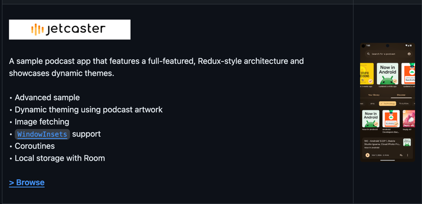

## やること
- [Jetcaster](https://github.com/android/compose-samples/tree/main/Jetcaster) を読んで Compose の UI 周りの知見を貯める

## 詳細
- 
- アーキテクチャ: Redux
- アドバンスサンプル
- podcast artwork を用いたダイナミックスィーミング
- Image Fetching
  - coil かな？
- WindowInsets support
- Coroutines
- Local storage with room