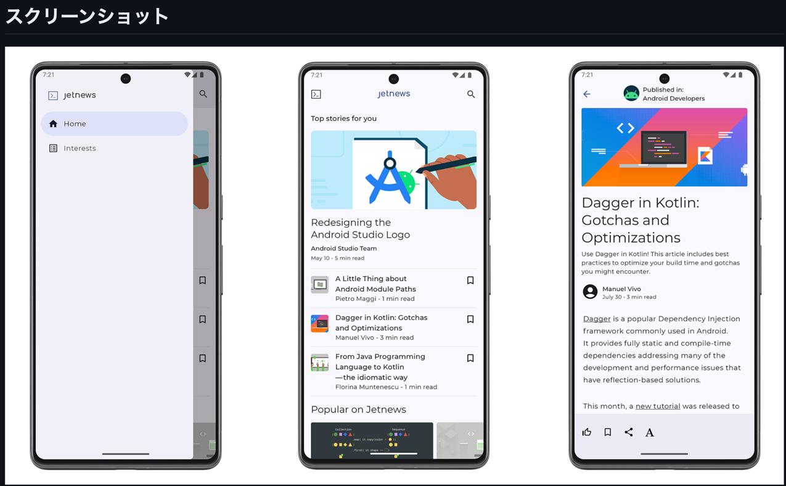

## やること
- [JetNews](https://github.com/android/compose-samples/tree/main/JetNews) を読んで Compose の UI 周りの知見を貯める

## 概要
• Medium complexity
• Varied UI
• Light & dark themes
• Resource loading
• UI Testing

## 詳細
- 
- 画面数は3つのみ

## Features
- 記事のリスト、記事の詳細ページ、興味のあるトピックを購読するページの３画面
- 記事のリストから興味のある画面へのナビゲーションはナビ下針ドロワーを使っている

### App Scaffolding
- `com.example.jetnews.ui`パッケージ
  - `JetnewsApp.kt`: NavDrawerLayout で異なるスクリーンを配置する    
    - `NavDrawerLayout`: サイドメニュー(興味のあるトピック購読ページ)をにゅっと出してあげるために必要 
  - `JetnewsNavGraph.kt`: アプリのナビゲーションルートとアクションを設定する

### Main Article List
- package `com.example.jetnews.ui.home`
  - この画面では、さまざまなカスタムコンポーザブル関数を作成し、縦方向と横方向にスクロールするリストでそれらを組み合わせる方法を示している
  - UIのコンテンツを配置するために行と列を使用する 
  - ユーザーのスクロールに合わせて上昇するトップアプリバーを追加する 
  - マテリアルのタイポグラフィとColorSchemeを使用してテキストをスタイリングする 
  - カードを背景から目立たせるためにトーナルエレベーションを使用する

### Article detail
- `Package com.example.jetnews.ui.article`
  - この画面では、Text APIを掘り下げて、Typographyで定義されているものとは異なるフォントを使用する方法を示している
  - また、カスタム・アクションを備えたボトム・アプリ・バーも追加している

### Interests screen
- Package `com.example.jetnews.ui.interests`
  - この画面では、タブを使用し、選択されたタブに応じてコンテンツを切り替える方法を示す
  - また、SelectTopicButtonというカスタム・チェックボックス・ボタンがあり、ToggleableというComposable関数を使って、
  - オン／オフの動作とセマンティクスを提供し、カスタムUIを描画している
  - ボタンのUIは、部分的に低レベルプリミティブで描画され、部分的に画像をオーバーレイしている
  - Android Studio Previewでオンとオフ、明るいバージョンと暗いバージョンを視覚化する方法も参照して

### AppWidget powered by Glance
- Package com.example.jetnews.glance
  - 本パッケージでは、Glance の使用方法と、AppWidgets 用のコンポーズ・スタイル・コードの記述方法を説明する
  - 以下の How to を参考に！
    - androidx.glance:glance-material3ライブラリを使用して、GlanceThemeでカスタムカラースキームを作成し、サポートされている場合はダイナミックカラーを使用する カラースキームに合わせて画像を着色する
    - actionStartActivityを使用してクリック時にアクティビティを起動する

### Data
- サンプルのデータは静的なもので、`com.example.jetnews.data`パッケージに格納されています。

### Instrumented and Robolectric tests
- UIテストはデバイス/エミュレータ上、またはRobolectricとJVM上で実行することができる
- Instrumentedテストを実行するには、"Instrumented tests "実行コンフィギュレーションを使用するか、./gradlew connectedCheckコマンドを実行
- Robolectricでテストを実行するには、"Robolectric tests "実行コンフィギュレーションを使用するか、./gradlew testDebugコマンドを実行

## アーキテクチャ
- MVVM + Repository

## Jetnews for every screen
- 私たちは最近、大小を問わずすべてのモバイルデバイスでの動作を強化するためにJetnewsをアップデート
-  Jetnewsはすでに "従来の "モバイルスクリーンをサポートしていたので、私たちのすべての変更を "大画面のサポートを追加する "と表現したくなった
- それは事実ですが、アダプティブUIを持つことの重要性を見逃している
- 例えば、あなたのアプリがタブレット上で分割画面モードで動作している場合、実際に十分なスペースがない限り、「タブレットUI」を表示しようとしてはいけない
- これらの変更により、Jetnewsは大画面だけでなく、小さな画面でもこれまで以上に動作するようになった
- 全ての変更について説明したブログは[こちら](https://medium.com/androiddevelopers/jetnews-for-every-screen-4d8e7927752)

## 適当に動かす時のダミーアカウント

## 学んだこと