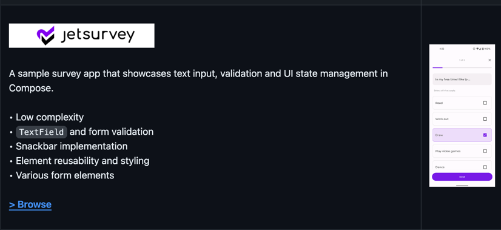
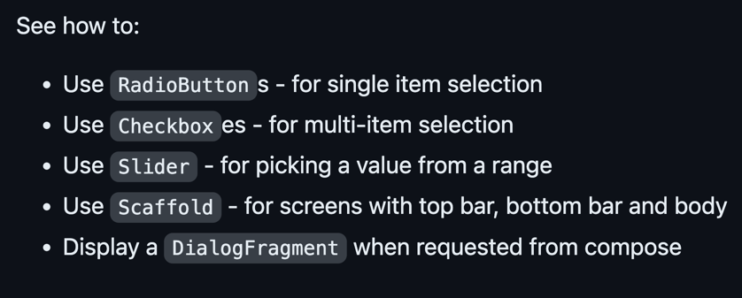

## やること
- [JetSurvey](https://github.com/android/compose-samples/tree/main/Jetsurvey) を読んで Compose の UI 周りの知見を貯める

## 概要
- 
- 低複雑性 
- テキストフィールドとフォームバリデーション 
- スナックバーの実装 
- 要素の再利用性とスタイリング 
- さまざまなフォーム要素

## Features
- このサンプルには、ユーザーがEメールを入力するウェルカム画面、サインインとサインアップ画面、アンケート画面など、いくつかの画面がある
- アプリにはライトとダークのテーマがある

### App scaffolding
- Package `com.example.compose.jetsurvey`
- `MainActivity` はアプリケーションのエントリーポイント
- 各画面は `Fragment` の中に実装され、`MainActivity` はすべての `Fragment` のホスト`Activity`
- Fragment間のナビゲーションはNavigationライブラリを使用
- スクリーンとナビゲーションはNavigation.ktで定義されている

### Sign in/sign up
- Package `com.example.compose.jetsurvey.signinsignup`
- This package contains 3 screens:
  - Welcome 
  - Sign in 
  - Sign up
- サインアップ画面に行くには、"signup "を含むEメールを入力
- これらの画面は、さまざまなカスタムコンポーザブル関数を作成し、複数の画面にわたって再利用し、UIの状態を処理する方法を示している
- `See how to:`
  - Use `TextFields`
  - `TextField` の検証を、1個の `TextField` 全体で（電子メール検証など）、 または複数の `TextField` 全体で（パスワード確認など） 実装
    - どういうこと？
  - Use Snackbar
  - Use different types of `Buttons`: `TextButton`, `OutlinedButton` and `Button`

### Complete a survey
- Package `com.example.compose.jetsurvey.survey`
- この画面では、ユーザがアンケートに回答することができ、複雑な状態を処理する方法を示している
- UI の状態は保持され、設定の変更や新しい質問が画面に表示されるなど、さまざまな理由によって再構成されたときに復元される
- 

### Data
- The data in the sample is static, held in the *Repository classes.

## アーキテクチャ
- 不明

## 適当に動かす時のダミーアカウント
- app_tagline@gmail.com
- asdfghjkl

## 学んだこと
- とりあえず Sign in 画面とアンケート画面について見た
- ディレクトリの分け方、監視するべきデータの管理が非常にわかりづらい。。easy とは書いてあるけど逆に難しい
- 画面遷移時の[アニメーション](https://github.com/android/compose-samples/pull/842)に新しく追加されたよ