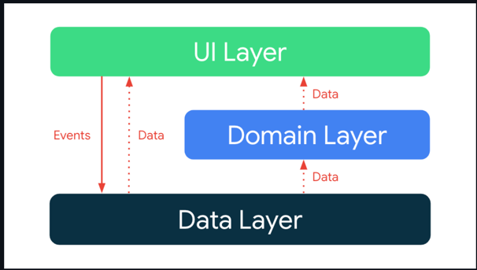
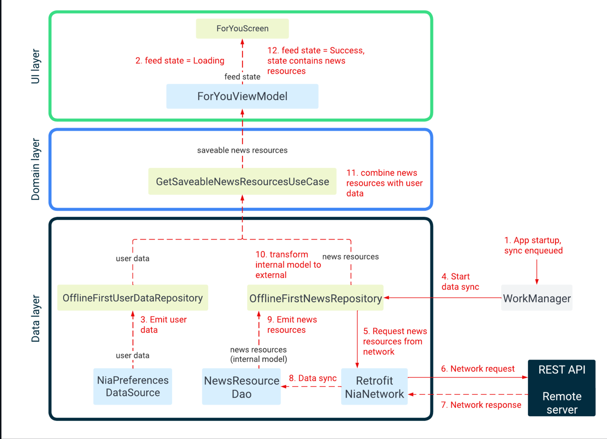
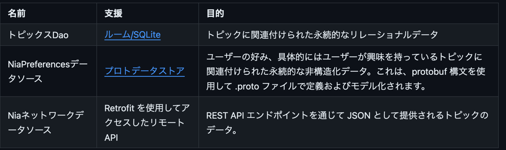
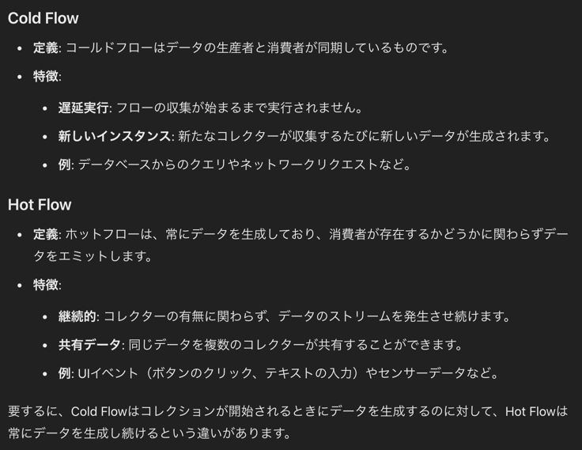

[Architecture Learning Journey](https://github.com/android/nowinandroid/blob/main/docs/ArchitectureLearningJourney.md)

- この学習の過程では、Now in Android アプリのアーキテクチャ、つまりそのレイヤー、主要なクラス、およびそれらの間の相互作用について学習

## goals and requirements
- アプリ アーキテクチャの目標は次のとおりです
    - 公式のアーキテクチャ ガイダンスにできる限り忠実に従ってください
    - 開発者にとって理解しやすく、実験的すぎるものではありません
    - 同じコードベースで作業する複数の開発者をサポートする
    - 開発者のマシン上と継続的インテグレーション (CI) の両方で、ローカル テストとインストルメント テストを容易に実行できる
    - ビルド時間を最小限に抑える

## Architecture Overview
- アプリ アーキテクチャには、データ レイヤー、ドメイン レイヤー、UI レイヤーの3 つのレイヤーがあります。
- 
    - 上位層は下位層の変化に反応
    - イベントは下流に流れる
    - データは上へ流れる
    - わかりやすいねえ
    - データフローは Kotlin Flows を使用して実現する

## Example: show news on ForYou(Recommend) Screen
なるほどね、、図を見た感じ、2つのデータを combine して表示する、みたいな起こり得る一番面倒くさそうなやつを例にしてくれている感じやな

- アプリを初めて実行すると、リモート サーバーからニュース リソースのリストを読み込もうとします
    - (prodビルド フレーバーが選択されている場合、demoビルドはローカル データを使用します)
- 読み込まれると、ユーザーが選択した興味に基づいて、これらが表示される
- 次の図は、発生するイベントと、これを実現するために関連オブジェクトからデータがどのように流れるかを示している
- 
- 各ステップで起こっていることを説明する

1. アプリの起動時に、全てのリポジトリを同期する WorkManager ジョブがキューに入れられる
2. ForyouViewModel は GetUserNewsResourcesUseCase を呼び出し、ブックマーク/保存された状態のニュースリソースのストリームを取得する
    1. ユーザーとニュースリポジトリの両方がアイテムを発行するまで、この太リームにアイテムは発行されない
    2. 待ち状態の間、フィードの状態は Loading に設定される
3. ユーザーデータリポジトリは Proto DataStore によってバックアップされたローカルデータソースから UserData オブジェクトのストリームを取得する
4. WorkManager は同期ジョブを実行し、OfflineFirstNewsRepositoryを呼び出してリモートデータソースとのデータ同期を開始する
5. OfflineFirstNewsRepository が API リクエスト投げる
6. RetrofitNiaNetwork がネットワーク応答を受信する
7. OfflineFirstNewsRepositoryは、ローカルRoomデータベースのデータを挿入、更新、または削除することで、NewsResourceDaoとリモートデータを同期
8. NewsResourceDaoでデータが変更されると、ニュースリソースデータストリーム（Flowである）に送信される
9. OfflineFirstNewsRepositoryはこのストリームの中間演算子として機能し、入力されるPopulatedNewsResource（データレイヤー内部のデータベースモデル）を、他のレイヤーで消費されるパブリックNewsResourceモデルに変換
10. GetUsserNewsResourcesUseCaseは、ニュースリソースのリストとユーザーデータを組み合わせて、UserNewsResourcesのリストを生成
11. ForYouViewModelが保存可能なニュースリソースを受信すると、フィードの状態をSuccessに更新
    12. ForYouScreenは、保存可能なニュースリソースを使用して画面をレンダリング

## Data layer
- データレイヤーは、アプリのデータとビジネスロジックのオフラインファーストのソースとして実装される
- アプリ内のすべてのデータの真実のソースとなる
- 各リポジトリは独自のモデルを持っている
  - TopicsRepositoryにはTopicモデルがあり、NewsRepositoryにはNewsResourceモデルがある
- リポジトリは他のレイヤーのパブリックAPIであり、アプリのデータにアクセスする唯一の方法を提供する
- リポジトリは通常、データを読み書きするための1つ以上のメソッドを提供する

## Reading data
- データはデータ ストリームとして公開される
- つまり、リポジトリの各クライアントは、データの変更に対応できるように準備する必要がある
- 使用される時点でまだ有効であるという保証がないため、データはスナップショット (例getModel) として公開されない
- 読み取りは、ローカル ストレージを真のソースとして実行されるため、Repositoryインスタンスから読み取るときにエラーが発生することはない
- ただし、ローカル ストレージ内のデータをリモート ソースと調整しようとすると、エラーが発生する可能性がある
- エラー調整の詳細については、以下のデータ同期セクションを確認して

### 例: トピックのリストを読む
 - トピックのリストは、TopicsRepository::getTopicsを発行するフローをサブスクライブすることで取得できる
 - トピックのリストが変更されるたびに (たとえば、新しいトピックが追加されたときなど)、更新された内容List<Topic>がストリームに送信される

## Write data
- データを書き込むために、リポジトリは suspend 関数を提供
- その実行が適切なスコープ内にあることを確認するのは呼び出し側の責任
  - コルーチンディスパッチャの話かな

### 例: トピックをフォローする
- `UserDataRepository.toggleFollowedTopicId`に、ユーザーがフォローしたいトピックのIDと、そのトピックをフォローすることを示すfollowed=trueを指定して呼び出すだけ

## Data sources
- リポジトリは、1 つ以上のデータ・ソースに依存する場合がある
  - たとえば、OfflineFirstTopicsRepository は以下のデータソースに依存
  - 

## Data synchronization
- リポジトリは、ローカル・ストレージ内のデータとリモート・ソースを照合する役割を担っている
- データがリモート・データ・ソースから取得されると、即座にローカル・ストレージに書き込まれる
- 更新されたデータは、ローカル・ストレージ（ルーム）から関連するデータ・ストリームに出力され、リスニングしているクライアントによって受信される
- このアプローチにより、アプリの読み込みと書き込みの懸念が分離され、互いに干渉しないことが保証される

- データ同期中にエラーが発生した場合、指数バックオフ戦略が採用される
- これは、Synchronizerインターフェースの実装であるSyncWorkerを介してWorkManagerに委譲される <-- ⚠️指数バックオフ戦略と、WorkerManager についてすぐイメージがついてない。。。
- データ同期の例については、`OfflineFirstNewsRepository.syncWith`を参照

## Domain layer
- ドメイン・レイヤーにはユースケースが含まれる
- これらは、ビジネスロジックを含む単一の呼び出し可能なメソッド（operator fun invoke）を持つクラス
  - ああ、ここで operator fun が出てくるのか
- これらのユースケースは、ViewModels から重複するロジックを簡素化し、削除するために使用される --> そうだね、その通り
  - たとえば、`GetUserNewsResourcesUseCase`は、`NewsRepository` からの `NewsResources` のストリーム（Flowを使用して実装）と、UserDataRepositoryからのUserDataオブジェクトのストリームを組み合わせて、UserNewsResourcesのストリームを作成
  - このストリームは、さまざまなViewModelによって使用され、ニュースリソースをブックマークされた状態で画面に表示する

## UI Layer
- UIレイヤーは、Jetpack Compose Android ViewModelsを使用して構築されたUIエレメントで構成される
- ViewModelsは、ユースケースやリポジトリからデータのストリームを受け取り、UIステートに変換
-  UI 要素はこの状態を反映し、ユーザーがアプリと対話する方法を提供
- これらのインタラクションはイベントとして ViewModel に渡され、そこで処理される
  - UIの状態は、常に基礎となるアプリのデータを表している
  - アプリのデータが真実の源
- `feedState` は `ForYouScreen` コンポーザブルに渡され、`ForYouScreen` コンポーザブルはこれらの両方の状態を処理する

## Modeling UI state
- UIステートは、インターフェースとイミュータブル・データ・クラスを使用して、密封された階層としてモデル化される
- ステート・オブジェクトは、データ・ストリームの変換を通じてのみ発行される
- このアプローチにより、以下のことが保証される

## Transforming streams into UI state
- ViewModel は、1 つ以上のユースケースやリポジトリから、コールドフローとしてデータのストリームを受け取る
- これらを結合するか、単にマッピングして、UI ステートの単一フローを生成
- この単一のフローは、stateInを使用してホットフローに変換される
- ステート・フローへの変換により、UIエレメントはフローから最後の既知のステートを読み取ることができる
- 
- まれに忘れるのでちゃんと調べたのを貼っておく

### Example: Displaying followed topics
- InterestsViewModel は uiState を StateFlow<InterestsUiState> として公開している
- このホットフローは GetFollowableTopicsUseCase によって提供される List<FollowableTopic> のコールドフローを取得することによって作成される
- 新しいリストが発行されるたびに、それは、UIに公開されるInterestsUiState.Interests状態に変換される

## 感想
- 至って普通の API 通信処理の流れをシンプルに書いてくれている、とても助かるよねこれ