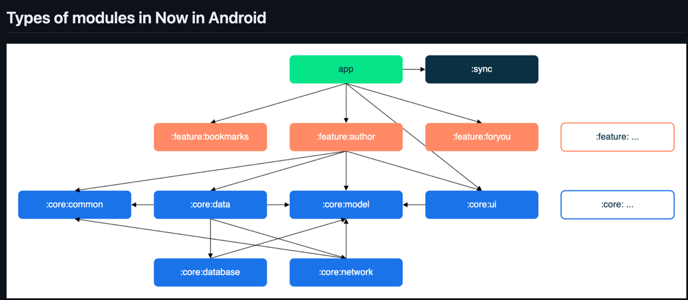
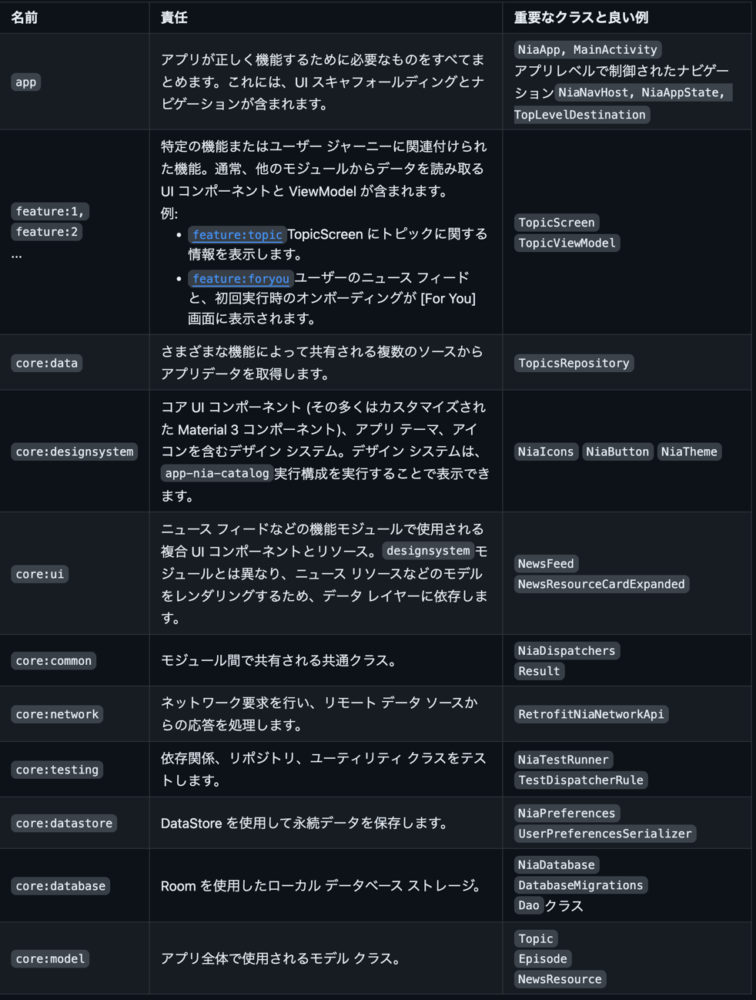

# [Modularization learning journey](https://github.com/android/nowinandroid/blob/main/docs/ModularizationLearningJourney.md)
- この学習の旅では、モジュール化について学び、Now in Androidアプリのモジュールを作成するために使用されるモジュール化戦略について学ぶ

## Overview
- モジュール化とは、モノリシックなワンモジュールのコードベースという概念を、疎結合で自己完結したモジュールに分割すること

### Benefits of modularization
- This offers many benefits, including:

- スケーラビリティ - 密接に結合されたコードベースでは、ひとつの変更が連鎖的に変更を引き起こす可能性がある
- 適切にモジュール化されたプロジェクトは、関係分離の原則を受け入れる
- その結果、アーキテクチャー・パターンを強制しながらも、貢献者により多くの自主性を与えることになる

- 並行作業の実現 - モジュール化により、バージョン管理のコンフリクトが減少し、大規模チームの開発者にとっては、より効率的な並行作業が可能になる

- オーナーシップ - モジュールには、コードとテストのメンテナンス、バグの修正、変更のレビューに責任を持つ専用のオーナーを置くことができる

- カプセル化 - 分離されたコードは、読みやすく、理解しやすく、テストしやすく、保守しやすい

- ビルド時間の短縮 - Gradleの並列ビルドとインクリメンタル・ビルドを活用することで、ビルド時間を短縮できる

- 動的配信 - モジュラライゼーションは、アプリの特定の機能を条件付きで配信したり、オンデマンドでダウンロードできるようにするPlay Feature Deliveryの要件

- 再利用性 - 適切なモジュール化により、コードを共有し、同じ基盤から異なるプラットフォーム間で複数のアプリを構築する機会が得られる

### Modularization pitfalls
- しかし、モジュール化は悪用される可能性のあるパターンであり、アプリをモジュール化する際に注意すべき点がいくつかある

- モジュールが多すぎる - 
  - 各モジュールには、ビルド構成の複雑化という形でオーバーヘッドが発生する
  - これはGradleの同期時間の増加の原因となり、継続的なメンテナンスコストが発生する
  - さらに、モジュールを追加すると、単一のモノリシックモジュールと比較して、プロジェクトのGradleセットアップの複雑さが増加する
  - これは、再利用可能でコンポーザブルなビルド設定を型安全なKotlinコードに抽出するために、規約プラグインを利用することで軽減できる
  - Now in Androidアプリでは、これらの規約プラグインは`build-logic`フォルダにある

- モジュールが足りない - 
  - 逆に、モジュールが少なく、大きく、緊密に結合していると、また新たなモノリスができてしまう。
  - これはモジュール化のメリットを失うことを意味する
  - もしあなたのモジュールが肥大化し、単一で明確に定義された目的を持っていないのであれば、そのモジュールを分割することを検討すべき

- 複雑すぎる -
  - ここに特効薬はない実際、プロジェクトをモジュール化することが常に意味を持つとは限らない
  - 支配的な要因は、コードベースのサイズと相対的な複雑さである
  - プロジェクトがある閾値を超えて成長する見込みがない場合、スケーラビリティとビルド時間の向上は適用されない

## Modularization strategy
- 重要なのは、すべてのプロジェクトに適合する単一のモジュール化戦略は存在しないということ
- しかし、モジュール化のメリットを最大化し、デメリットを最小化するための一般的なガイドラインはある

- ベアボーンモジュールは、単にGradleビルドスクリプトを含むディレクトリ
- しかし通常、モジュールは1つ以上のソースセットと、場合によってはリソースやアセットのコレクションから構成される
- モジュールは独立してビルドし、テストすることができる
-  Gradleの柔軟性により、プロジェクトをどのように構成するかについての制約はほとんどない
-  一般的には、疎結合と高凝集を目指すべき

- 低カップリング - 
  - モジュール同士は可能な限り独立しているべきで、あるモジュールへの変更が他のモジュールに与える影響はゼロか最小であるべき
  - モジュールは、他のモジュールの内部構造に関する知識を持ってはいけない
- 高い結束力 - 
  - モジュールは、システムとして機能するコードの集合体でなければならない
  - 明確に定義された責任を持ち、特定のドメイン知識の境界内にとどまるべきである
  - 例えば、Now in Androidのcore:networkモジュールは、ネットワークリクエストの作成、リモートデータソースからのレスポンスの処理、他のモジュールへのデータ供給を担当する

### Types of modules in Now in Android
- 
- トップ・ヒント: 
  - モジュール化計画時に、モジュール間の依存関係を可視化するモジュール・グラフ（上図）が役立つ
- Now in Androidアプリには、以下のタイプのモジュールが含まれている 

#### The app module
- MainActivity、NiaApp、アプリレベルで制御されたナビゲーションなど、コードベースの残りの部分をバインドするアプリレベルとスキャフォールディングクラスが含まれている
- 例えば、NiaNavHostによるナビゲーションのセットアップや、TopLevelDestinationによるボトムナビゲーションバーのセットアップが挙げられる
- アプリモジュールは、すべての機能モジュールと必要なコアモジュールに依存する

#### feature: modules
- アプリ内の1つの責任を処理するためにスコープされた、機能に特化したモジュール
- これらのモジュールは、必要なときに、テストアプリや他の風味のアプリを含むどのアプリでも再利用することができる
- あるクラスが1つのfeatureモジュールにのみ必要な場合は、そのモジュール内に残すべき
- そうでない場合は、適切なコアモジュールに抽出されるべき
- feature モジュールは他の feature モジュールと依存関係を持つべきではない
- それらが必要とするコアモジュールにのみ依存する

#### core: modules
- 補助コードと、アプリ内の他のモジュール間で共有する必要がある特定の依存関係を含む、共通のライブラリモジュール
- これらのモジュールは他のコアモジュールに依存することができますが、featureモジュールやアプリモジュールに依存すべきではない

#### Miscellaneous modules 
- シンク、ベンチマーク、テストモジュールや、app-nia-catalog - デザインシステムを素早く表示するためのカタログアプリなど

## Modules
- 上記のモジュール化戦略を使って、Now in Androidアプリには以下のモジュールがある
- 
- これを見た上で、それぞれのモジュールを眺めよ

## Modularization in Now in Android
- 私たちのモジュール化アプローチは、"Now in Android "プロジェクトのロードマップ、今後の作業や新機能を考慮して定義されました
- さらに、今回の私たちの目的は、比較的小さなアプリを過剰にモジュール化することと、この機会を利用して、より大規模なコードベースに適したモジュール化パターンを紹介することの間で、適切なバランスを見つけることでした

- このアプローチはAndroidコミュニティと議論され、彼らのフィードバックを考慮して進化してきた
- しかし、モジュール化では、1つの正解があれば他のすべてが間違っているということはない
- 結局のところ、アプリのモジュール化には多くの方法とアプローチがあり、1つのアプローチがすべての目的、コードベース、チームの好みに合うことはめったにない
- このため、事前に計画を立て、すべての目標、解決しようとしている問題、将来の作業、潜在的な足がかりを予測することを考慮に入れることが、独自の状況で最適な構造を定義するための重要なステップとなる
- 開発者は、モジュールと依存関係のグラフを描くブレーンストーミングセッションを行うことで、これをよりよく視覚化し、計画することができる

- 私たちのアプローチはそのような一例であり、すべてのケースに適用できる不変の構造であるとは思っていませんし、実際、将来的には進化し、変化する可能性もある
- これは、私たちのプロジェクトに最も適していると判断した一般的なガイドラインであり、さらに修正、拡張、構築できる一つの例として提供するものだ
- その方法のひとつが、コードベースの粒度をさらに上げることだ
- 粒度とは、コードベースをどの程度のモジュールで構成するかということだ
- データレイヤーが小さければ、1つのモジュールで十分
- しかし、リポジトリやデータソースの数が増え始めたら、別々のモジュールに分割することを検討する価値があるかもしれない
- また、私たちはいつでも建設的なフィードバックを受け付けている
- コミュニティから学び、アイデアを交換することは、私たちのガイダンスを改善するための重要な要素のひとつだ

