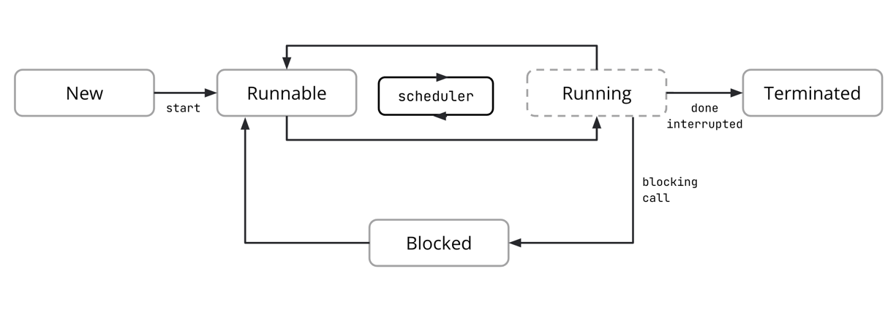
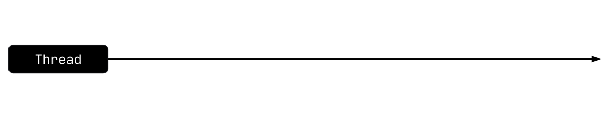
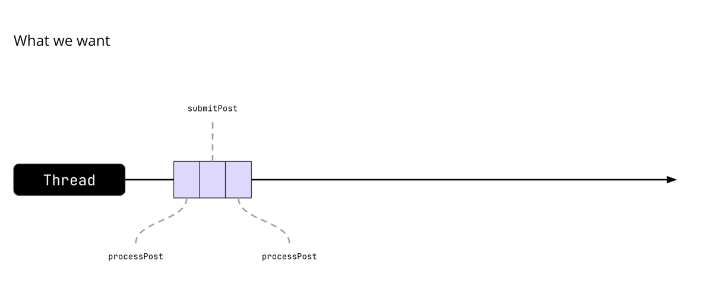
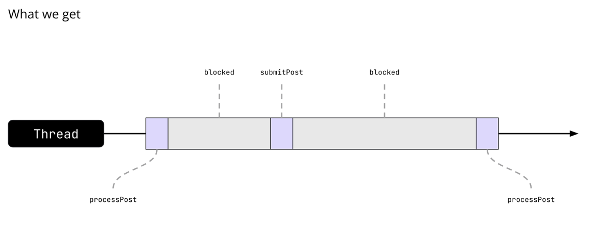
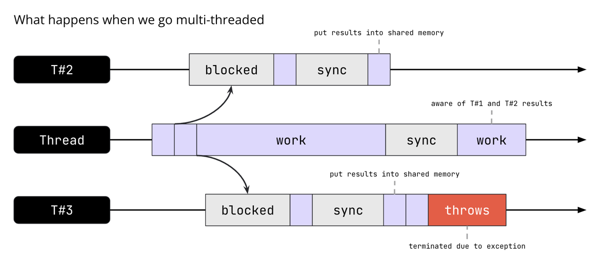
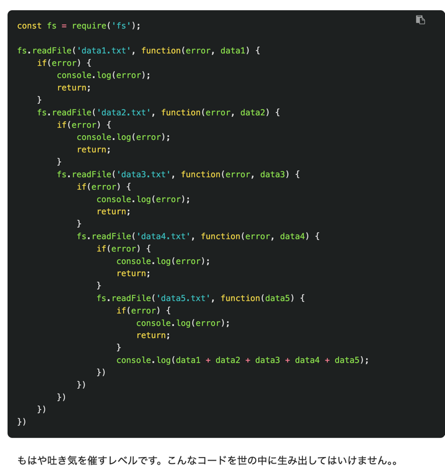
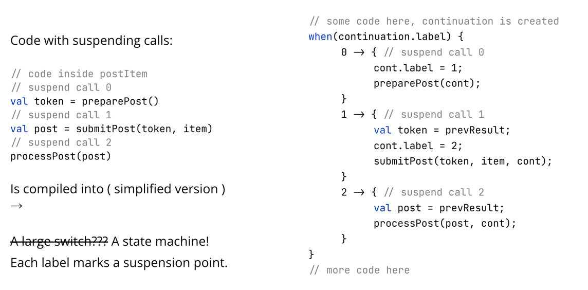

# [Asynchronous Programming in Kotlin](https://docs.google.com/presentation/d/1WT0kVeLpZ8-cS1211oXVvjPesgPgTJxIuIJHkU6-49k/edit#slide=id.p1)
coroutines の話だねえ

## What we’ll cover
- 並列プログラミングと非同期プログラミング
- コルーチンの歴史
- Kotlinのコルーチン
- CoroutineScopeの内部
- チャンネル
- その他

- この講義では、非同期プログラミングの概念について説明
- まず、並列プログラミングとの違いや、並列プログラミングの問題点を解決する方法について説明
- その後、いくつかの歴史に触れる
- その後、Kotlinにおける非同期プログラミングの実装であるKotlinコルーチンについて説明
  - Dispatcher 周りの話に関して詳しくなりたい

## Parallel programming            
- 
- Kotlinで並列プログラミングをするときのスレッドの状態を振り返ってみよう
- スレッドは、後で起動するのであればNew状態で作成できるし、Runnable状態で作成することもできる
- Runnableへの遷移は一度だけ起こる
- ある時点で、スレッドは例外によって、あるいは実行中の作業によって、あるいはスレッド内で処理中の割り込みシグナルによって、Terminated状態に遷移するかもしれない
- (割り込みシグナルが送信された場合、スレッドは終了する義務はないことを覚えておいてください。その責任は開発者にある)
- Terminatedへの移行も一度だけ行われる
- 作業中、スレッドはRunnable、Running、Blockedの間で切り替わる
- 前の講義で確立されたように、RunnableとRunningの間の遷移は開発者によって制御されるのではなく、JVMスケジューラによって制御されるため、開発者はほとんど制御できない
- そのため、開発者はこの遷移をほとんどコントロールできない
- これは、スレッドが同期プリミティブにアクセスしようとしたり、単にスリープ状態になったりするときに起こるので、開発者が完全にコントロールできる
- これは非常に重要なことで、並列アプリケーションに取り組む開発者は、共有リソースの管理方法、スレッドの同期方法、
- そしてスレッドが有用な作業を行わず、他のスレッドや外部イベントを待つためにどれだけの時間を費やすかに、多くの注意を払わなければならないことを意味する


## An example
- マルチスレッド化によって解決されることがある問題の簡単な例を見てみよう
- この例では、postItemという関数があり、ネットワーク越しにリクエストを行う他の2つの関数を呼び出しています
```kotlin
fun postItem(item: Item) {
    val token = preparePost()
    val post = submitPost(token, item)
    processPost(post)
}

fun preparePost(): Token { // requestToken
// makes a request and consequently blocks the execution thread
    return token
}
```

- このコードがシングルスレッドでどのように実行されるか
- 
- シングルスレッドのアプリケーションで、前のスライドの関数を呼び出しているとする
- 
- (最初に呼ばれている関数が　processPost になっているけれど、これは preparePost よな)
- 私たちは、スレッドが常に何か有用なことをしていて、アプリケーションのコードを間断なく実行していることを望んでいる

- 実際に起こることはこう
- 
- スレッドがネットワークリクエストを行うと、そのリクエストが完了するまで何もできないので、ある程度の時間はブロックされ、コードの実行を進めることができない
- スレッドは何もしないし、CPU時間を得ても何の命令も実行しない
- ただ応答を待つだけで、その時点でまたリクエストを行い、また待つことになる

- マルチスレッドにするとどうなるか
- 
- ここで、アプリケーションに1つのスレッドではなく3つのスレッドを使用させ、その関数を2回呼び出そうとする
- 最初の呼び出しはスレッド#2に移され、2回目の呼び出しはスレッド#3に移される
- 今、これらのスレッドはメインスレッドの代わりにブロックされ、何か有用な処理を進めることができる
- これらのスレッドが結果を得るとき、おそらく何らかの方法でメインスレッドと共有する必要がある
- そのため、メインスレッドはスレッド#2とスレッド#3の結果を得るために、ある時点でブロックされることになる

- スレッドの数が増えたので、より多くの仕事ができるようになると期待される
- その代わり、新たなブロックに直面することになり、全体の有用な作業時間は3倍には増えなかった
- さらに、たとえばスレッド#3が予期せぬ例外に遭遇した場合、メインスレッドはもはやそのスレッドに仕事を送ることができない
- スレッドを再起動するか、これらのことを管理する専用のオーケストレーター・スレッドが必要になり、有用な作業時間の割合はさらに低下する

## Asynchronous Programming

## Continuation passing style
```kotlin
fun preparePostAsync(callback: (Token) -> Unit) {
    // make request and return immediately
    // arrange callback to be invoked later
}
```
- コールバックとは、ある関数を別の関数にパラメータとして渡し、処理が完了したらその関数を呼び出すというもの
```kotlin
fun postItem(item: Item) { 
    preparePostAsync { token ->
        submitPostAsync(token, item) { post -> 
            processPost(post)
        }
    }
}
```
- 継続渡しスタイルでは、トークンを返していた関数が、トークンを引数として受け取るコールバック関数を受け入れる関数になる
- つまり、コールサイトで関数の結果を待つ代わりに、その関数に結果を渡して、その関数が終了するのを待つ代わりに作業を続ける
- 梯子 (= {})は 「コールバック地獄 」への 「天国への階段」
- エラー処理はどこにある？
- **コールバックは「本来」非同期ではない**
- このアプローチでわかりやすい最初の問題は、中括弧（{）の多さ
- コールバック地獄」でググれば、これがいかに読みづらく管理しづらいものであるかという実例が見つかるだろう
  - 
  - [コールバック地獄からの脱出](https://qiita.com/umeko2015/items/2fdb2785eac8f4117f23) より引用
  - まあやばい
- 例外処理がマルチスレッドにおける問題であることは述べた
- CPSでは、エラー処理も複雑で、より定型的なコードになる
- CPSでは、エラー処理が複雑なだけでなく、ループや単純な条件文の記述も難しいことに注意する必要がある
- 最後になるが、CPSはもともと非同期ではない
- postItemを呼び出すと、実行スレッドはpostItemが終了するまで待ってから処理を進めることになる
- コールバック関数を受け付けるようにシグネチャを変更することは、単なる構文の変更に過ぎない
- コールバックを非同期で動作させるためには、メインスレッドを占有しないように、それぞれのコールバックを何らかのエクゼキュータで起動する必要がある

## Futures, promises, and other approaches
- Promise<T> はコールバックをカプセル化する
```kotlin
fun preparePostAsync(): Promise<Token> {
    // makes request and returns a promise that is completed later
    return promise
}
```
- 非同期プログラミングのもうひとつのアプローチはプロミス
- この場合、関数はコールバックを受け入れないが、元の戻り値の型も返さない
- その代わりに、関数は結果(と言うよりは Token class)を囲むラッパーを返す
- ラッパーとは特別なクラスのことで、結果を待つか、そのクラスにコールバックを渡して、結果が出たときに呼び出されるようにする

```kotlin
fun postItem(item: Item) { 
    preparePostAsync()
		.thenCompose { token -> submitPostAsync(token, item) }
		.thenAccept { post -> processPost(post) }
		…
}
```
- このモデルは典型的なトップダウンの命令型アプローチとは異なる
- ライブラリやフレームワーク、プラットフォームによって異なるAPIがある
- 実際に必要なものの代わりにPromise<T>のリターン・タイプを採用
- それぞれのthenCompute/Accept/Handleは新しいオブジェクトを生成する
- エラー処理は複雑になる可能性がある

#### スライド説明
- これによってコードは明確になるが、それでも多くの開発者が慣れ親しんでいるコードを書くアプローチではない
- プロミスの実装には、さまざまな名前とAPIがある
- 関数は、私たちが興味を持っている実際の型の代わりにラッパーを返すことに注意して
- さらに、これらのラッパーはオブジェクトであり、かなりのメモリを消費する
- エラー処理も複雑になる。これはループにも言えることだが、CPSに比べればはるかに簡単

## Kotlin coroutines
お出ましですよと

```kotlin
/// suspend — a keyword in Kotlin marking suspendable function.
suspend fun submitPost(token: Token, item: Item): Post {
    /// ...
}

suspend fun postItem(item: Item) {
    val token = preparePost()
    val post = submitPost(token, item)
    processPost(post)
}
```
- これによって、コードのロジックに集中することができます
- エディタの矢印は suspend ポイントを示しているよと
- 非同期プログラミングには別のアプローチもあり、それについては本プレゼンテーションの最後で説明する
- しかし当面は、Kotlinが推奨するアプローチを取り上げることにする
- `Kotlin` には `suspend` キーワードがあり、ある時点で何かを待つ（ブロックされる）関数をマークします
- このキーワードでマークされた関数はサスペンディング関数と呼ばれる
- サスペンディング関数を使ったコードは、一見普通のシーケンシャルなコードに見えますが、その裏ではすべてが非同期で効率的に実行されている
- 通常の言語機能はすべて問題なく使用でき、例外処理もいつも通り行われることに注意
- 今のところ、このコードはあなたが書ける他のどのコードよりも多くを必要としない。(この図は、後でもう少し複雑になる)
- IntelliJ IDEAは、ガター（エディタの左側の領域）に特別なマーカーを付けて、サスペンド関数の呼び出しにフラグを付ける

## The history of coroutines
- メルビン・コンウェイは1958年に彼のアセンブリプログラムに対して「コルーチン」という言葉を作った
- コルーチンはSimula'67のdetachとresumeコマンドで初めて言語機能として導入された
- コルーチンはサスペンド可能な計算のインスタンスと考えることができる
- コルーチンが互いに呼び合う（そしてデータをやり取りする）ことで、協調的なマルチタスクが実現できる
- Go'09、C#'12、Kotlin'17、C++'20、OpenJDK、Project Loom
- コルーチンは新しい概念ではない
- コルーチンは、KotlinやJava、さらにはC言語よりもずっと前から存在していた
- Simula'67はC++に影響を与えた画期的な言語で、コルーチンを中核機能の1つとしていた
- Scheme（1975年）もこの文脈で言及する価値がある
- Schemeにはcall-with-current-continuationがあり、Kotlinのコルーチンのインスピレーションとなった
- コルーチンは、スレッドが主にプリエンプティブ・マルチタスクで動作する協調型マルチタスク・モデルで動作するアプリケーションを構成することができる
- 最近、コルーチンは多くの言語で使われるようになった

## Kotlin
- コルーチンはバージョン1.1でKotlinに導入され、バージョン1.3で安定
- suspend - サスペンド可能な関数を示すキーワード
- kotlin.coroutines - 標準ライブラリのごく一部
- kotlinx.coroutines - 必要な機能をすべて備えたライブラリ
- 標準ライブラリの一部ではないため、ホスト・プラットフォームに対する追加要件がなく、マルチプラットフォーム開発が容易

- コルーチンはサスペンド可能な計算のインスタンス
- 実行にコードのブロックを必要とし、同様のライフサイクルを持つという意味で、概念的にはスレッドに似ている
- コルーチンは作成され開始されるが、特定のスレッドに束縛されることはない
- あるスレッドで実行を中断し、別のスレッドで再開することもできる
- さらに、futureやpromiseのように、何らかの結果（値か例外）で完了することができる

- コルーチン機能のほとんどはkotlinx.coroutinesライブラリで提供されている
- この主な利点は、コルーチンがKotlinコンパイラーをサポートするためにほとんど何もする必要がないということ
- さらに、Kotlinチームが提供するものを使わなくても、誰でもコルーチンの実装を書くことができる

## Kotlin coroutines

## Under the hood
- コンパイラはsuspend関数を呼び出す
```kotlin
suspend fun submitPost(token: Token, item: Item): Post {...}

fun submitPost(token: Token, item: Item, cont: Continuation<Post>) {...}

public interface Continuation<in T> {
    public val context: CoroutineContext
    public fun resumeWith(result: Result<T>)
}
```
- そこで、suspend修飾子を追加してsubmitPost関数をサスペンド関数にしたのですが、なぜか非同期になってしまいました。なぜだろう？ --> なんだこの文章は
- suspend修飾子は、その関数を別のものに変更するようコンパイラに指示する

- コンパイラーは、ジェネリッククラスであるContinuation型の最後の引数を追加し、関数の戻り値の型をContinuationジェネリックの型パラメーターとして与えます
- これはコールバックのように見えるが、実際にはコールバックである
- つまり、コンパイラーは私たちの関数を、Continuationオブジェクトの形でコールバックを受け取る関数に変えてしまう
- Continuationは、中断している呼び出し以下のすべてのコードを表すオブジェクトと考えることができる
```kotlin
// code inside postItem
// suspend call 0
val token = preparePost()
// suspend call 1
val post = submitPost(token, item)
// suspend call 2
processPost(post)
```
- 関数のシグネチャで何が起こるかを見てきたが、次は関数のボディで何が起こるかを見てみよう
- 内部では3つの関数を呼び出していますが、これらもすべてサスペンディング関数とみなす
- こうすることで、コンパイラーは関数本体の中にさらに3つのサスペンド呼び出しがあることを知ることができる

- 
~~- 何言ってんのかよくわからんこれ~~
- これは起こっていることを簡略化して表現したものである。詳細は後ほど説明する
- 関数の本体は有限状態マシンになり、サスペンドコールはそれぞれその状態マシンのラベルに対応する
- 関数の主な作業はwhenの内部で行われている
- 関数は通常のコードを実行するが、他のサスペンド関数を呼び出すタイミングが来ると、ラベルを次のものに変更し（ステートマシン遷移を行う）、アプリケーションにサスペンドして後で呼び出すことができることを伝える
- これはwhenの下で起こることで、スライドでは表現されていない

- ここで、ボンネットの下では非常に洗練されたことが起こっているにもかかわらず、追加の引数（継続/コールバック）はコンパイル時にしか現れないことに注意して
- さらに、ステートマシン自体は軽量なオブジェクト
- なぜなら、ステートマシンに格納されるものはすべて、関数の実行中にスタック上にあるからです（他の関数呼び出しの結果のように）
- 追加データはラベルだけで、これは1つの整数

## State of coroutine
- 
- これは、例の関数を有限状態マシンとして視覚的に表現したもの
- この関数は、内部でラベルを変更した後、サスペンド状態に移行し、そこで特定の何かを待つか、しばらく一時停止する
- 結果が表示されるか、実行者がこの関数を続行する時が来たと判断すると、実行に戻され、次のステートで続行される
- このサイクルは最終状態に達するまで繰り返される
- 最終状態から、実行は最初に引数として関数に渡された継続に渡される

## Practice
- これでようやく、実行スレッドをブロックせずにアイテムをポストできるようになった！
```kotlin
fun nonBlockingItemPosting(...) { {...
    ...
    postItem(item)
}
```
- サスペンディング関数postItemは、コルーチンか他のサスペンディング関数からのみ呼び出されるべきである
- サスペンディング関数の中に入っていくことはできない
- 普通のコードからこの関数を呼び出そうとするとエラーになる
- サスペンディング関数は、コードをノンブロッキングにするために使われる
- これは、コードが何かを待ち、実行スレッドから離れて、今すぐ実行できる他の何かに置き換えることができるポイントをマークすることによって行われる
- それを可能にするためには、「他の何か」が存在しなければならない
- その環境とはCoroutineScopeインターフェイスである

## Inside CoroutineScope

## Practice
```kotlin

```