# [Asynchronous Programming in Kotlin](https://docs.google.com/presentation/d/1WT0kVeLpZ8-cS1211oXVvjPesgPgTJxIuIJHkU6-49k/edit#slide=id.p1)
coroutines の話だねえ

## What we’ll cover
- 並列プログラミングと非同期プログラミング
- コルーチンの歴史
- Kotlinのコルーチン
- CoroutineScopeの内部
- チャンネル
- その他

- この講義では、非同期プログラミングの概念について説明
- まず、並列プログラミングとの違いや、並列プログラミングの問題点を解決する方法について説明
- その後、いくつかの歴史に触れる
- その後、Kotlinにおける非同期プログラミングの実装であるKotlinコルーチンについて説明
  - Dispatcher 周りの話に関して詳しくなりたい

## Parallel programming            
- 
- Kotlinで並列プログラミングをするときのスレッドの状態を振り返ってみよう
- スレッドは、後で起動するのであればNew状態で作成できるし、Runnable状態で作成することもできる
- Runnableへの遷移は一度だけ起こる
- ある時点で、スレッドは例外によって、あるいは実行中の作業によって、あるいはスレッド内で処理中の割り込みシグナルによって、Terminated状態に遷移するかもしれない
- (割り込みシグナルが送信された場合、スレッドは終了する義務はないことを覚えておいてください。その責任は開発者にある)
- Terminatedへの移行も一度だけ行われる
- 作業中、スレッドはRunnable、Running、Blockedの間で切り替わる
- 前の講義で確立されたように、RunnableとRunningの間の遷移は開発者によって制御されるのではなく、JVMスケジューラによって制御されるため、開発者はほとんど制御できない
- そのため、開発者はこの遷移をほとんどコントロールできない
- これは、スレッドが同期プリミティブにアクセスしようとしたり、単にスリープ状態になったりするときに起こるので、開発者が完全にコントロールできる
- これは非常に重要なことで、並列アプリケーションに取り組む開発者は、共有リソースの管理方法、スレッドの同期方法、
- そしてスレッドが有用な作業を行わず、他のスレッドや外部イベントを待つためにどれだけの時間を費やすかに、多くの注意を払わなければならないことを意味する


## An example
- マルチスレッド化によって解決されることがある問題の簡単な例を見てみよう
- この例では、postItemという関数があり、ネットワーク越しにリクエストを行う他の2つの関数を呼び出しています
```kotlin
fun postItem(item: Item) {
    val token = preparePost()
    val post = submitPost(token, item)
    processPost(post)
}

fun preparePost(): Token { // requestToken
// makes a request and consequently blocks the execution thread
    return token
}
```

- このコードがシングルスレッドでどのように実行されるか
- 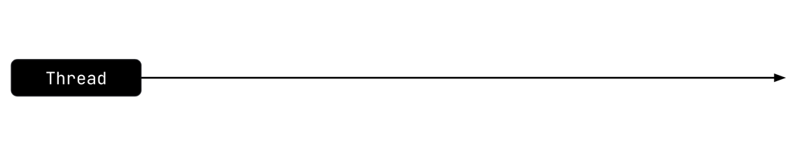
- シングルスレッドのアプリケーションで、前のスライドの関数を呼び出しているとする
- 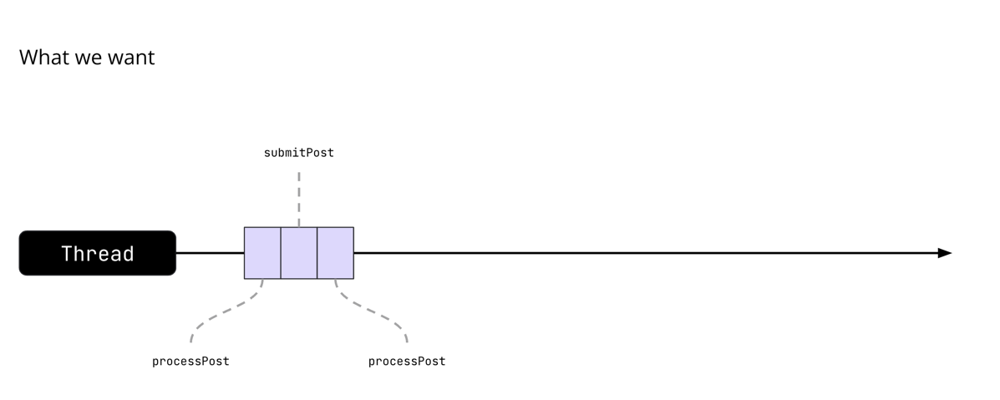
- (最初に呼ばれている関数が　processPost になっているけれど、これは preparePost よな)
- 私たちは、スレッドが常に何か有用なことをしていて、アプリケーションのコードを間断なく実行していることを望んでいる

- 実際に起こることはこう
- 
- スレッドがネットワークリクエストを行うと、そのリクエストが完了するまで何もできないので、ある程度の時間はブロックされ、コードの実行を進めることができない
- スレッドは何もしないし、CPU時間を得ても何の命令も実行しない
- ただ応答を待つだけで、その時点でまたリクエストを行い、また待つことになる

- マルチスレッドにするとどうなるか
- 
- ここで、アプリケーションに1つのスレッドではなく3つのスレッドを使用させ、その関数を2回呼び出そうとする
- 最初の呼び出しはスレッド#2に移され、2回目の呼び出しはスレッド#3に移される
- 今、これらのスレッドはメインスレッドの代わりにブロックされ、何か有用な処理を進めることができる
- これらのスレッドが結果を得るとき、おそらく何らかの方法でメインスレッドと共有する必要がある
- そのため、メインスレッドはスレッド#2とスレッド#3の結果を得るために、ある時点でブロックされることになる

- スレッドの数が増えたので、より多くの仕事ができるようになると期待される
- その代わり、新たなブロックに直面することになり、全体の有用な作業時間は3倍には増えなかった
- さらに、たとえばスレッド#3が予期せぬ例外に遭遇した場合、メインスレッドはもはやそのスレッドに仕事を送ることができない
- スレッドを再起動するか、これらのことを管理する専用のオーケストレーター・スレッドが必要になり、有用な作業時間の割合はさらに低下する

## Asynchronous Programming

## Continuation passing style
```kotlin
fun preparePostAsync(callback: (Token) -> Unit) {
    // make request and return immediately
    // arrange callback to be invoked later
}
```
- コールバックとは、ある関数を別の関数にパラメータとして渡し、処理が完了したらその関数を呼び出すというもの
```kotlin
fun postItem(item: Item) { 
    preparePostAsync { token ->
        submitPostAsync(token, item) { post -> 
            processPost(post)
        }
    }
}
```
- 継続渡しスタイルでは、トークンを返していた関数が、トークンを引数として受け取るコールバック関数を受け入れる関数になる
- つまり、コールサイトで関数の結果を待つ代わりに、その関数に結果を渡して、その関数が終了するのを待つ代わりに作業を続ける
- 梯子 (= {})は 「コールバック地獄 」への 「天国への階段」
- エラー処理はどこにある？
- **コールバックは「本来」非同期ではない**
- このアプローチでわかりやすい最初の問題は、中括弧（{）の多さ
- コールバック地獄」でググれば、これがいかに読みづらく管理しづらいものであるかという実例が見つかるだろう
  - 
  - [コールバック地獄からの脱出](https://qiita.com/umeko2015/items/2fdb2785eac8f4117f23) より引用
  - まあやばい
- 例外処理がマルチスレッドにおける問題であることは述べた
- CPSでは、エラー処理も複雑で、より定型的なコードになる
- CPSでは、エラー処理が複雑なだけでなく、ループや単純な条件文の記述も難しいことに注意する必要がある
- 最後になるが、CPSはもともと非同期ではない
- postItemを呼び出すと、実行スレッドはpostItemが終了するまで待ってから処理を進めることになる
- コールバック関数を受け付けるようにシグネチャを変更することは、単なる構文の変更に過ぎない
- コールバックを非同期で動作させるためには、メインスレッドを占有しないように、それぞれのコールバックを何らかのエクゼキュータで起動する必要がある

## Futures, promises, and other approaches
- Promise<T> はコールバックをカプセル化する
```kotlin
fun preparePostAsync(): Promise<Token> {
    // makes request and returns a promise that is completed later
    return promise
}
```
- 非同期プログラミングのもうひとつのアプローチはプロミス
- この場合、関数はコールバックを受け入れないが、元の戻り値の型も返さない
- その代わりに、関数は結果(と言うよりは Token class)を囲むラッパーを返す
- ラッパーとは特別なクラスのことで、結果を待つか、そのクラスにコールバックを渡して、結果が出たときに呼び出されるようにする

```kotlin
fun postItem(item: Item) { 
    preparePostAsync()
		.thenCompose { token -> submitPostAsync(token, item) }
		.thenAccept { post -> processPost(post) }
		…
}
```
- このモデルは典型的なトップダウンの命令型アプローチとは異なる
- ライブラリやフレームワーク、プラットフォームによって異なるAPIがある
- 実際に必要なものの代わりにPromise<T>のリターン・タイプを採用
- それぞれのthenCompute/Accept/Handleは新しいオブジェクトを生成する
- エラー処理は複雑になる可能性がある

#### スライド説明
- これによってコードは明確になるが、それでも多くの開発者が慣れ親しんでいるコードを書くアプローチではない
- プロミスの実装には、さまざまな名前とAPIがある
- 関数は、私たちが興味を持っている実際の型の代わりにラッパーを返すことに注意して
- さらに、これらのラッパーはオブジェクトであり、かなりのメモリを消費する
- エラー処理も複雑になる。これはループにも言えることだが、CPSに比べればはるかに簡単

## Kotlin coroutines
お出ましですよと

```kotlin
/// suspend — a keyword in Kotlin marking suspendable function.
suspend fun submitPost(token: Token, item: Item): Post {
    /// ...
}

suspend fun postItem(item: Item) {
    val token = preparePost()
    val post = submitPost(token, item)
    processPost(post)
}
```
- これによって、コードのロジックに集中することができます
- エディタの矢印は suspend ポイントを示しているよと
- 非同期プログラミングには別のアプローチもあり、それについては本プレゼンテーションの最後で説明する
- しかし当面は、Kotlinが推奨するアプローチを取り上げることにする
- `Kotlin` には `suspend` キーワードがあり、ある時点で何かを待つ（ブロックされる）関数をマークします
- このキーワードでマークされた関数はサスペンディング関数と呼ばれる
- サスペンディング関数を使ったコードは、一見普通のシーケンシャルなコードに見えますが、その裏ではすべてが非同期で効率的に実行されている
- 通常の言語機能はすべて問題なく使用でき、例外処理もいつも通り行われることに注意
- 今のところ、このコードはあなたが書ける他のどのコードよりも多くを必要としない。(この図は、後でもう少し複雑になる)
- IntelliJ IDEAは、ガター（エディタの左側の領域）に特別なマーカーを付けて、サスペンド関数の呼び出しにフラグを付ける

## The history of coroutines
- メルビン・コンウェイは1958年に彼のアセンブリプログラムに対して「コルーチン」という言葉を作った
- コルーチンはSimula'67のdetachとresumeコマンドで初めて言語機能として導入された
- コルーチンはサスペンド可能な計算のインスタンスと考えることができる
- コルーチンが互いに呼び合う（そしてデータをやり取りする）ことで、協調的なマルチタスクが実現できる
- Go'09、C#'12、Kotlin'17、C++'20、OpenJDK、Project Loom
- コルーチンは新しい概念ではない
- コルーチンは、KotlinやJava、さらにはC言語よりもずっと前から存在していた
- Simula'67はC++に影響を与えた画期的な言語で、コルーチンを中核機能の1つとしていた
- Scheme（1975年）もこの文脈で言及する価値がある
- Schemeにはcall-with-current-continuationがあり、Kotlinのコルーチンのインスピレーションとなった
- コルーチンは、スレッドが主にプリエンプティブ・マルチタスクで動作する協調型マルチタスク・モデルで動作するアプリケーションを構成することができる
- 最近、コルーチンは多くの言語で使われるようになった

## Kotlin
- コルーチンはバージョン1.1でKotlinに導入され、バージョン1.3で安定
- suspend - サスペンド可能な関数を示すキーワード
- kotlin.coroutines - 標準ライブラリのごく一部
- kotlinx.coroutines - 必要な機能をすべて備えたライブラリ
- 標準ライブラリの一部ではないため、ホスト・プラットフォームに対する追加要件がなく、マルチプラットフォーム開発が容易

- コルーチンはサスペンド可能な計算のインスタンス
- 実行にコードのブロックを必要とし、同様のライフサイクルを持つという意味で、概念的にはスレッドに似ている
- コルーチンは作成され開始されるが、特定のスレッドに束縛されることはない
- あるスレッドで実行を中断し、別のスレッドで再開することもできる
- さらに、futureやpromiseのように、何らかの結果（値か例外）で完了することができる

- コルーチン機能のほとんどはkotlinx.coroutinesライブラリで提供されている
- この主な利点は、コルーチンがKotlinコンパイラーをサポートするためにほとんど何もする必要がないということ
- さらに、Kotlinチームが提供するものを使わなくても、誰でもコルーチンの実装を書くことができる

## Kotlin coroutines

## Under the hood
- コンパイラはsuspend関数を呼び出す
```kotlin
suspend fun submitPost(token: Token, item: Item): Post {...}

fun submitPost(token: Token, item: Item, cont: Continuation<Post>) {...}

public interface Continuation<in T> {
    public val context: CoroutineContext
    public fun resumeWith(result: Result<T>)
}
```
- そこで、suspend修飾子を追加してsubmitPost関数をサスペンド関数にしたのですが、なぜか非同期になってしまいました。なぜだろう？ --> なんだこの文章は
- suspend修飾子は、その関数を別のものに変更するようコンパイラに指示する

- コンパイラーは、ジェネリッククラスであるContinuation型の最後の引数を追加し、関数の戻り値の型をContinuationジェネリックの型パラメーターとして与えます
- これはコールバックのように見えるが、実際にはコールバックである
- つまり、コンパイラーは私たちの関数を、Continuationオブジェクトの形でコールバックを受け取る関数に変えてしまう
- Continuationは、中断している呼び出し以下のすべてのコードを表すオブジェクトと考えることができる
```kotlin
// code inside postItem
// suspend call 0
val token = preparePost()
// suspend call 1
val post = submitPost(token, item)
// suspend call 2
processPost(post)
```
- 関数のシグネチャで何が起こるかを見てきたが、次は関数のボディで何が起こるかを見てみよう
- 内部では3つの関数を呼び出していますが、これらもすべてサスペンディング関数とみなす
- こうすることで、コンパイラーは関数本体の中にさらに3つのサスペンド呼び出しがあることを知ることができる

- 
~~- 何言ってんのかよくわからんこれ~~
- これは起こっていることを簡略化して表現したものである。詳細は後ほど説明する
- 関数の本体は有限状態マシンになり、サスペンドコールはそれぞれその状態マシンのラベルに対応する
- 関数の主な作業はwhenの内部で行われている
- 関数は通常のコードを実行するが、他のサスペンド関数を呼び出すタイミングが来ると、ラベルを次のものに変更し（ステートマシン遷移を行う）、アプリケーションにサスペンドして後で呼び出すことができることを伝える
- これはwhenの下で起こることで、スライドでは表現されていない

- ここで、ボンネットの下では非常に洗練されたことが起こっているにもかかわらず、追加の引数（継続/コールバック）はコンパイル時にしか現れないことに注意して
- さらに、ステートマシン自体は軽量なオブジェクト
- なぜなら、ステートマシンに格納されるものはすべて、関数の実行中にスタック上にあるからです（他の関数呼び出しの結果のように）
- 追加データはラベルだけで、これは1つの整数

## State of coroutine
- 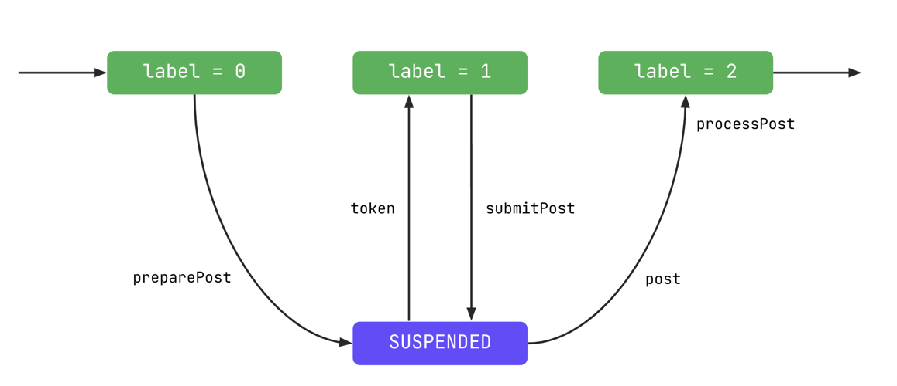
- これは、例の関数を有限状態マシンとして視覚的に表現したもの
- この関数は、内部でラベルを変更した後、サスペンド状態に移行し、そこで特定の何かを待つか、しばらく一時停止する
- 結果が表示されるか、実行者がこの関数を続行する時が来たと判断すると、実行に戻され、次のステートで続行される
- このサイクルは最終状態に達するまで繰り返される
- 最終状態から、実行は最初に引数として関数に渡された継続に渡される

## Practice
- これでようやく、実行スレッドをブロックせずにアイテムをポストできるようになった！
```kotlin
fun nonBlockingItemPosting(...) { {...
    ...
    postItem(item)
}
```
- サスペンディング関数postItemは、コルーチンか他のサスペンディング関数からのみ呼び出されるべきである
- サスペンディング関数の中に入っていくことはできない
- 普通のコードからこの関数を呼び出そうとするとエラーになる
- サスペンディング関数は、コードをノンブロッキングにするために使われる
- これは、コードが何かを待ち、実行スレッドから離れて、今すぐ実行できる他の何かに置き換えることができるポイントをマークすることによって行われる
- それを可能にするためには、「他の何か」が存在しなければならない
- その環境とはCoroutineScopeインターフェイスである

## Inside CoroutineScope

## Practice
- suspend関数は、他のsuspend関数から呼び出すことも、CoroutineScope内から呼び出すこともできる
```kotlin
fun main() = runBlocking { // this: CoroutineScope
    launch { // launch a new coroutine and continue
        delay(1000L) // non-blocking delay for 1 second (default time unit is ms)
        println("World!") // print after delay
    }
    print("Hello ") // main coroutine continues while the previous one is delayed
}
```
- 他のサスペンディング関数から呼び出そうとすると、同じ問題が発生
- つまり、CoroutineScopeとは何かを知る必要がある
- 開発の初期段階では、CoroutineLifecycleと呼ばれていた
- ここではrunBlockingを使ったコードを見ているが、これはコルーチンが最終的に呼び出されるCoroutineScopeを作るもの
- runBlockingは、ブロッキング（通常の）世界とコルーチンとの橋渡し
- しかし、サンプルやテストには便利です（runBlockingTestに代わってrunTestが使われるようになりました）
- 最後に、CoroutineScopeの中で普通のコードを書いたり、メイン実行スレッドをブロックすることなくバックグラウンドで非同期に動作するコルーチンを起動することができる
- launchは 「fire and forget 」と考えることができる
- コードはlaunchが何かをするのを待つのではなく、ある時点で実行されるようにスコープに放り込まれるだけで、実行は何事もなかったかのように続けられる
- launchは引数としてサスペンディング・ブロックを受け取り、それが新しいコルーチンで実行されるコードになる
- launchのように新しいコルーチンを作成できるものをコルーチンビルダーと呼ぶ

## Sophisticated practice
```kotlin
val jobs: List<Job> = List(1_000_000) {
    launch(
      Dispatchers.Default + CoroutineName("#$it") + CoroutineExceptionHandler { context, error ->
            println("${context[CoroutineName]?.name}: $error") 
    }, // CoroutineContext
    CoroutineStart.LAZY // do not start instantly
        ) {
            delay(Random.nextLong(1000))
            if (it % 10 == 0) { throw Exception("No comments") }
            println("Hello from coroutine $it!")
        }
    }
jobs.forEach { it.start() }
```
- 全てを一つ一つ見ていこう
- スコープを取得する少なくともひとつの方法がわかったので、この例のようなことをスコープの中で書くことができる
- ここでは、launchを100万回呼び出すことで、100万個のコルーチンのリストを作成する
- それぞれのlaunchは第一引数にCoroutineContext、第二引数に開始タイプ、第三引数に実行するラムダブロックを受け取り、それぞれJobを返す
- 開始タイプはCoroutineStart列挙型で表される
- ここではCoroutineStart.LAZYを渡していますが、これはコルーチンが即座に開始されるのではなく、start()が呼ばれた後に開始されることを意味している

## Scope and context
```kotlin
public interface CoroutineScope {
    public val coroutineContext: CoroutineContext
}
```
- 簡単でしょ？
- CoroutineScopeは標準ライブラリで提供されているインターフェースで、その実装はkotlinx.coroutinesにあるか、ゼロから書くことができる
- インターフェイスには、CoroutineContextという1つのフィールドしかない
```kotlin
public interface CoroutineScope {
    public val coroutineContext: CoroutineContext
}

public interface CoroutineContext {
    public operator fun <E : Element> get(key: Key<E>): E?
    …

    public interface Element : CoroutineContext {
    public val key: Key<*>
    ...
    }
}
```
- Coroutine Context は Map<Key<Element>, Element> のように考えることができる
- CoroutineContextは、コルーチンの実行環境に関する情報を格納するためのインターフェースである
- クラスから環境内のクラスのインスタンス（オブジェクト）へのマップと考えることができる
- コンテキストの各要素は、それ自体がコンテキストである
- コンテキストを簡単に扱えるように設計されている
- 例えば、CoroutineNameのインスタンスを作るだけでコンテキストを作ることができ、さらにコンテキスト用にオーバーライドされているplusを使うだけでCoroutineDispatcherを追加することができる
- CoroutineScopeのプロパティはCoroutineContextだけなのに、なぜCoroutineScopeが必要なのか？
- CoroutineContextを使うだけで同じ結果が得られるのでは？
- この分割は、コンテキストであるコルーチンの実行環境／状態と、スコープであるコルーチンの動作／ライフサイクルを分離するために行われる
- この考え方は、構造化された並行処理について説明するときに、改めて説明する
  - 構造化された平行処理ね、懐かしいね
  - 親のこルーチンスコープをキャンセルすると全ての子がキャンセルされるとかそういう話だよね

## Inside CoroutineScope (Job)
```kotlin
public interface Job : CoroutineContext.Element {
    public companion object Key : CoroutineContext.Key<Job>
    public fun start(): Boolean
    public fun cancel(cause: CancellationException? = null) public val children: Sequence<Job>
    ...
}
```
- ジョブはバックグラウンドで実行される作業である
- ジョブはキャンセル可能なワークアイテムであり、完了するまでのライフサイクルを持つ
- ジョブは親子階層に配置することができる
- 子プロセスが失敗した場合、親プロセスと他の子プロセスは即座にキャンセルされる
- この動作はSupervisorJobを使ってカスタマイズできる

- JobはCoroutineContext.Elementを継承し、それ自体がCoroutineContextを継承している
- ここで、Keyが通常どのように作られるかを見ることができる
- これはCoroutineContext.Keyを実装するインターフェースのコンパニオン・オブジェクトで、クラス自身をジェネリック引数として持つ
- その結果、この特定のインターフェースのインスタンスはすべて同じキーを共有するので、クラス／インターフェース全体のキーとなる

- Jobはコルーチンを表し、どこかで非同期に実行されるバックグラウンド作業を表す

- すでに見たstart()メソッドや、その他多くのメソッド、例えばcancelメソッドがあり、このジョブが表すコルーチンの実行を止めることができる
- 例えば、cancel はこのジョブで表されるコルーチンの実行を停止させる
- また、Job は全ての子ジョブ（この特定のジョブから起動される他の全てのコルーチン）へのリンクを保存する

- キャンセル時に何が起こるかは次のスライドで説明する

## Job States
- 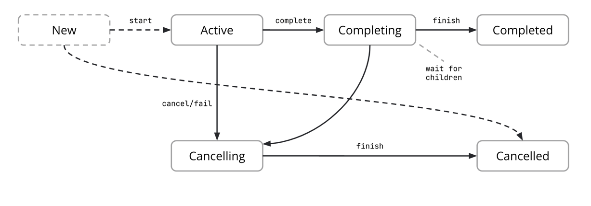
- ジョブはスレッドと似たような状態を持つ
- 大きな違いは、コルーチンはブロックする代わりにサスペンドするので、ジョブにはブロックされた状態がないこと
- また、CancelledとCompletedの両状態には、'-ing'アナログが付随している
- これらは、コルーチンが終了するのはその子プロセスがすべて終了した時だけだから

- つまり、あるジョブ（コルーチン）が全ての処理を成功裏に完了しても、
- その後に子プロセスが同じように完了するのを待たなければならず、子プロセスの1つがこの段階で失敗するかもしれないということ
- もしこのようなことが起きると、ジョブ自身は成功したにもかかわらず、すべての子プロセスを含む、ジョブに接続されたすべての負荷が失敗したことになり、ジョブがキャンセル状態に遷移し、キャンセルされたことを示す

- 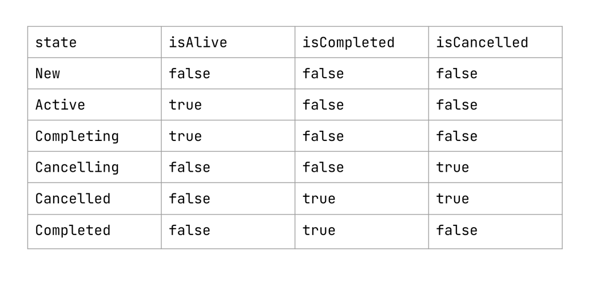
- スレッドのフラグと似ているが、ジョブの状態を扱うときに便利なフラグがいくつかある

# Inside CoroutineScope (Dispatchers)
- 次に、kotlinx.coroutinesの最も重要な側面の1つであるディスパッチャーについて説明する

## Dispatchers
```kotlin
public abstract class CoroutineDispatcher : ... {
    ...
    public abstract fun dispatch(context: CoroutineContext, block: Runnable)
}
```
- `Dispatchers.Default（デフォルト）` - バックグラウンド・スレッドの共有プール、計算負荷の高いコルーチンに適している
- `Dispatchers.IO` - オンデマンドで生成されるスレッドの共有プールで、IO集約的なブロック処理（ファイル/ソケットIOなど）をオフロードするために設計されている

- Jobと同じく、`CoroutineDispatcher` も `CoroutineContext.Element` を継承しており、それ自体がコンテキストでもある
- オブジェクト：Keyも内包している

- **ディスパッチャで一番重要なのはディスパッチメソッド**

- サスペンド関数がどのようにコンパイルされるかを説明したときに、ステートマシンを見て、いくつかのことがwhenブロックの外でも起こることを述べた
- そのひとつが、関数がその継続（遷移後のステートマシン）を実行可能ブロックとしてディスパッチャーに渡すこと

- つまり、ステートマシンはラベルを切り替え、コードを実行し、CoroutineContextからディスパッチャを取り出し、後で非同期に実行されるように自分自身をそこに渡す
- ディスパッチャが必要なのは、サスペンド関数が、ディスパッチャを持つコンテキストが存在するCoroutineScope内でのみ呼び出される必要があるためだ
- ディスパッチャはいくつかあり、それぞれに目的があるので、どのタイミングで使うかを知っておくことが重要
- **視覚的にイメージができない！！もどかしい！！！！！！あーーーーー、復習必須**

- `Dispatchers.Main`
  - UIオブジェクトを操作するメインスレッドに限定されたディスパッチャー通常はシングルスレッドで、coreには存在しませんが、androidやswingなどのパッケージで提供されている
- `Dispatchers.Unconfined` 
  - アンコンファインドディスパッチャは、通常コードで使用するべきではない(じゃあなんで作られたんだよって突っ込みたい💢)
- プライベートスレッドプールは newSingleThreadContext と newFixedThreadPoolContext で作成できる(どちらも @ExperimentalCoroutinesApi)
- 並列コルーチンを超えるコルーチンが同時に実行されないことを保証するディスパッチャのビューは、次のようにして作成できる
```kotlin
// method of public abstract class CoroutineDispatcher
@ExperimentalCoroutinesApi
public open fun limitedParallelism(parallelism: Int): CoroutineDispatcher { ... }
```

- 任意の ExecutorService を asCoroutineDispatcher 拡張関数でディスパッチャに変換することができる
```kotlin
interface ExecutorService : Executor {
    fun execute(command: Runnable) // Executor is a SAM with this method
    ...
}

val myExecutorService: ExecutorService = ...
val myDispatcher = myExecutorService.asCoroutineDispatcher()
```
- ディスパッチャが適切でない場合は、 newSingleThreadContext や newFixedThreadPoolContext を使うか、(newFixedThreadPoolExecutor のような) エクゼキュータサービスをディスパッチャに変換することができる

## A peek under the hood
```kotlin
internal class GlobalQueue : LockFreeTaskQueue<Task>(singleConsumer = false)

internal class CoroutineScheduler( 
    @JvmField val corePoolSize: Int, @JvmField val maxPoolSize: Int,
    @JvmField val idleWorkerKeepAliveNs: Long = ...,
    @JvmField val schedulerName: String = ...
) : Executor, Closeable {
    ...
    val globalCpuQueue = GlobalQueue()

    val globalBlockingQueue = GlobalQueue()
    ...
}
```
- kotlinx.coroutinesの各ディスパッチャーはCoroutineSchedulerの実装
- これらはすべて、実行するタスクのキューを持っている
- 1つはグローバルで、すべてのディスパッチャで共有される
- 呼び出されると、ステートマシンにコンパイルされたサスペンド関数がラベルを切り替え、いくつかのコードを実行し、CoroutineContextからディスパッチャを取り出し、そのディスパッチャのキューに継続を追加し、時間があるときに実行される


```kotlin
internal class CoroutineScheduler(...) : Executor, Closeable {
    ...
    val workers = AtomicReferenceArray<Worker?>(maxPoolSize + 1)

    fun dispatch(
        block: Runnable, 
        taskContext: TaskContext = NonBlockingContext, 
        tailDispatch: Boolean = false
        ) {
        ...
    }
}
```
- 次に、各ディスパッチャはワーカーのプールを持つ
- デフォルトはCPUコア数と同じ数のワーカーを持っている
- IOはもっと多いが、Mainは1つしか持っていないはず

- 並列プログラミング」の講義では、アトミックが「危険地帯」であると指摘されたが、ここでは、ワーカーを追跡するためにアンダーザフードのアトミックが使われていることがわかる
  - `tailDispatch` のことであっているか？
- これはコルーチンを抽象化する効率的で低レベルな方法だが、家庭で繰り返すことはお勧めしない
- これはエクゼキュータ・インターフェースの実装なので、ディスパッチの実装がある

```kotlin
internal inner class Worker private constructor() : Thread() {
    ...
    val localQueue: WorkQueue = WorkQueue()
    var state = WorkerState.DORMANT

    fun findTask(scanLocalQueue: Boolean): Task? {
        // localQueue -> globalBlockingQueue
        return task ?: trySteal(blockingOnly = true)
    }
}
```
- ワーカー自体は Thread を継承しており、Thread は独自のタスクキューを持っている
- ワーカーの面白い点は、ワーカーが自分のプールや親ディスパッチャのプールで仕事を見つけられない場合、
- 効率よく常に何かをしているために、他のどこかから仕事を盗もうとするかもしれないということ

## Inside CoroutineScope (Coroutines vs threads)
- コルーチンはスレッドを継承するワーカー上で動作することがわかったので、スレッドプールを使ってタスクを投げる代わりにコルーチンを使うメリットはあるのだろうかと思うかもしれない
- やっぱり、総じてスレッドの理解が曖昧だから Coroutine もよくわかってこないのが問題なんだよね

## Adding contexts
```kotlin
val jobs: List<Job> = List(1_000_000) {
    launch(
        BaseContext 
            + SupervisorJob()
            + CoroutineName("#$it")
            + CoroutineExceptionHandler { context, error ->
                println("${context[CoroutineName]?.name}: $error")
            }, // launch’s first argument is CoroutineContext, which is a sum here
        ...
    ) { ... }
```
- コンテキストは足し合わせることができる
- この場合、Keyの右端の値が結果のコンテキストとなる
- 各ElementはCoroutineContextを実装しているので、これは要素の合計のように見える

- まず、コンテキストの合計を取得する方法を見てみよう
```kotlin
Context1 = Dispatcher1 + ExceptionHandler
Context2 = Dispatcher2 + CoroutineName
Context1 + Context2 -> ExceptionHandler + Dispatcher2 + CoroutineName
Context2 + Context1 -> CoroutineName + Dispatcher1 + ExceptionHandler
```
- 各 Key に対して、右端の値が新しいコンテキストとして使用される

## Context switching
```kotlin
suspend fun preparePost(): Token = withContext(Dispatchers.IO) { ... }

// submitPost also withContext(Dispatchers.IO)

suspend fun processPost(post: Post) =
withContext(Dispatchers.Default) { ... }

suspend fun postItem(item: Item) {
    val token = preparePost()
    val post = submitPost(token, item) 
    processPost(post)
}

// somewhere in our application's code there is a View and a CoroutineScope related to it
viewScope.launch { 
postItem(someItem) 
// show the result in the UI somehow
}
```
- これまで見てきたように、いくつかのディスパッチャがあり、それぞれが独自の目的を持っている
- また、**`withContext`** という便利な関数があり、新しいコルーチンを立ち上げることなくコンテキストの一部を変更することができる
- withContextは、引数として渡されたものを、呼び出されたコンテキストに追加する
- 上の例では、各関数のディスパッチャを変更するためだけに使われている
- つまり、各関数は、どのワーカーのプールで実行されるべきかを正確に指定する

## How is this actually better than threads?
- 実際、何がスレッドより良いんだ？
- 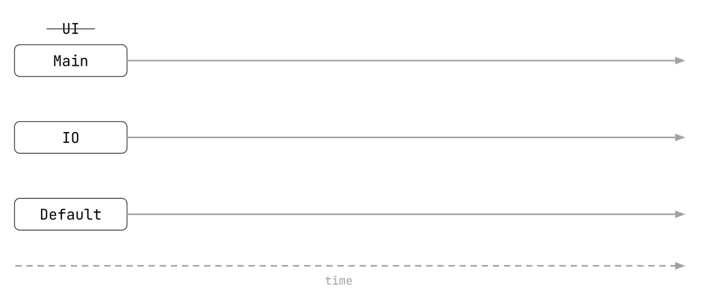
- viewScopeがMainを使っているとする
- Mainは通常、アプリケーションのUIに接続されている
- 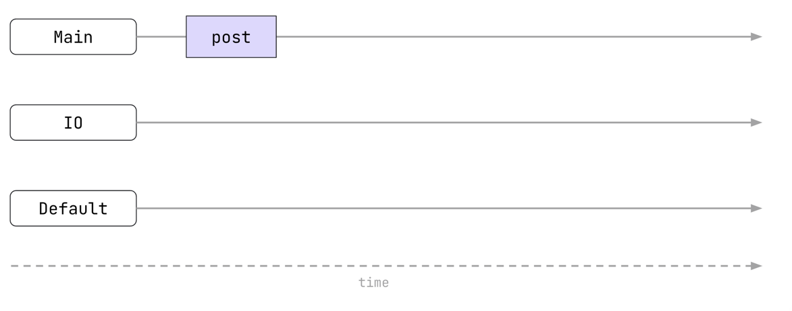
- MainディスパッチャのviewScopeで関数を呼び出す
- 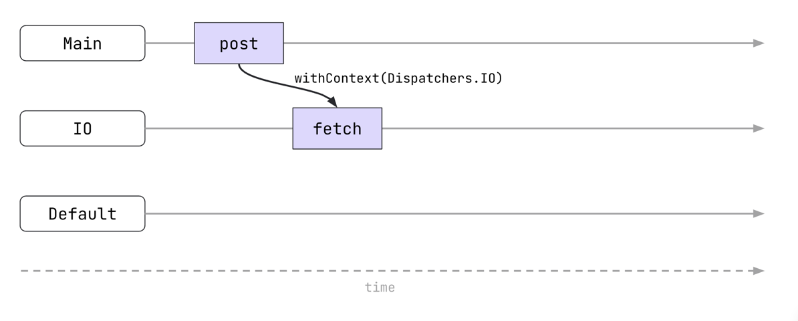
- この関数はコンテキストを IO に切り替えて、ブロッキング/ウェイト方式でデータを取得する
- 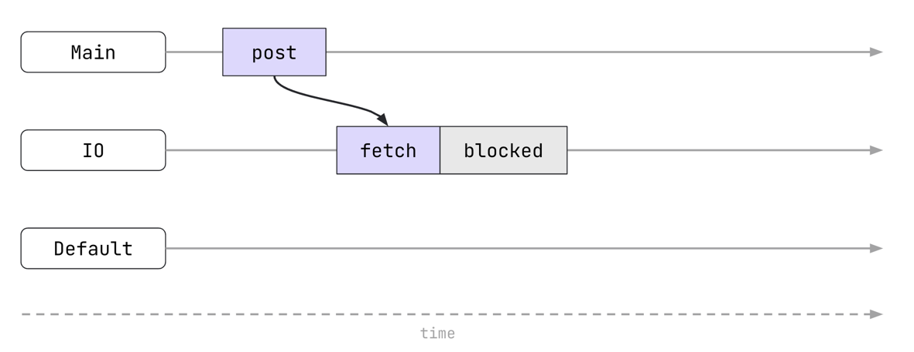
- IOスレッドはデータがフェッチされるのを待つ
- 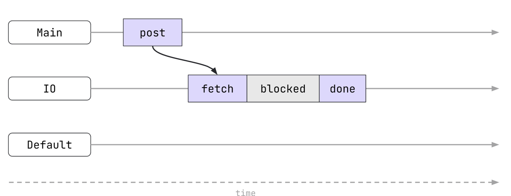
- submitPostもIOで働くので、別に書かない
- 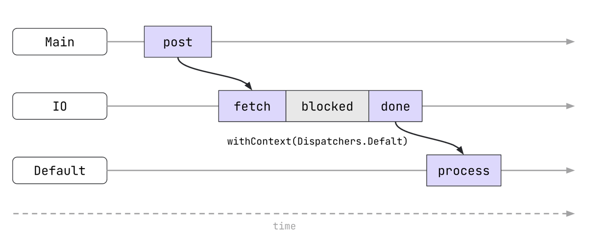
- その後、ディスパッチャはプロセス機能のデフォルトに切り替えられる 
- 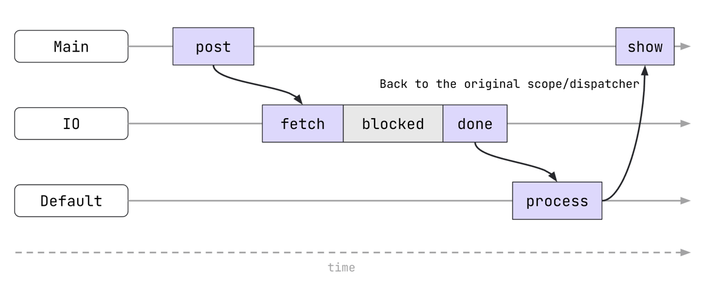
- 最後に、ディスパッチャはメインに戻され、結果はユーザー・インターフェースに表示される
- 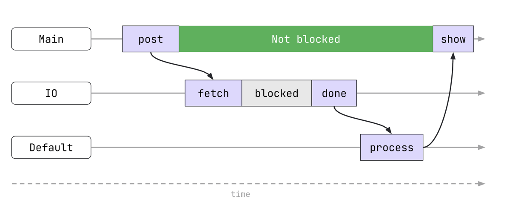
- このすべてのポイントは何だったのだろうか？このすべてが起こっている間、ユーザーはUIとやりとりしていたかもしれない
- なぜなら、メイン実行スレッドが何かを待ったり、何かと同期したりすることは一切なかったから
- 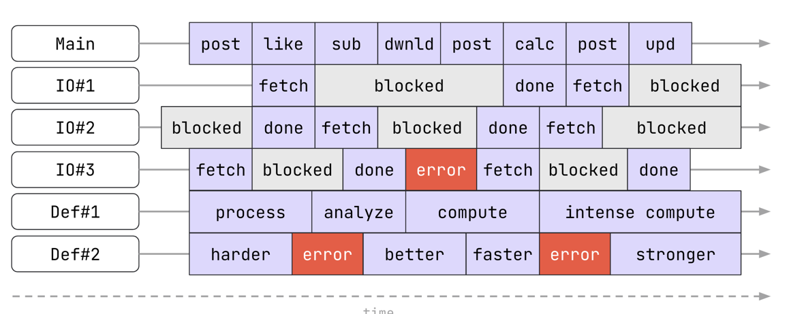
- 実際には、このようになる
- メインは常にユーザーイベントやインターフェイスの更新処理で占められている
- IOスレッドはたくさんあり、常にネットワークやディスクからデータを取得している
- 処理（デフォルト）スレッドは計算を行い、UIに表示されるかもしれないが、アプリケーションの全体的なワークフローには影響しないエラーに遭遇するかもしれない

## Coroutines - fibers - threads
```kotlin
fun main(): Unit = runBlocking {
    repeat(1_000_000) { // it: Int 
        delay(Random.nextLong(1000))
        println("Hello from coroutine $it!")
    }
}
```
- スレッドともうひとつ比較して、一度に100万個のコルーチンを起動してみよう
  - うん？これ100万のコルーチン起動にはならなくね？
- これらのコルーチンは、ランダムな時間だけ遅延して表示される単純なもの
- 違う！ デフォルトの動作はシーケンシャル
  - シーケンシャル: 連続しているという意味
- しかし、これはコルーチンを起動する正しい方法ではなかった
- この書き方では、すべてがrunBlockingで作られたスコープの中で動くだけだ
- つまり、この例では同時実行は起こらない、ですよね

```kotlin
fun main(): Unit = runBlocking {
    repeat(1_000_000) { // it: Int
    launch { // new asynchronous activity
        delay(1000L)
        println("Hello from coroutine $it!")
        }
    }
}
```
- コルーチンは軽量スレッドのようなものだ
- コードをローンチコールに移すことで、バックグラウンドのどこかでこのコードを実行するように依頼し、
- 次のステートメント（この場合はループの別の繰り返し）に移る前にその終了を待たない
- こうすることで、バックグラウンドで同時に実行される100万個のコルーチンを作ることができる

```kotlin
fun main(): Unit {
    repeat(1_000_000) { // it: Int
    thread { // new thread 
        sleep(1000L)
        println("Hello from thread $it!")
        }
    }
}
```
- この例は簡単にスレッドに変換できる
- runBlockingはスレッドを開始するのに必要ないので削除する
- コルーチンを作成するlaunchを、スレッドを作成するthreadに置き換える
- サスペンド・ディレイをスレッドのスリープに置き換える

```kotlin
fun main(): Unit {
    repeat(1_000_000) { // it: Int
        thread { // new thread
            sleep(1000L)
            println("Hello from thread $it!")
        }
    }
}
```
- `Exception in thread "main" java.lang.OutOfMemoryError: unable to create native thread: possibly out of memory or process/resource limits reached`
- ほとんどのマシンでは、100万のスレッドを同時に作成することは不可能だからだ

```kotlin
fun main(): Unit = runBlocking {
    repeat(1_000_000) { // it: Int
        launch { // new asynchronous activity
            delay(1000L)
            println("Hello from coroutine $it!")
        }
    }
}
```
- Coroutines are ~~like~~ light-weight ~~threads~~.
- ここでの要点は、コルーチンはスレッドではないということだ
- 似たような問題を解決するのに役立つが、全体的には異なるもの

## Inside Coroutine Scope (Thread switching problem)
- コルーチンがディスパッチャを使って、ディスパッチャのプールからあるスレッドの実行時間を取得することは知っている
- 問題は、サスペンド関数やその継続がどのスレッドで実行されるかはわからないということ

## An important non-guarantee
- コルーチンが同じスレッドで再開される保証はないので、モニターを保持したままサスペンド関数を呼び出すのは慎重に
```kotlin
val lock = ReentrantLock()

suspend fun russianRoulette() {
    lock.lock()
    pullTheTrigger()
    lock.unlock()
}
```
- ロック解除は別のスレッドで行われるかもしれない
- マーフィーの法則： 「間違う可能性のあることはすべて間違う
- その場合、アンロックはIllegalMonitorStateExceptionをスローする

- ロックの制限の1つは、ロックを現在保持しているスレッドによってのみロック解除を呼び出すことができるということ
- ロックを取得した後にサスペンド関数を呼び出すと、ディスパッチャのタスクキューに継続が置かれ、別のスレッドである別のワーカーがそれを受け取り、ロックを解放しようとするかもしれない
- このとき、厄介な例外がスローされます
- この問題を解決する1つの方法は、コルーチンで同期を使わないことですが、別の方法もある

## Mutual Exclusion mutex? 何これ
- 相互排除 ==> ミューテックス
- Mutual Exclusion ==> Mutex.
- 排他制御や同期機構の一種らしい
```kotlin
val mutex = Mutex() // .lock() suspends, .tryLock() does not suspend
var counter = 0

suspend fun withMutex() {
    repeat(1_000) {
        launch {
        // protect each increment with lock
        mutex.withLock { counter++ }
        } 
    }
    println("Counter = $counter") // Guaranteed `1000`
}
```
- ロックは、マルチスレッド・アプリケーションでの相互排他に使われる
- コルーチンではMutexが相互排除に使われる
- 欠点としては、ReentrantMutex（ReentrantLockのようなもの）がないので、同じMutexを2度取得しようとしないように注意する必要がある

## Inside CoroutineScope (Exceptions)
- コルーチンの中で例外が発生したらどうなるのか？
- まず、もちろん例外はtry/catchブロックで処理できる
- しかし、例外がcatchで処理されない場合、それは未処理例外となり、コルーチンの実行を停止し、コルーチン自体から離脱することになる

## Exception handling
```kotlin
public interface CoroutineExceptionHandler : CoroutineContext.Element {
    public companion object Key : CoroutineContext.Key<...>
    public fun handleException(context: CoroutineContext, exception: Throwable)
}
```
- 子コルーチンは親コルーチンに処理を委譲します
- SupervisorJob で実行されているコルーチンは、親に例外を伝播しない
- CancellationExceptionsは無視される
- コンテキストにジョブがある場合は、Job.cancelが呼び出される
- ServiceLoader経由で見つかったCoroutineExceptionHandlerのすべてのインスタンスが呼び出される
- 現在のスレッドのThread.uncaughtExceptionHandlerが呼び出される

- ExceptionHandlerは与えられたコンテキストの中に存在することができるが、これは問題を解決するために最初に使われるものではない
- すでに述べたように、コルーチンは子コルーチンへのリンクを保存し、各子コルーチンはその親にもアクセスできる
- 処理されない例外が発生すると、コルーチンは停止（キャンセル）し、全ての子コルーチンをキャンセルし、そしてこの例外を親Jobに渡そうとする

- SupervisorJobは子ジョブの例外を無視し、CoroutineExceptionHandlerを使用して子ジョブ自身で例外を処理するように要求する
- 一方、通常の親ジョブは自分自身と全ての子ジョブをキャンセルし、CoroutineExceptionHandlerを使用する
- もし既に例外が発生している子ジョブで別の未処理の例外が発生した場合、それは最初の例外の内部で抑制された例外となる

- CoroutineExceptionHandlerがない場合、例外はThreadの未処理の例外と同じように処理される
- 視覚化してくれると嬉しいよねこれ

## Exception propagation
- 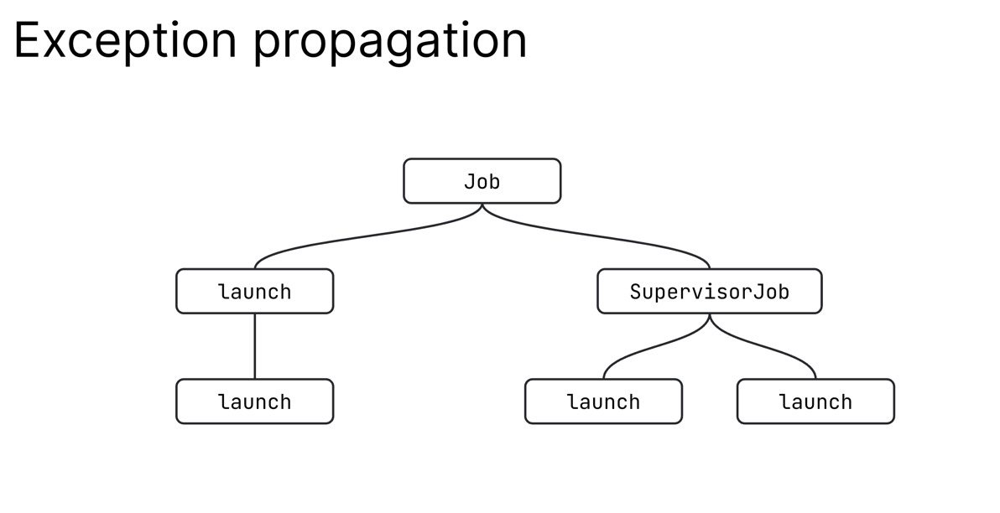
- ルートジョブがあり、その中でローンチが呼び出され、さらに別のローンチも呼び出されたとする
- 同時に、ルートジョブの中に2つの子を持つSupervisorJobも作成されたとする
- 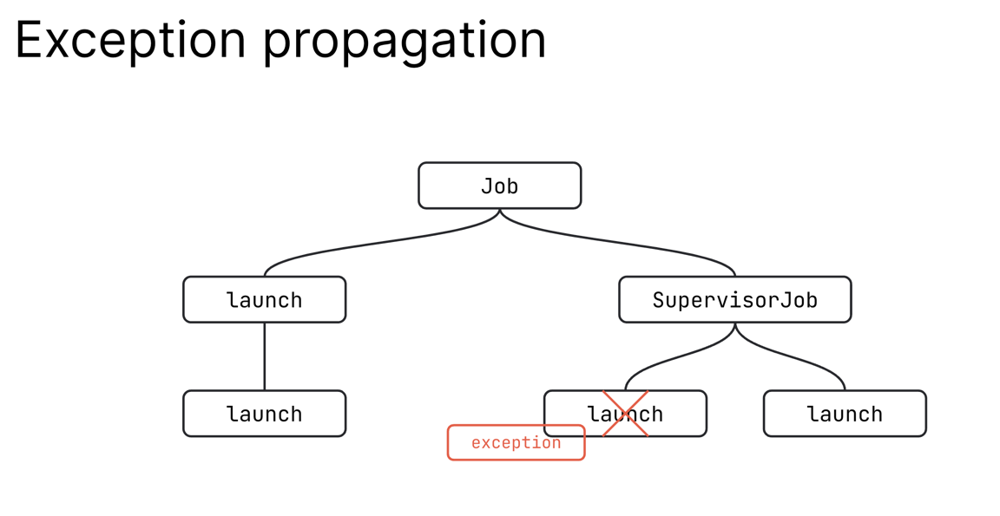
- ここで、SupervisorJobの子プロセスの1つで処理されない例外が発生し、その子プロセスがキャンセルされたとする
- 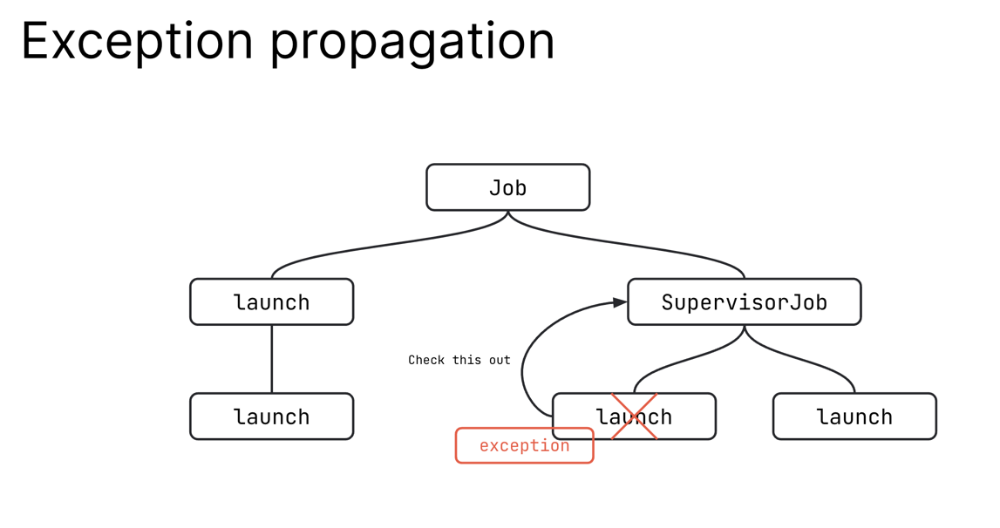
- Exception が発生した launch は SuperVisorJob に例外を委譲しようとする
- 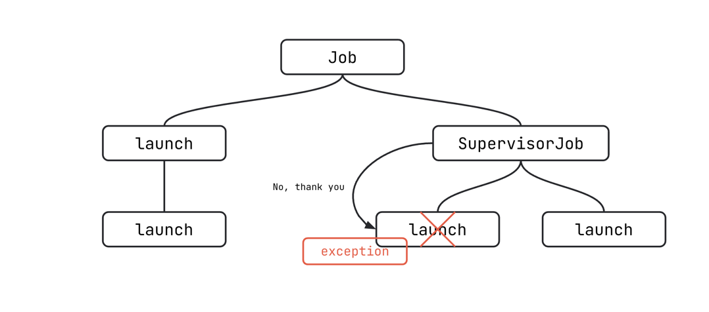
- 親はSupervisorJobなので、それに対して何もしない
- そして、専用のCoroutineExceptionHandlerがないので、例外はおそらくThread.uncaughtExceptionHandlerで処理され、標準エラーログに記録される
- 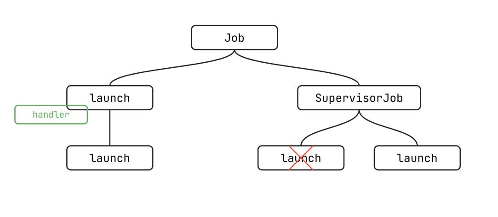
- ここで、ルートジョブの最初の子がハンドラを持っているとする
- 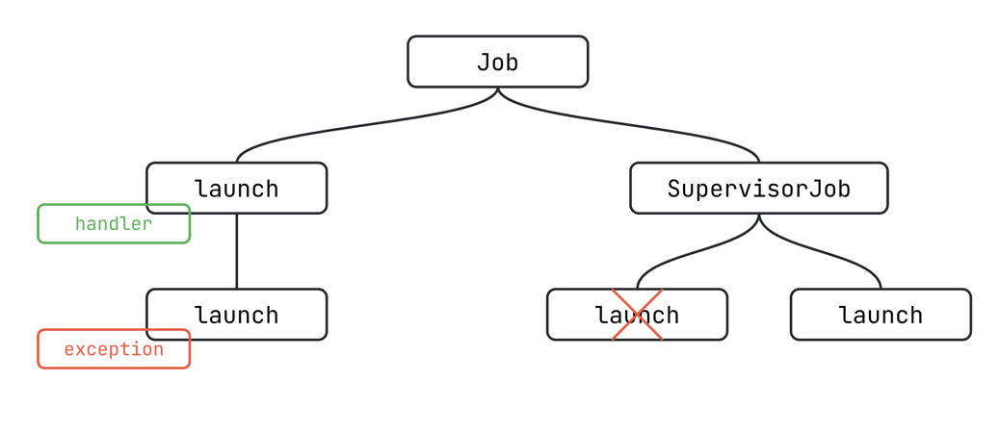
- handler を持っている launch スコープの中で立ち上げられた launch で例外発生したとする
- 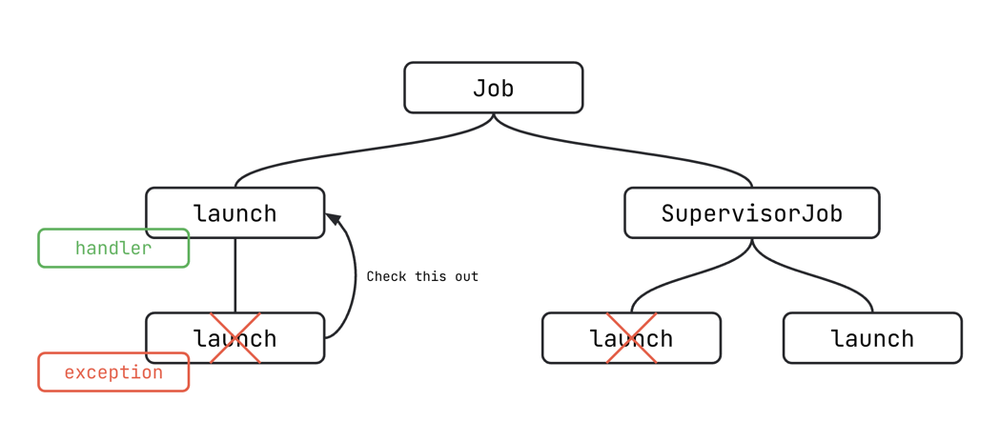
- lunch コルーチンは例外によってキャンセルされ、例外を lunch コルーチンの親に渡す
- 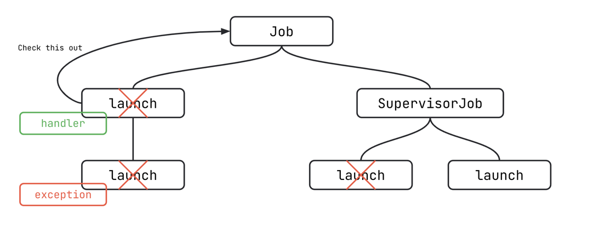
- 親がハンドラーを持っていても、それは使われず、例外はルートジョブに渡される
- 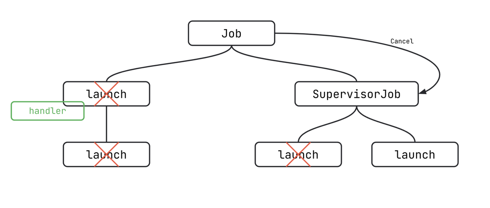
- 子ジョブから例外が発生すると、ルートジョブはすべての子ジョブをキャンセルする
- 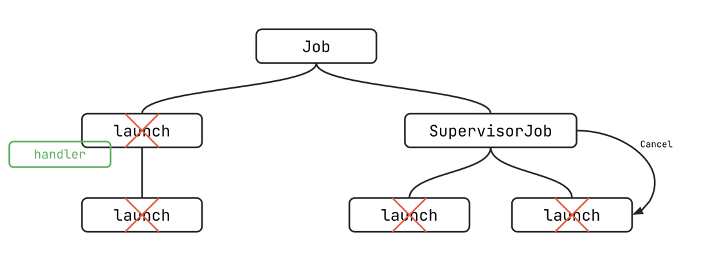
- 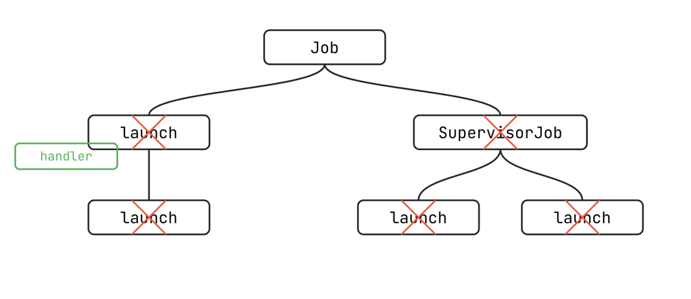
- 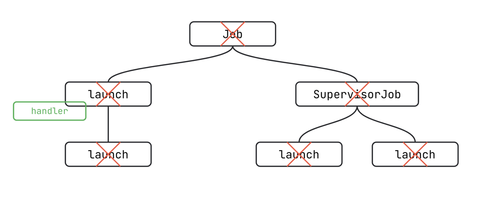
- 結局、すべてがキャンセルされる
- もしルートジョブがルートジョブではなく、他の何かの子ジョブだった場合、全ての子ジョブをキャンセルした後、さらにその親ジョブに例外を渡す

## Now you see it
```kotlin
val jobs: List<Job> = List(1_000_000) {
    launch(
      Dispatchers.Default + CoroutineName("#$it") + CoroutineExceptionHandler { context, error ->
        println("${context[CoroutineName]?.name}: $error")
        },
        CoroutineStart.LAZY
    ) {
        delay(Random.nextLong(1000))
        if (it % 10 == 0) { throw Exception("No comments") }
        println("Hello from coroutine $it!")
    }
}

jobs.forEach { it.start() }
```
- このコード↑がSupervisorJobの中にない場合、この例外ハンドラは役に立たない

## Error handling
```kotlin
fun main() = runBlocking { // root coroutine
    val job1 = launch {
        delay(500)
        throw Exception("Some jobs just want to watch the world burn")
    }
    val job2 = launch {
        println("Going to do something extremely useful")
        delay(10000)
        println("I've done something extremely useful")
    }
}
```
- ジョブ1で例外発生→親に伝播→ジョブ2がキャンセルされる
- スコープ内に2つのジョブがあり、そのうちの1つが非常に重要だとする
- そのジョブは起動され、重要な仕事を始めるが、その後、重要でない仕事が失敗し、重要な仕事はキャンセルされてしまう

```kotlin
fun main() {
    val scope = CoroutineScope(Dispatchers.Default + SupervisorJob())
    with(scope) {
        val job1 = launch {
            throw Exception("Some jobs just want to watch the world burn")
        }
        val job2 = launch {
            delay(3000)
            println("I've done something extremely useful")
        }
    }
    scope.coroutineContext[Job]?.let { job ->
    runBlocking { job.children.forEach { it.join() } }
    } // `job1.join()` will throw, so `it.join()` should actually be in a `try/catch` block
}
```
- その代わりに、このようなケースでは、他のコルーチンのエラーによって重要な作業がキャンセルされないことを保証するために、SupervisorJobを使うべき
- これは、runBlockingやサスペンド関数なしでコルーチンを開始できる方法の例でもある
- 最後の行は非常に重要
- なぜなら、ルートジョブとそれに続く全ての子ジョブが終了するまでアプリケーションが停止しないようにするため
  - なるほどねえ

```kotlin
fun main() {
    // `someScope: CoroutineScope` already exists
    someScope.launch { // this coroutine is a child of someScope
        supervisorScope { // SupervisorJob inside
            val job1 = launch {
                throw Exception("Some jobs just want to watch the world burn")
            }
            val job2 = launch {
                println("Going to do something extremely useful")
                delay(3000)
                println("I've done something extremely useful")
            }
        }
    }
...
}
```
- 便利なsupervisorScope関数があり、これはスコープ内のジョブをSupervisorJobに置き換える
- これはすでに特定のスコープで仕事をしている場合に非常に便利
  - そうだねえ

```kotlin
fun main() {
    val scopeWithHandler = CoroutineScope(CoroutineExceptionHandler { 
        context, error -> println("root handler called")
    })

    scopeWithHandler.launch { 
        supervisorScope {
            launch { throw Exception() }
            launch(CoroutineExceptionHandler { context, error ->
                println("personal handler called")
            }) {
              throw Exception() 
            }
        }
    }
...
}
```
- 例外は親に伝搬されないので、ハンドラをオーバーライドできる
- `最後に、コンテキストは継承され、withContextなどが使用されると、その一部だけが置き換えられることがわかっている`
  - なるほどねえ！！！！
- もしExceptionHandlerをルートScopeに（そのContextに）置くと、SupervisorJobの下に作成される全ての子プロセスで使用される

## Inside CoroutineScope (Structured concurrency)
- コルーチンは親子階層を形成し、例外は伝搬され、決して失われない
- そして、すべての作業はスコープにグループ化される
- これらの特徴を合わせて、構造化並行処理アプローチを構成している

## Error handling (revisited)
```kotlin
fun processReferences(refs: List<Reference>) {
    for (ref in refs) {
        val location = ref.resolveLocation()
        GlobalScope.launch {
            val content = downloadContent(location)
            processContent(content)
        }
    }
}
```
- ダウンロードはバックグラウンドで開始される
- `GlobalScope` - これはデリケートなAPIであり、その使用には注意が必要
  - デリケートなAPIとしてマークされている宣言のドキュメントを十分に読み、理解する必要がある
  - `デリケートな部分とは、GlobalScopeにジョブがアタッチされていないこと`であり、その使用は危険で不便
  - downloadContentやprocessContentがクラッシュすると、コルーチンがリークする
    - メモリリークでいいのかな

- リファレンスのリストを処理する必要があり、それぞれがブロッキング・ネットワーク・フェッチを必要とし、それらのすべてが一緒に成功するか、あるいは一緒に失敗する必要があるとする
- リファレンスのリストを処理するには、このように書いてみて
- ここで初めてGlobalScopeを見た
- これは、kotlinx.coroutinesの開発初期に、いくつかのタスクを簡単に実行できるようにするために導入されたものですが、構造化された並行処理の考え方をほとんど放棄しているため、現在では非推奨と見なすことができる
- このスコープで起動されたものは、普通のスレッドのように振る舞う

- 問題なのは、ダウンロードのどれかひとつが失敗しても、他のダウンロードはそのことを知らずに続行し、この作業が無駄で時間の無駄になってしまう可能性があるということ
- 共有同期フラグを作成することで、この問題に対処することができる
- これはマルチスレッド的な方法だが、コルーチンを使うには適切な方法ではない
  - 適切じゃないのかよ

## Structured concurrency
```kotlin
suspend fun processReferences(refs: List<Reference>) {
    coroutineScope { // new scope with outer context, but a new Job
        for (ref in refs) {
            val location = ref.resolveLocation()
            launch { // child of the coroutineScope above
            val content = downloadContent(location)
            processContent(content)
            }
        }
    }
}
```
- downloadContentまたはprocessContentがクラッシュした場合、例外はcoroutineScopeに送られ、coroutineScopeはすべての子コルーチンへのリンクを保存し、それらをキャンセルする
- これは、スレッドにはない構造化並行処理の例
- その代わりに、関数をサスペンド関数に変更し、coroutineScope高次関数の助けを借りてその中にスコープを作成することができる
- こうすることで、起動したコルーチンを蓄積し、1つのコルーチンが失敗したら他のダウンロードをキャンセルする、別のジョブを関数の中に作ることができる

## A helpful convention
- 以下の関数は長い時間がかかり、何かを待つものである
```kotlin
suspend fun work(...) { ... }
```
- この関数は、より多くのバックグラウンド作業を起動し、すぐに戻る
```kotlin
fun CoroutineScope.backgroundWork(...) {
    launch { ... }
}
```
- または
```kotlin
fun CoroutineScope.moreWork(...): Job = launch { ... }
```
- Not
```kotlin
suspend fun CoroutineScope.dontDoThisPlease()
```

- サスペンデッド・ファンクションとは、終了までに時間を要する作業で、ある時点で中断することができるもの
- サスペンディング関数の連鎖は、他の作業とインターリーブされた典型的な同期コードと考えることができる

- 同時に、CoroutineScope内やサスペンド関数から呼び出されるlaunchや別のコルーチンビルダーによって、いくつかの作業をバックグラウンドに移すことができる

- この2つを混同しないようにするための慣例がある
- サスペンドする作業は、サスペンド関数の中に置くべき
- こうすることで、ユーザーは、呼び出されたサスペンド関数が終了した後も実行が継続されること、
- そして、サスペンドして実行スレッド上で何か他の処理をさせることになるかもしれないことを知ることができる
- バックグラウンドで行われる作業は、CoroutineScope拡張関数の中に置かれるべきで、この作業は同じスコープで行われるが、別の場所で行われ、実行は起動直後のコードにジャンプすることをユーザーに知らせる

- これはCoroutineContextとCoroutineScopeの非常に重要な違いでもある
- 後者はCoroutineContext型のプロパティを1つ持つ単純なインターフェースであるにもかかわらず、CoroutineContextが単なるデータストレージであるのに対して、この規約のようにコルーチンの構造を担当するように設計されている

```kotlin
fun CoroutineScope.processReferences(refs: List<Reference>) {
    for (ref in refs) {
        val location = ref.resolveLocation()
        launch { // child of coroutineScope
            val content = downloadContent(location)
            processContent(content)
        }
    }
}
```
- この規約を使えば、関数を次のように書き換えることができる
- もしユーザーがこう書いたとしたら
```kotlin
// refs exist
val msg = "A message"
processReferences(refs)
println(msg)
```
- たとえコンテンツのダウンロードに多くの時間がかかったとしても、コードはほとんど即座にメッセージを印刷するはず
- なぜなら、彼らの実行スレッドでは、メッセージが作成され、その後、バックグラウンドで何らかの作業が開始され、それが素早く行われ、
- その後、そのバックグラウンド作業の終了を待たずにメッセージが印刷されるからである
  - は？復習必須

## Inside CoroutineScope (Coroutine cancellation)

## Cancelling coroutines
```kotlin
val job = launch(Dispatchers.Default) {
    repeat(5) {
        println("job: I'm sleeping $it...")
        Thread.sleep(500) // simulate blocking work
    }
}

yield() // lets the childJob work

println("main: I'm tired of waiting!")

job.cancel() // cancels the `job`
job.join() // waits for `job`'s completion

println("main: Now I can quit.")
```
- コルーチン（ジョブ）は、誰かがそれをキャンセルしようとしていることを知らない
- キャンセルは協調的である

- ループの中でブロック処理を行うコルーチンがあるとする
- ある時点で、アプリケーションを停止させるため、あるいは単に動作させる必要がなくなったため、このコルーチンをキャンセルしたくなるかもしれない

- ジョブへの参照があるので、そのキャンセルメソッドを呼び出してみる
- 問題なのは、この例ではコルーチン内のコードがキャンセルされることに気づいていないこと
- スレッド内のコードが、誰かがそのスレッドに割り込もうとしていることに気づいていないのと同じ

- つまり、この例では、ジョブが先に終了しなければならないので、最後のメッセージはおよそ2500ミリ秒後に出力される

```kotlin
val job = launch(Dispatchers.Default) {
    repeat(5) {
        try {
            println("job: I'm sleeping $it...")
            delay(500)
        } catch (e: CancellationException) {
            println("job: I won't give up $it")
        }
    }
}

yield()

println("main: I'm tired of waiting!")
job.cancelAndJoin() // cancel + join
println("main: Now I can quit.")
```
- 別のケースでは、コルーチン内に他のサスペンド呼び出しがあれば、それらがステートマシンにコンパイルされていることがわかる
- ステートマシン遷移後、コンパイルされたコードは、コルーチンがキャンセルされたかどうかをチェックする
- もしそうなら、スレッドでInterruptedExceptionがスローされるように、CancellationExceptionがサスペンド・ポイントでスローされる

- しかし、このコードでも例外をキャッチして作業を続行する

```kotlin
val job = launch(Dispatchers.Default) {
    var i = 0
    while (isActive && i < 5) { // check Job status
        println("job: I'm sleeping ${i++}...")
        Thread.sleep(500)
    }
}

delay(1300L)

println("main: I'm tired of waiting!")

job.cancelAndJoin()

println("main: Now I can quit.")
```
- ジョブにはステートがあり、コルーチンは自身のジョブのステートにアクセスできることがわかった
- そこで、CancellationExceptionにつながる特定のサスペンド・ポイントに依存する代わりに、isActiveフラグを使ってコルーチンがキャンセルを要求されたかどうかをチェックすることができる
- これは、コルーチン内のコードにサスペンドポイントがなくても機能する

```kotlin
val job = launch {
    try {
        repeat(1_000) {
            println("job: I'm sleeping $it...")
            delay(500L)
        }
    } finally {
        withContext(NonCancellable) {
            println("job: I'm running finally")
            delay(1000L)
            println("job: Delayed for 1 sec thanks to NonCancellable")
        }
    }
}
...
job.cancelAndJoin()
```
- 場合によっては、作業をキャンセルできないようにする必要があるかもしれない
- このような極めて稀なケースには、NonCancellableという特別なCoroutineContext.Elementがあり、このコルーチンのキャンセルを禁止する
- これは、リソースを解放するためのfinallyブロックなどで使われることがある

## Channels
- ⚠️ 初めて見た概念なので最初からよくわかってないから復習必須

## Communicating sequential processes
- ChannelはBlockingQueueのようなものだが、ブロック呼び出しの代わりにサスペンド呼び出しがある

- ブロッキング put → サスペンディング send
- テイクをブロック → 受信を中断 
- ミュータブルなステートは共有されない！ 
- チャンネルはまだ実験的なもの

```kotlin
public interface Channel<E> : SendChannel<in E>, ReceiveChannel<out E> { 
  suspend fun send(element: E)
  suspend fun recieve(): E
  ...
}
```
- trySendと同じように、待機しないものもある

- 逐次プロセスの通信は、非同期プログラミングのもうひとつの側面である
- これは、メッセージの送受信を可能にするチャネルを通して、異なる並行プロセスの作業をオーケストレーションするものである
- チャネルは、共有された変更可能な状態なしに、さまざまな場所で送受信されるメッセージのキューと考えることができる
- チャネルのいくつかの機能はまだ実験的ですが、大部分は安定しており、kotlinx.coroutinesに残る
- 基本インターフェースはSendChannelとReceiveChannelで、これらの機能はChannelインターフェースに統合されている

## Practice
```kotlin
fun main() = runBlocking {
    val channel = Channel<Int>()
    launch {
        for (x in 1..5) channel.send(x * x)
    }
    
    repeat(5) {
        println(channel.receive())
    }
    
    println("Done!")
}
```
- この例では、整数のチャンネルが作られる
- そして、整数をこのチャンネルに送るコルーチンが起動される
- メインの実行スレッドはこれらの整数を受信してプリントする
- 最終的には、同期メカニズムを使わずに、すべての整数が印刷される
- flow に繋げていきたい意図を感じる

## Prime Numbers
```kotlin
fun CoroutineScope.numbersFrom(start: Int) = produce<Int> {
    var x = start
    while (true) send(x++) // infinite stream of integers from start
}

fun CoroutineScope.filter(numbers: ReceiveChannel<Int>, prime: Int) = produce<Int> { for (x in numbers) if (x % prime != 0) send(x) }

fun main() = runBlocking {
    var cur = numbersFrom(2)
    repeat(10) {
        println(cur.receive())
        cur = filter(cur, prime)
    }
    
    coroutineContext.cancelChildren()
}
```
- これはより洗練された例で、produceコルーチンビルダーによって2つのReceiveChannelが生成される
- 最初のReceiveChannelは整数の無限列を生成し、2番目のReceiveChannelは最初のReceiveChannelから整数を受け取り、与えられた整数で割り切れるものをフィルタリングして取り除く
- そしてメイン関数では、2番目のチャネルから整数を受信する
- しかし、そのたびに2番目の関数で、前のチャネルと最後に受信した整数を用いて新しいチャネルが作られる
- 結局、これがチャンネルを使ったエラトステネスのふるいの短い実装
  - へええ

## Fan-in and fan-out
```kotlin
fun <T> CoroutineScope.production(ch: SendChannel<T>, msg: T) = launch { while (true) { delay(Random.nextLong(23)); ch.send(msg) } }

fun <T> CoroutineScope.processing(ch: ReceiveChannel<T>, name: String) = launch { for (msg in ch) { println("$name: received $msg") } }

fun main() = runBlocking {
    val channel = Channel<String>()
    listOf("foo", "bar", "baz").forEach { production(channel, it) }
    
    repeat(8) { processing(channel, "worker #$it") }
    
    delay(700) 
    
    coroutineContext.cancelChildren(CancellationException("Enough!"))
}
```
- この例では、まず1つの通信チャネルが作られる
- そして、3つのプロデューサーが存在し、それぞれがランダムな時間間隔の後にチャンネルにメッセージを送信する
- そして、これらのメッセージを受信してコンソールに表示する8人のワーカーがいる
- この例でも同期メカニズムは使われていない
- 3人のライターと8人のリーダーがいますが、データ競合はない
- 最後に、アプリケーションを停止するために、プロデューサーとリーダーを含め、現在のコンテキストのすべての子コンテキストがキャンセルされる

## Details
- チャンネルはまだ実験的なもの --> 実用化はまだされてないけど今後来る可能性はあるんやな
- チャンネルは公平であり、送信と受信のコールは先入れ先出しの順序で処理される
- デフォルトでは、チャンネルはRENDEZVOUSの容量を持つ
- この動作は調整することができる： 
  - ユーザはバッファの容量、バッファがオーバーフローしたときの処理、未配信アイテムの処理を指定することができる

## Select (experimental!)
```kotlin
suspend fun selector(
    channel1: ReceiveChannel<String>, 
    channel2: ReceiveChannel<String>
    ): String = select<String> {
        // onReceive clause in select fails when the channel is closed
        channel1.onReceive { it: String -> "b -> '$it'" }
        channel2.onReceiveCatching { it: ChannelResult<String> -> 
            val value = it.getOrNull()
            if (value != null) { 
                "a -> '$value'"
            } else {
                "Channel 'a' is closed" // Select does not stop!
            }
        }
}
```
- チャンネルはまた、興味深い実験的なselect式もサポートしている


## Miscellaneous (Beyond asynchronous programming)
- その他（非同期プログラミングを超えて） 

## Sequences
```kotlin
val fibonacci = sequence { // A coroutine builder!
    var cur = 1 
    var next = 1 
    while (true) {
        yield(cur) // A suspending call! 
        cur += next
        next = cur - next
    }
}

val iter = fibonacci.iterator() // nothing happens yet
println(iter.next()) // process up to the first yield -> 1 
println(iter.next()) // wake up and continue -> 1 
println(iter.next()) // 2 and then to infinity and beyond
```
- コルーチンはシーケンスの基礎でもある
- シーケンスとは、ジョブを内包した小さなスコープであり、必要なときに必要な値だけを計算することができる
- ある意味、各値の計算と取得が終わると、シーケンスは再び呼び出されるまで中断される

## Miscellaneous (Under the hood: advanced)

## Under the hood
- このコード覚えてる？
```kotlin
suspend fun postItem(item: Item) {
    val token = preparePost()
    val post = submitPost(token, item) 
    processPost(post)
}
```
- さて、だいぶわかってきたので、ボンネットの下で何が起こっているのか、よりおおよその見当をつけてみよう

```kotlin
fun postItem(item: Item, completion: Continuation<Any?>) {

class PostItemStateMachine( 
    completion: Continuation<Any?>?, 
    context: CoroutineContext?
    ): ContinuationImpl(completion) {
        
        var result: Result<Any?> = Result(null)
        var label: Int = 0

        var token: Token? = null
        var post: Post? = null
        ...
    }
}
```
- サスペンド関数は、Continuation<T>型の引数を加えた関数にコンパイルされる
- その関数の内部で、この関数のステートマシンのクラスが宣言される
- このクラスは、中間値のような、通常関数のスタック上にあるものを格納する
- さらに、このクラスは、この関数で計算された最後の結果のためのラベルと特別なフィールドを持っている
- これは、正しい結果を格納するためと、ある時点で例外が発生したかどうかを追跡するために必要
- ？？？

```kotlin
fun postItem(item: Item, completion: Continuation<Any?>) {

    class PostItemStateMachine(...): ... {
        ...
        override fun invokeSuspend(result: Result<Any?>) {
            this.result = result
            postItem(item, this)
        }
    }

    val continuation = completion as? PostItemStateMachine ?: PostItemStateMachine(completion)
    ...
}
```
- この関数が最初に呼ばれたとき、その関数の下にあるすべてのコードが継続として渡される
- その下のコードは、関数のステートマシンではないので、最初の実行時に、そのステートマシンの新しいインスタンスにラップされ、元の継続は、ステートマシンに渡され、ステートマシンは、それ自身の内部ですべての作業を行い、元の継続に必要な結果を得た後、それを呼び出す
- このインスタンスが作成されると、ラベルが切り替わるたびに、関数（ステートマシン）はこの新しいインスタンスを使って自分自身を呼び出し、キャストを渡す
- あ？？？わかんねえよ。。

```kotlin
...
when(continuation.label) {
    0 -> { ... }
    1 -> {
        continuation.token = continuation.result.getOrThrow() as Token
        continuation.label = 2
        submitPost(continuation.token!!, continuation.item!!, continuation)
    }
    2 -> { ... }
    3 -> {
        continuation.finalResult = continuation.result.getOrThrow() as FinalResult
        continuation.completion.resume(continuation.finalResult!!)
    }
    else -> throw IllegalStateException(...)
}
...
```
- そしてwhenの部分に到達し、そこで現在のラベルをチェックし、現在のラベルに対応するコードを実行し、新しい状態に遷移する
- 最後のラベルでは、関数に渡された元の継続を呼び出す
- これより下は、遷移後、ワーカーが利用可能になったときに呼び出されるように、コンテキストに存在するディスパッチャにステートマシンが渡される
- そこでは、コルーチンが外部からの何かによってキャンセルされていないかどうかもチェックされる

## More (Continuation as generic callback)
- その他（汎用コールバックとしての継続）

## Continuation

```kotlin
/// Here’s a refresher on what Continuation looks like:
public interface Continuation<in T> {
  public val context: CoroutineContext
  public fun resumeWith(result: Result<T>)
}

/// We are given:
suspend fun suspendAnswer() = 42
suspend fun suspendSqr(x: Int) = x * x

How can we run suspendSqr(suspendAnswer) without kotlinx.coroutines?
```
- サスペンディング関数は、継続が渡されることを期待してコンパイルされることが分かっている
- kotlinx.coroutinesはスコープを作成し、その中でサスペンディング関数を呼び出す方法をいくつか提供してくれる
- しかし、kotlinx.coroutinesを使わずにサスペンディング関数を呼び出したい場合はどうすればいいか？
- その場合、コンパイルした関数にContinuationの実装を渡す必要がある

- 継続は一般的なコールバックなので、継続パスのスタイルに戻ることができる
```kotlin
fun main() {
    ::suspendAnswer.startCoroutine(object : Continuation<Int> {
        override val context: CoroutineContext
            get() = CoroutineName("Empty Context Simulation")

        override fun resumeWith(result: Result<Int>) {
            val prevResult = result.getOrThrow()
            ::suspendSqr.startCoroutine(
                prevResult,
                Continuation(CoroutineName("Only name Context")) {
                        it: Result<Int> -> println(it.getOrNull())
                }
            )
        } // Oh no!
    }) // Closing brackets are coming!
} // Please help! I am being dragged into Callback Hell!!!
```
- 各サスペンディング関数はその名前空間に startCoroutine メソッドを持っており、このメソッドを使用することで、スコープなしでサスペンディング関数の外から呼び出すことができる
- この例では、kotlinx.coroutinesを使わずにサスペンディング関数を呼び出す2つの方法を説明する
- 最初の呼び出しでは、Continuationのインプレース実装が関数に提供される
- 2番目の呼び出しでは、Continuation(...)標準ライブラリ関数を使用して、インターフェースの匿名実装をインスタンス化する
- 第3の（そして明白な）方法は、Continuationのための本格的なクラスを書き、必要なときにそれを使用すること

## Miscellaneous (To wrap existing async code or to implement your own?)
- その他（既存の非同期コードをラップするか、独自のコードを実装するか？）

## To wrap existing async code or to implement your own?
```kotlin
suspend fun AsynchronousFileChannel.aRead(b: ByteBuffer, p: Int = 0) =
// Scheme: call-with-current-continuation; call/cc 
    suspendCoroutine { cont ->
// CompletionHandler ~ Continuation
        read(b, p.toLong(), Unit, object : CompletionHandler<Int, Unit> {
            override fun completed(bytesRead: Int, attachment: Unit) {
                cont.resume(bytesRead)
            }

            override fun failed(exception: Throwable, attachment: Unit) {
                cont.resumeWithException(exception)
            }
        })
    }
```
- 標準ライブラリには特別な高階関数が用意されており、ブロッキングや別のライブラリから既に存在する非同期コードをKotlinのコルーチンに切り替えることができる
- 必要なのは、関数を呼び出し、その結果をコルーチンに現れる継続に渡す方法を書くことだけ

```kotlin
fun main() = runBlocking {
    val readJob = launch(Dispatchers.IO) {
        val fileName = ...
        val channel = AsynchronousFileChannel.open(Paths.get(fileName))
        val buf = ByteBuffer.allocate(...)
        channel.use { // syntactic sugar for `try { ... } finally { channel.close() }`
            while (isActive) {
                ... = it.aRead(buf)
                ...
            }
        }
    }
    ...
}
```
- このコードがコルーチンでどのように使われるようになったかを紹介しよう

```kotlin
suspend fun cancellable(…) =
    suspendCancellableCoroutine { cancellableCont ->
        cancellableCont.invokeOnCancellation { throwable: Throwable? ->
// release resources, etc. 
            ...
        }

        ...

        cancellableCont.cancel(…)
    }
```
- 中断した作業をキャンセルしたい場合のために、suspendCancellableCoroutineもある

## Miscellaneous (async/await)

## async / await in Kotlin
```kotlin
async Task PostItem(Item item) {
  Task<Token> tokenTask = PreparePost();
  Post post = await SubmitPost(tokenTask.await(), item);
  ProcessPost();
}
```
- async, await は C# のキーワード
- Awaiting は思い OS スレッドをブロックしない
- await は明確な中断点
- await は1つの機能だが、環境によっては2つの異なる行動になる
- C#のアプローチは、Dart、TS、JS、Python、Rust、C++...と同様、Kotlinチームがコルーチンを設計する際に大きなインスピレーションとなっ

- Kotlinのコルーチンに最も強いインスピレーションを与えた非同期プログラミングの最後のアプローチは、C#で導入されたasync/await
- これはC#で導入されたもので、実行中に中断できる関数をマークする特別な修飾子が追加される
- プロミスと同様、戻り値の型は単なるTではなく、Task<T>に変更される

```kotlin
fun CoroutineScope.preparePostAsync(): Deferred<Token> = async<Token> { ... }

suspend fun postItem(item: Item) {
    coroutineScope {
        val token = preparePost().await()
        val post = submitPost(token, item).await()
        processPost(post)
    }
}
```
- Deferred<T> : ジョブは結果を得るためのジョブです。Kotlinでも全く同じことが書ける！
- しかし、なぜそうするのか？これはKotlinのイディオムではない
- Kotlinでは、asyncは単なるコルーチンビルダーの1つに過ぎない
- 唯一の違いは、awaitメソッドを持つDeferred<T>というJobの別の実装を提供していること
- 通常のジョブでは、バックグラウンドで何かを行っていることがわかり、joinを呼び出すことで終了を待つことができる
- Deferred<T>を使えば、結果の型であるTを知ることができ、awaitを呼び出すことで結果を求めたり、結果が表示されるまで中断することも可能

```kotlin
suspend fun postItemAsyncAwait(item: Item) {
    coroutineScope {
        val deferredToken = async { preparePost() }
// some work
        val token = deferredToken.await()
        val deferredPost = async { submitPost(token, item) }
// more work
        val post = deferredPost.await()
        processPost(post)
    }
}
```
- これはasync/awaitを使ったコードの例
  - やっとわかるところ出てきたわ

## Miscellaneous (Coroutine builders)

## A zoo of them
```kotlin
public fun CoroutineScope.launch(
    context: CoroutineContext,
    start: CoroutineStart,
    block: suspend CoroutineScope.() -> Unit // suspend lambda
): Job

public fun <T> future(...): CompletableFuture<T> // jdk8/experimental
public fun <T> CoroutineScope.async(...): Deferred<T>
public fun <T> runBlocking(...): T // Avoid using it
public fun <E> CoroutineScope.produce(
    context: CoroutineContext,
    capacity: Int,
    @BuilderInference block: suspend ProducerScope<E>.() -> Unit
): ReceiveChannel<E>
```
- launchは最も一般的なもので、すでに何度も見てきた
- futureは、Javaからの移行を容易にするために設計されたコルーチンビルダー
- runBlockingは、ルート（親）コルーチンを作成し、その中のすべてのコードが終了するまで待ってから停止するという意味で、コルーチンビルダーである
- produceはChannelで動作するコルーチンを作成する

## Actor
```kotlin
/// Actor ∼ coroutine + channel

// Message types for counterActor – Command pattern
sealed class CounterMsg
// one-way message to increment
object IncCounter : CounterMsg() counter
// a request with a reply
class GetCounter(val response: CompletableDeferred<Int>) : CounterMsg()
```
- アクターは、アクター・モデルで動作する興味深いコルーチンビルダー
- アクターはバックグラウンドで何らかの作業を行っているエンティティを表し、他のアクターと通信するためにメッセージを送受信することができる
- 通常、メッセージはコマンド・パターン・クラスで表現される

```kotlin
// This function launches a new counter actor
fun CoroutineScope.counterActor() = actor<CounterMsg> {
    var counter = 0 // actor state
    for (msg in channel) { // iterate over incoming messages
      when (msg) {
        is IncCounter -> counter++
        is GetCounter -> msg.response.complete(counter)
      }
    }
  }
```
- しばしば別のクラスにカプセル化される
- ここでは、チャネルでメッセージを受信して処理する準備ができたアクタを見ることができる
- アクターはコルーチンビルダーであり、アクターモデルのアイデアで遊ぶことができますが、通常アクターはチャネルとジョブをカプセル化した別のクラスとして書かれる

## Miscellaneous (Android)

```kotlin
class MyViewModel: ViewModel() {
    init {
        viewModelScope.launch { ... }
    }
}
```
- developer.android.comをチェックして、最新のAndroid開発でコルーチンがどのように（広範囲に）使われているかを学んでほしい
- ViewModelScopeは、アプリ内の各ViewModelに対して定義される
- LifecycleScopeは、各Lifecycleオブジェクトに対して定義される
- この講義では取り上げないが、Androidではフローが一般的である

## Further Reading
- 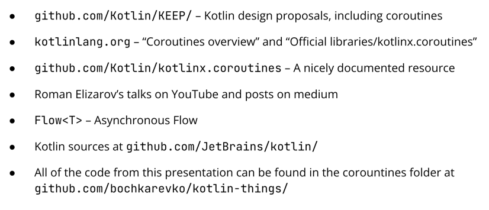