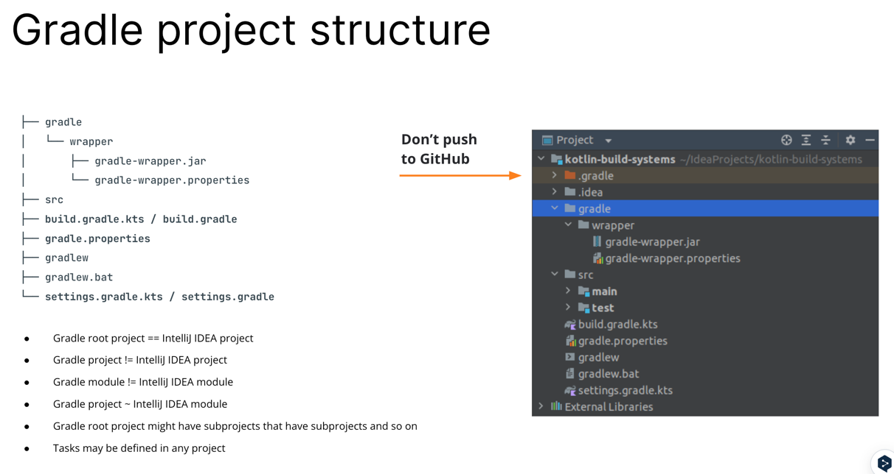
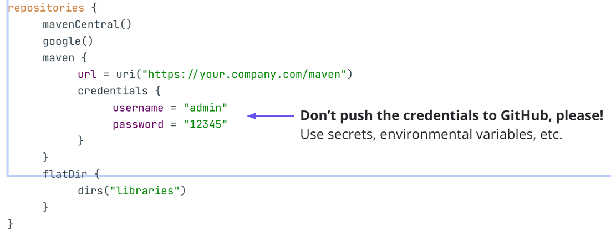
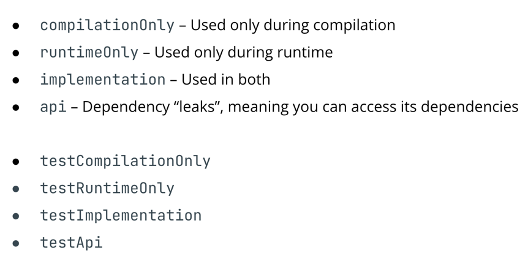
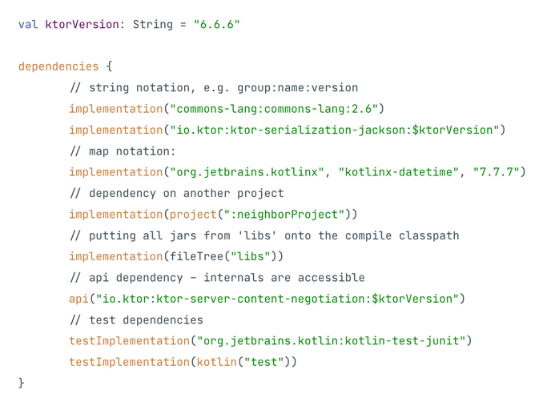
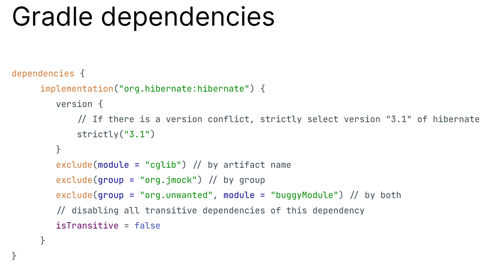

# [Build Systems](https://docs.google.com/presentation/d/1Plt2cpm-GRzxHt1Vu8C90FWnuSYToucWXPLaJKlBRMc/edit#slide=id.p1)

## What? Why?
- Build System: ソースコードから何らかの成果物を得るプロセスを自動化するソフトウェア
  - Apache ant
  - Gradle 
  - Maven
  - Bazel 
  - etc..

## How?
- 書くこと特になし

## Maven
- JVMの世界で言えば、最も広く使われているビルドシステムはMavenだった
- 他の多くのビルドシステムとは異なり、Mavenは宣言型
- 何をビルドするかは記述するが、どのようにビルドするかは記述しない
- ビルド中にカスタム処理を行うには、カスタムプラグインを使用する必要があり、それを見つけて再利用するか、自分でゼロから作成する必要がある
- Mavenは規約に大きく依存
  - ビルドプロセスを簡素化するために、プロジェクトに定義済みのレイアウトを与え、コンパイルやテストなどに標準的なツールを使用する必要がある
  - ビルドのあらゆる側面をカスタマイズする必要がある場合は、そうすることができますが、多くの追加設定および/またはカスタムプラグインが必要になるかもしれない
- JVM依存関係を共有して使用する簡単な方法を導入している
- すべての依存関係には「座標」（依存関係グループ名、アーティファクト名、バージョンを記述する文字列の構造化されたタプル）があり、MavenとMaven互換ツールによって普遍的に理解される
- 依存関係の座標は、ビルドプロセス中に検出され、ダウンロードされるのに十分

## pom.xml
- Mavenがそれほど広く使われなくなった主な理由は、一時期（JVMの世界で）ナンバーワンのビルド・システムだったのと同じ理由
- 宣言的で規約ベースであることは、標準的なユースケースを単純化する一方で、何か特別なニーズ（例えば、インクリメンタルビルドのサポートや自明でないカスタムビルドロジックなど）があるとすぐに、設定を肥大化させ、多くのカスタムMavenプラグインを開発しなければならない
- そして時が経つにつれて、コミュニティは代替のビルドシステムを求めるほどの問題を蓄積していった
- MavenのコンフィギュレーションがXMLで行われるという事実は、この時代におけるMavenの人気の助けにはならない

## Gradle
- そこでGradleが登場
- Gradleは、設定用のDSLリッチな汎用プログラミング言語（GroovyとKotlin）を使うことで、ビルドを記述する宣言的な方法と命令的な方法の両方の長所を組み合わせようとしている
- これにより、通常のビルドでは規約で定義されたシンプルな宣言的記述を行うことができ、一方でスタンドアロンのプラグインを書く必要なく、より複雑なシナリオをカスタマイズすることができる
- ただし、プラグインが必要な場合は、プラグインを書いてビルドをカスタマイズすることもできる
- 依存関係の管理については、Mavenと同じ座標ベースのアプローチを使用しており、既存のMavenスタイルの依存関係リポジトリとの後方互換性が容易
- さらに、Gradleの拡張性は、それを使ってJVMプロジェクトをビルドすることに限定されないことを意味する
  - それは、C++やJavaScriptのような非JVM言語でのプロジェクト構築のために（必要に応じて）使用するのに十分柔軟である

## Gradle project structure
- 
- Gradleプロジェクトはプログラムのビルドを担当し、フォルダに格納される
- 標準的なGradleプロジェクトの構造は上図のようになり、これらはその主な部分
- gradlew{.bat}とgradle|wrapperフォルダは、特定のGradleビルドシステムバージョンのプロジェクトローカルコピーで、プロジェクトのビルドが自己完結していることを保証する
- gradle.propertiesは、ビルドの設定パラメータのキーと値のペアを格納
- settings.gradle{.kts}は通常、Gradleビルドシステム自体を設定するために使用
- build.gradle{.kts}は、プロジェクトのビルド方法を記述するメインファイル
- IntelliJ IDEAとGradleのエンティティ間のマッピングを確立したい場合、経験則として、GradleのプロジェクトはIntelliJ IDEAのモジュールとほぼ同等
- トップレベルのIntelliJ IDEAモジュールはIntelliJ IDEAプロジェクトと呼ばれ、ルートGradleプロジェクトに対応
- ネストされている場合、これらのエンティティはサブプロジェクト、サブモジュールなどを形成
- このマッピングは、IntelliJ IDEAの（サブ）モジュールを使用するデフォルトのIntelliJ IDEAビルドシステム（JPS）と、（サブ）プロジェクトを使用するGradleを整合させる方法
- ビルドシステムがバージョン管理システム（GitやMercurialなど）とどのように連携するかについて詳しく説明することは、この講義の範囲外ですが、ビルドのたびに（再）生成される（したがって、安全に無視できる）無視ファイルとディレクトリの適切なセットを用意する必要があることを述べておく
  - gitignore の話かね
- 良い出発点は次のようなものでしょう: https://github.com/github/gitignore/blob/main/Gradle.gitignore

## Gradle DSL
- build.gradle{.kts}ファイルは特別なGradle DSL (ドメイン固有言語) を使って書かれる
- Groovy/Kotlinの強力なDSL機能のおかげで、これらのファイルはビルドの宣言的記述のように読める
- それでは、build.gradle{.kts}ファイルのさまざまなセクションと、設定できる内容について説明する

## Gradle repositories


- リポジトリセクションでは、プロジェクトが依存関係を見つけるために使用できる依存関係リポジトリについて説明
- 定義済みのリポジトリ (Maven Central や Google など) と、ビルドファイルで定義するカスタムリポジトリの両方を使用できる
- リポジトリ（またはビルドの他の部分）が何らかの個人情報（例えば、カスタムの認証情報）を必要とする場合、VCS管理下のファイルに保存してはいけない
- Gradle は、そのようなプライベートな情報をビルドに渡す複数の方法をサポートしている

## Gradle dependencies


- 詳しくはここを参照
- References:
  - https://docs.gradle.org/current/userguide/declaring_dependencies.html
  - https://docs.gradle.org/current/userguide/declaring_dependencies.html#sec:choosing-configuration


- 依存関係は依存関係セクションで宣言する
- 依存関係のタイプ（つ1まり、ビルドおよび/または実行プロセスのどの部分に属するか）を指定することに加えて、その座標を指定するか、それを見つけるための他の手段を提供する必要がある
- すでに説明したように、これらの依存関係は、repositoriesセクションから設定されたリポジトリで検索される
  - MavenCentral, Google とかね
- 座標は通常、「groupId:artifactId:version」のタプルで指定
- このタプルは、いくつかの異なる表記法（文字列表記法やマップ表記法など）を使用して宣言できる
- これらの座標は、提供されたリポジトリで解決され、ダウンロードされ、ビルドプロセスに含まれる

- また、別のGradleモジュール（別のプロジェクト）やファイルシステム上のライブラリファイルなどへの依存を宣言することもできる
  - マルチモジュールみたいなやつね

- Gradleは設定に本格的なプログラミング言語（Groovy/Kotlin）を使用するため、使用可能な依存関係の記述を作成するカスタム関数を宣言することができる
- 例えば、Kotlinビルドでは、Kotlin固有の依存関係を簡単に追加できる特別なkotlin関数を定義する
- kotlin("test")関数を呼び出すと、Kotlinコンパイラのバージョンやターゲットプラットフォームなどを考慮して、プロジェクトの現在のKotlin設定に正しいkotlin-test依存関係を返す

- さらに、依存性宣言の内部で文字列補間（$ktorVersion）を使って、ビルド構成で利用可能なプロパティ（たとえば、ktorVersion）を使用できる


- お気持ち
  - ほう、こういう設定もできるのか、exclude とかもできるんやな
  - まあでも、結局マルチモジュールみたいにして、そのモジュールで使用するライブラリはそのモジュールの build.gradle に記載するべきやな
- `依存関係の管理で最も重要な点は、依存関係の推移的依存関係（依存関係の依存関係）がビルドシステムによって自動的に処理されること`
- これは、あなたのプロジェクトの依存関係foo:bar:1.33.7自体がbaz:quz:42に依存する場合、その依存関係もプロジェクトに含める必要がないことを意味する
- Gradleのビルドシステムは、このような依存関係を処理し、ビルドに含める

- しかし、これは問題を引き起こします: 同じ依存関係が、あなたのプロジェクトで2つの異なるバージョンの推移的依存関係を持つ場合、どうなるでしょうか?
- どちらを選択しますか？
- デフォルトでは、Gradleは最新バージョンのものを選択する
  - あなたはおそらく、最新の（そして最高の）バージョンで作業したいでしょう
- しかし、もしあなたが、より細かく依存関係を設定したいのであれば、それは可能 (これが画像の設定方法だね)

## BOM
- 依存関係の衝突の問題に対処するもう1つの方法は、Mavenの部品表を使用すること
- これは、他の依存関係のリストとそのバージョンを含む特別な種類の依存関係
- BOMを依存関係として含めると、Gradleはその依存関係をプロジェクトに含める
- さらに、バージョンの競合を解決するためにBOM依存関係のバージョンを使用したい場合は、enforcedPlatformとしてインクルードすることができる

## Gradle tasks
- プロジェクトをビルドするプロセスにはいくつかのステップがある
- これらのステップはGradleではタスクと呼ばれ、標準的な定義済みのものがいくつかある
- 依存関係のように、タスクは他のタスクに依存することもできる
- タスクとは、Gradleに実行させる一連の命令です：
  - ソースコードのコンパイル
  - テストを実行する
  - JARをビルドする
  - Maven（または他のどこか）にパブリッシュするなど。
- デフォルトのタスク、プラグインからのタスク、そしてあなたのカスタムタスクがある
- 最も一般的なタスクは init、wrapper、build、clean、test

## Gradle tasks
```kotlin
// build.gradle.kts – buildfile
tasks.create<Copy>("copy") {
   description = "Copies sources to the destination directory"
   group = "Custom"

   from("src")
   into("dst")
}
```
- あんまりみたことないかもな
- 原則的に、Gradleはビルドの設定に汎用プログラミング言語を使うので、ビルドに関係ない完全なプログラムを書くことも含めて、ビルドでやりたいことは何でもできる
- 例えば、フィボナッチ数を計算するタスクを定義することもできます！
- ふーん
```kotlin
tasks.register("Fib") {
    var first = 0
    var second = 1
    doFirst { 
      println("What is going on?")    
      for (i in 1..11) {
            second += first
            first = second - first
        }
    }
  
    doLast {
        println("Result = $first")
    }
}
```

```kotlin
abstract class FibonacciTask : DefaultTask() {
   @get:Input
   abstract val n: Property<Int>

   @TaskAction
   fun execute() {
       if (n.get() < 0) {
           throw StopExecutionException("n must be non-negative")
       }
       var first = 0
       var second = 1
       for (i in 1..n.get()) {
           second += first
           first = second - first
       }
       println("Result = $first")
   }
}
```
- 使うのかこの知識。。。
- ビルドでフィボナッチ数の計算が頻繁に必要になる場合は、別のタスクタイプに抽象化することができ、簡単に再利用できる
- Gradleタスクを定義するとき、@get:Inputアノテーションでいくつかのプロパティをマークすることで入力を指定し、@TaskActionでマークすることでどの関数がメインであるかを指定する必要がある
- Gradle タスクを使用する場合、タスクビルダーで入力を指定する必要があります (例えば、n.set(11))。タスクが実行されると、タスクのメイン関数（executeなど）が呼び出される

```kotlin
tasks.withType<Test> {
    dependsOn(tasks.withType<PublishToMavenLocal>{}, "jar_name")
}
```
- 以前に説明したように、dependsOn関数を使用して、タスクを互いに依存させることができる
- この場合、（tasks.withType<Test>関数呼び出しで収集した）Test型のすべてのタスクは、PublishToMavenLocal型のすべてのタスクに依存
- これもあんまりみたことがないんだよな。。。

## Gradle plugins
- プラグイン - 特定の何かを処理するのに役立つタスクのセット： Kotlin、Java、Protobufなど
- プラグインのブロックは、他のすべての前に個別にコンパイルされる
- アーティファクトはクラスパスに配置され、IDEがオートコンプリートやその他の便利な機能を提供できるようにする
- apply false` は、いくつかのサブプロジェクトでプラグインが必要な場合に便利
```kotlin
plugins {
   kotlin("jvm") version "1.7.10"
   application // A plugin that runs a project as a Java application
   id("org.jlleitschuh.gradle.ktlint") version "10.3.0" apply false
}
```

- `apply false,true` について
```text
プラグインをバージョンとともに指定したいが、現在のプロジェクトでは有効にしたくない場合 (たとえば、ルートプロジェクトでプラグインを指定したいが、サブプロジェクトでのみ適用したい場合)、
apply false を指定することで実現できます。
プラグインのバージョンはサブプロジェクトに継承され、サブプロジェクトのプラグインブロックを実行したときに自動的に使用されます。
```

```kotlin
// projectRoot/build.gradle.kts
class SamplePlugin : Plugin<Project> {
   override fun apply(target: Project) {
       target.tasks.register("pluginTask") {
           doLast { println("A plugin task was called") }
       }
   }
}

apply<SamplePlugin>()
```
- シンプルなプロジェクトレベルのプラグインはとても簡単に作成できる
- メインのエントリーポイントはターゲットプロジェクトを受け取り、Gradle APIを使用してそれを変更することができる
- この定義はビルド設定スクリプトに置くことができ、他に何もする必要はない

```text
Build script plugins, however, cannot be used in your subprojects. If you want to do that, or if your plugin is too complex to be simply included in build.gradle{.kts}, you may place it in the buildSrc directory of your root Gradle project. The organization of this directory is very similar to any other Gradle project (as Gradle plugins are built using Gradle). Using a java-gradle-plugin, you enable the Gradle API to be used in the plugin project, and there are additional DSLs for specifying and configuring different aspects of the plugin.

References:
https://docs.gradle.org/current/userguide/organizing_gradle_projects.html#sec:build_sources
```
- よくわかんないやこれ、スルメかな

```kotlin
// projectRoot/buildSrc/src/main/kotlin/SamplePlugin.kt [CONTINUED]

class SamplePlugin : Plugin<Project> {
   override fun apply(target: Project) {
       target.tasks.register("PluginTask", SampleTask::class.java) { task ->
           task.username.set("world")
       }
   }
}
```
- now in android, pokedex あたりの buildSrc モジュールと同じ感じだから、それを読むときにここに立ち帰るのがいい気がする

## Gradle properties
- プロパティは、Gradle自身や特定のプロジェクトの動作を設定するために使用される
- 優先順位の high --> low の順
  - Command-line flags, such as --build-cache
  - Properties stored in a local gradle.properties file.
  - Properties stored in the ~/.gradle/gradle.properties file.
  - Gradle properties, such as org.gradle.caching=true, which are typically stored in a gradle.properties file in a project root directory or GRADLE_USER_HOME environment variable.
  - Environment variables

```kotlin
// gradle.properties
kotlin.code.style=official
username=student

// build.gradle.kts
val username: String by project
val kotlinCodeStyle = project.property("kotlin.code.style") as String
tasks.register("printProps") {
   doLast {
       println(username)
       println(kotlinCodeStyle)
       println(System.getProperty("idea.version"))
   }
}
```
- プロパティはキーと値のペアで、キーがプロパティ名、値がプロパティ値
- プロパティ値をビルド構成で使用する必要がある場合、プロパティ名を使って構成から取得することができる


## Gradle settings
- Gradleはビルドのためにプロジェクトをアセンブルする前に、Settingsインスタンスを作成し、設定ファイルをロードする
- Gradleプロジェクトに保存される設定ファイルは1つだけで、次のように使用される
1. ビルドにサブプロジェクトを追加する
2. 新しいプロジェクトプロパティを追加するなど、コマンドラインからパラメータを変更する
3. ライフサイクルハンドラを登録するためにグローバルなGradleオブジェクトにアクセスする

- Gradle自身を設定するには、Gradle settingsを使う
- これは通常settings.gradle{.kts}ファイルにある
- これらはサブプロジェクトをルートプロジェクトにリンクしたり、Gradle固有のプロパティを変更したりする役割を担っている
- 設定の初期化はビルド中に最初に行われます。(Gradleがプラグインセクションを実行する前に行われる)

```kotlin
// settings.gradle.kts
rootProject.name = "Project’s name"
include(
	"Module1",
    "Module2"
)

// Include a repository from GitHub
sourceControl {
	gitRepository(URI.create("Repository URL")) {
		producesModule("Module")
    }
}
```
- 例えば、Gradle の設定では、プロジェクトにサブディレクトリのサブプロジェクトと GitHub リポジトリのサブプロジェクトを含めるように指定できる
- また、プラグインの解決に使用するリポジトリを変更したり、fooという名前のプラグインが実際にはbarという名前のプラグインに解決されるように、完全な解決プロセスを変更することもできる

## Gradle wrapper
- Gradleラッパー（gradlew）は、必要なバージョンのGradleをダウンロードしてキャッシュするシェルスクリプト
  - gradlew - *nix で使用される、nix って何？
  - gradlew.bat - Windowsで使用される
- 最後になりますが、GradleプロジェクトにはGradleラッパーを含める必要がある
- これは、あなたのプロジェクトで使われるGradleビルドシステムの特定のバージョン
- これを固定することで、ビルドの安定性、再現性、再現性を保証することができる
- すべての開発者が独自のバージョンのGradleを使用している場合、バージョン間のGradleの動作の違いによって引き起こされる問題に遭遇するでしょう

## Gradle can do so much more!
- Gradleは多くの追加機能をサポートしているが、今日は取り上げない：
- 正直なところ、私たちはGradleでできることの多くを省きました
- もしあなたがGradleマスターになりたいのであれば、Gradleの素晴らしいドキュメントやチュートリアルを参照してね

# 感想
- 全体を通して、書いてあることはややわかるという感じだった
- 実務で使えるところで言うと、`buildSrc` モジュールを定義されているプロジェクトのコードリーディングをする場合に役に立つかもしれない、くらいだった