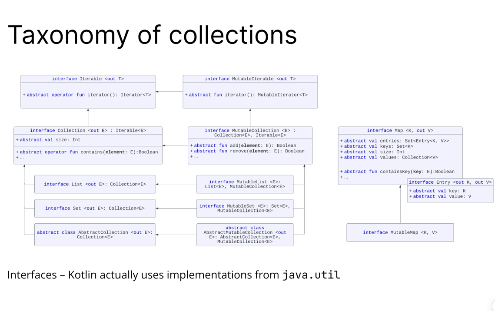
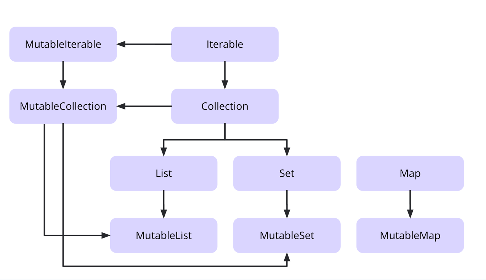
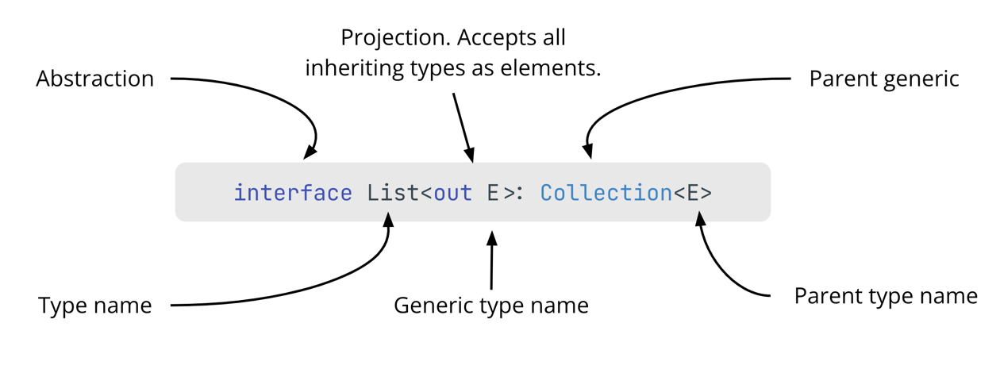

# [Collections and co.](https://docs.google.com/presentation/d/1o0c25j-5UKE1Qw94W26numHxMU_xL0uFchCWJfaOuUc/edit#slide=id.p1)

### What are they?

List, Set, Map について

### How can they be used?
- ↓なるほどね
- 前回のジェネリクスのレッスンで説明したように、コレクションインターフェースとジェネリクスの併用はとても効果的
- コレクションに関して言えば、ジェネリックスのおかげで、例えばListはIntやString、あるいは他のカスタムデータ型を格納するために使うことができるということ

### Taxonomy of collections
- 階層構造

- すべてのコレクションタイプにミュータブルなサブタイプがある
- ミュータブルインターフェースは、対応する読み取り専用インターフェースを、追加や削除のような書き込み操作で拡張する
- (オプション) 読み取り専用インターフェースとミュータブル・インターフェースの両方が同じ実装に裏打ちされている可能性があるので、これは厄介
- 例えば以下はコンパイルエラーになる
```kotlin
val myList = listOf(1, 2, 3)
println(myList[1])
myList[2] = 100
for (e in myList) println("Value: $e")
```
- 当然に読み取り専用なので、mutableList を使用しよう
```kotlin
val myList = mutableListOf(1, 2, 3)
println(myList[1])
myList[2] = 100
for (e in myList) println("Value: $e")
```
- これはコンパイルエラーになるか？(なるわけないだろ)
```kotlin
val myList = listOf(1, 2, 3)
(myList as MutableList)[2] = 100
for (e in myList) println("Value: $e")
```
- 変なキャストしないで mutableListOf を使おうね、以上
- わかりやすく書くとこう



### [Iterable](https://docs.google.com/presentation/d/1o0c25j-5UKE1Qw94W26numHxMU_xL0uFchCWJfaOuUc/edit#slide=id.g19fdf32a2df_0_30) (分かってないんだよなここ)
- 前のスライドで見たように、Iterable型はコレクション型階層の最上位
- これは、Kotlin標準ライブラリのすべてのコレクションが反復可能であることを意味する
- 反復可能とは何か？
  - for ループを使えること、と覚えてしまって良い
- Iterable インターフェースの iterable メソッドには operator 修飾子がついている
```kotlin
public interface Iterable<out T> {
    // Returns an iterator over the elements of this object.
   public operator fun iterator(): Iterator<T>
}
```
- Iterator interface と Iterable interface の違いは何か？
- Iterable interface: 反復可能なデータ構造を表す
- Iterator interface: 反復中にコレクションから要素を取得するメソッドを提供する

### Iterable
- While も反復可能なコレクションを反復処理するのに使える
- 明示的にイテレータを取得して、hasNext() を while ルーオプと並行してしようすることで、項目をループ処理できる
- hasNext() と next() は Iterator インターフェースで宣言されている
```kotlin
/**
* Returns the next element in the iteration.
*/
public operator fun next(): T

/**
* Returns `true` if the iteration has more elements.
*/
public operator fun hasNext(): Boolean
```

### Iterable vs MutableIterable
```kotlin
All collections in Kotlin are Iterable:
val iterator = myIterableCollection.iterator()
while (iterator.hasNext()) {
   iterator.next()
}

But some of them are MutableIterable:
val iterator = myMutableIterableCollection.iterator()
while (iterator.hasNext()) {
   iterator.next()
   iterator.remove() // Because it is a mutable iterator	
}
```
- MutableIterable は remove が追加されているよってだけ、可変な、配列であり、マップであり、セットだからね
- コード↓
```kotlin
/**
* An iterator over a mutable collection. Provides the ability to remove elements while iterating.
* @see MutableCollection.iterator
*/
public interface MutableIterator<out T> : Iterator<T> {
   /**
    * Removes from the underlying collection the last element returned by this iterator.
    */
   public fun remove(): Unit
}
```

### Different kinds of collections
- コレクションには2種類ある： CollectionとMutableCollection
- CollectionはIterableインターフェイスのみを実装
- MutableCollectionはCollectionとMutableIterableインターフェイスを実装
- Collectionは、値を読み込むことができ、コレクションを不変にすることができる
- 反対に MutableCollection は要素の追加削除、コレクションを変更可能

### Mutable Collection != Mutable Variable
```kotlin
val mutableCollection = mutableListOf(1, 2, 3)
mutableCollection.add(4) // OK
mutableCollection = mutableListOf(4, 5, 6) // ERROR: Val cannot be reassigned


var mutableCollection = mutableListOf(1, 2, 3)
mutableCollection.add(4) // OK
mutableCollection = mutableListOf(4, 5, 6) // OK
```
- var にすれば mutableList を再代入できるよ、だけ


### The anatomy of a collection


```kotlin
public interface Collection<out E> : Iterable<E> {
    public val size: Int

    public fun isEmpty(): Boolean

    public operator fun contains(element: @UnsafeVariance E): Boolean

    public fun containsAll(elements: Collection<@UnsafeVariance E>): Boolean
}
```
- ベースとなるCollectionインターフェイスの実装に潜ってみると、isEmpty()などのベースとなるメソッドがいくつか見つかる
- CollectionインターフェイスはKotlin標準ライブラリのすべてのコレクションで実装されているため、 コレクションに要素が含まれているかどうかをチェックするにはisEmpty()が望ましい
- Kotlin の拡張関数を使えばさらに多くのコレクション機能にアクセスできる
- Kotlin 標準ライブラリには複数のコレクション拡張関数があって、そのいくつかは例で見ることができる
- 前回は CollectionインターフェースのisEmpty()メソッドを見た
- コレクションに少なくとも1つの要素が含まれているかどうかをチェックするisNotEmpty()拡張関数もある
- 例えば、isNullOrEmpty() はとてもシンプルで便利
```kotlin
public inline fun <T> Collection<T>?.isNullOrEmpty(): Boolean {
   contract {
       returns(false) implies (this@isNullOrEmpty != null)
   }

   return this == null || this.isEmpty()
}
```

### Сollections under the hood: List
- sublist を使うな、親も更新されちゃうよ
```kotlin
val list1 = emptyList<Int>() // Builds the internal object EmptyList
val list2 = listOf<Int>() // Calls emptyList()
val list3 = listOf(1, 2, 3) // The type can be inferred

val list4 = mutableListOf<Int>() // But better: ArrayList<Int>()
val list5 = mutableListOf(1, 2, 3) // The type can be inferred
val list6 = buildList {
        // constructs MutableList<Int>
        add(5)
        addAll(0, listOf(1, 2, 3))
    }
```
- ArrayListは配列ベースの実装
- 読み込みは安く、一般的に追加も安いが、注入や削除は高い
- これまで述べてきたように、Kotlin標準ライブラリーは多くのコレクション機能を提供してる
- 先に見たlistOfメソッドやmutableListOfメソッドなど、コレクションを素早く作成するためのヘルパーメソッドも複数用意されている

### Сollections under the hood: Set
```kotlin
public interface Set<out E> : Collection<E> {
	abstract val size: Int

	abstract fun contains(element: @UnsafeVariance E): Boolean

    abstract fun containsAll(collection: Collection<E>): Boolean

    abstract fun isEmpty(): Boolean 

    abstract fun iterator(): Iterator<E>
}
```
- 要素の重複をサポートしない
- オブジェクトが同じかどうかをチェックする代わりに、equalsメソッドでオブジェクトを比較

```kotlin
class A(val primary: Int, val secondary: Int)
class B(val primary: Int, val secondary: Int) {
    override fun hashCode(): Int = primary

    override fun equals(other: Any?) = primary == (other as? B)?.primary
}

fun main() {
    val a = A(1,1)
    val b = A(1,2)
    val set = setOf(a, b)
    println(set) // two elements
}
```

```kotlin
class A(val primary: Int, val secondary: Int)
class B(val primary: Int, val secondary: Int) {
    override fun hashCode(): Int = primary

    override fun equals(other: Any?) = primary == (other as? B)?.primary
}

fun main() {
    val a = B(1,1)
    val b = B(1,2)
    val set = setOf(a, b)
    println(set) // only one element
}
```
- hasaCode と equals をオーバーライドすると、setOf(a,b) の結果は要素１つとなる
- 理由は set自体が、set内のオブジェクトが一意であるかどうかをチェックするためにequalsとhashCodeオブジェクト・メソッドのみを使用するから、らしいけどようわからん

### [Сollections under the hood: Map](https://docs.google.com/presentation/d/1o0c25j-5UKE1Qw94W26numHxMU_xL0uFchCWJfaOuUc/edit#slide=id.g19fdf32a2df_0_150)
脳のメモリを死ぬほど食う、この辺全然分かってないので続きは明日