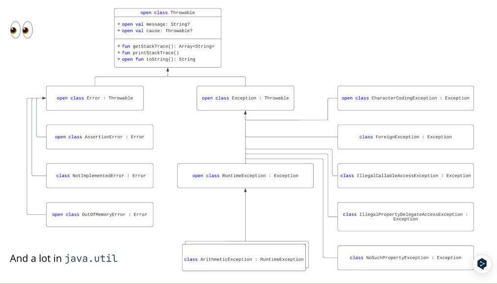

## Exceptions

## What, WHy?
- 例外は何かが当別にうまくいかなかったことを知らせる
- 開発ミス
- 外部のリソースによって発生したエラー
- システムエラー

- 例外を使う理由
  - エラー処理コードを通常のコードから分離するため
  - エラーをコールスタックに伝搬させる
  - エラーの種類をグループ化して区別する
  - 以下の例では例外を使わない方が良い
    - 制御フロー
    - 管理可能なエラー

## How?
```kotlin
fun main() {
   throw Exception("Hello, world!")
}
/// or even better
fun main() {
   val nullableString: String? = null
   println("Hello, NPE! ${nullableString!!}")
}
```
- 例外は　Java から導入された
- 全体的なコンセプトは非常によく似ているが、大きな違いもある
- 例外を投げる簡単なコードを見てみよう
- 手動で例外を投げるには throw と任意の型を使う
- Kotlin にはチェックされた例外はない
- 言い換えれば、全ての例外はチェックされていない
- Kotlin コンパイラーは、try-catch で呼び出しをラップしたり、例外をrethrow したりすることを強制しない
- 最初のコードスニペットをコンパイルしてみると・・・？
  - 読んだけどよくわからん

## Example
```kotlin
fun main() {
    try {
        throw Exception("An exception", RuntimeException("A cause"))
    } catch (e: Exception) {
        println("Message: ${e.message}")
        println("Cause: ${e.cause}")
        println("Exception: $e") // toString() is called "under the hood"
        e.printStackTrace()
    } finally {
        println("Finally always executes")
    }
}
```

## Another meaningful example
```kotlin
data class Person(val name: String, val surname: String, val age: Int) {
   init {
       if (age < 0) {
           throw IllegalStateException("Age cannot be negative")
       }
       if (name.isEmpty() || surname.isEmpty()) {
           throw IllegalArgumentException("For blank names/surnames use -")
       }
   }
}
```
- init でバリデーションかけるいつものやつやな

## Dealing with exceptions
```kotlin
try {
   val (n, s, a) = readLine()!!.split('/')
   val person = Person(n, s, a.toInt())
   addToDataBase(person)
} catch (e: IllegalStateException) {
   println("You've entered a negative age! Why?")
} catch (e: IllegalArgumentException) {
   println(e.message)
} catch (e: NullPointerException) {
   println("NPE ;^)")
} catch (e: Exception) {
   println("Something else went wrong")
   throw Exception("Failed to add to the database", e)
} finally {
   println("See you in the next episodes!")
}
```

```kotlin
inline fun <T, E> Result<T>.on(vararg exceptionClasses: KClass<out E>, action: (exception: E) -> Unit) =
   onFailure { exception ->
       if (exceptionClasses.any { it.isInstance(exception) }) action(exception as E)
   }

runCatching {
   // do some nasty things...
   .on(IllegalArgumentException::class, IllegalStateException::class) {
      kotlin.io.println("Something went terribly wrong ${it.message}")
   }
}
```
- Result の例だから、API 通信周りのハンドリングでこういうのあるよって話だね
- 複数例外をこれでキャッチできるよってことだね

## 👀


## Kotlin Sugar
```kotlin
/// try is an expression:
val a: Int? = try { input.toInt() } catch (e: NumberFormatException) { null }

// More sugar:
require(count >= 0) { "Count must be non-negative, was $count" } 
// IllegalArgumentException

error("Error message")
// IllegalStateException
```
- Kotlin には例外を扱うための標準ライブラリにさらにいくつかの追加関数がある
- 例えば、require を見てみよう
```kotlin
@kotlin.internal.InlineOnly
public inline fun require(value: Boolean, lazyMessage: () -> Any): Unit {
   contract {
       returns() implies value
   }
   if (!value) {
       val message = lazyMessage()
       throw IllegalArgumentException(message.toString())
   }
}
```
- この関数は、渡された値がfalseの場合、IllegalArgumentExceptionをスローすることがわかる
- では、明示的に例外をスローする代わりにrequireを使ってPersonデータ・クラスを実装してみよう
```kotlin
data class Person(val name: String, val surname: String, val age: Int) {
   init {
       require(age > 0)  { "Age cannot be negative or zero" }
   }
}
```
- Person の init でこれ使ったほうがわかりやすいよねってやつだけだね
完了！