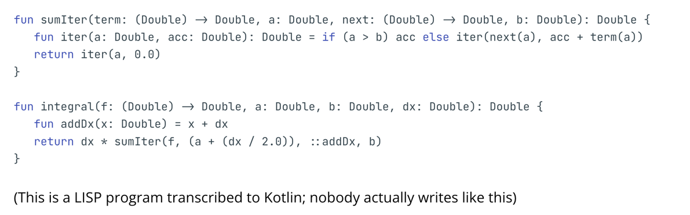
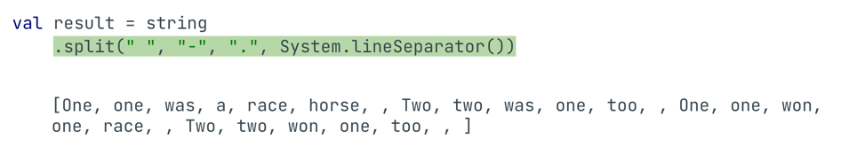
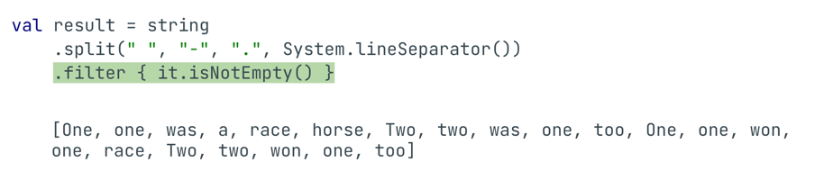
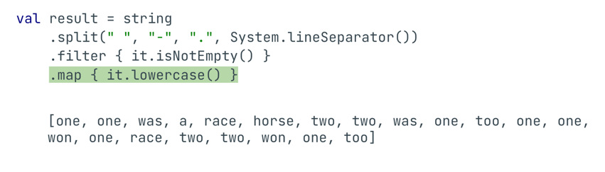
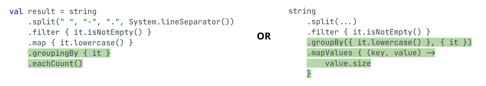
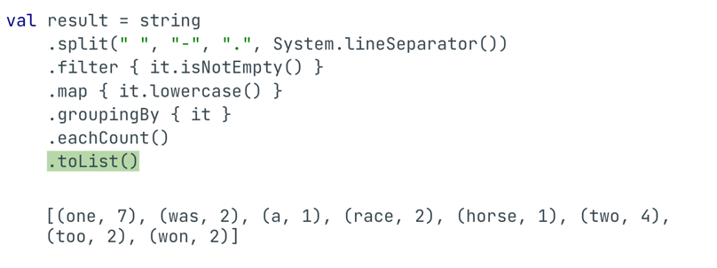
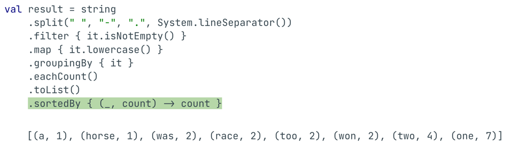
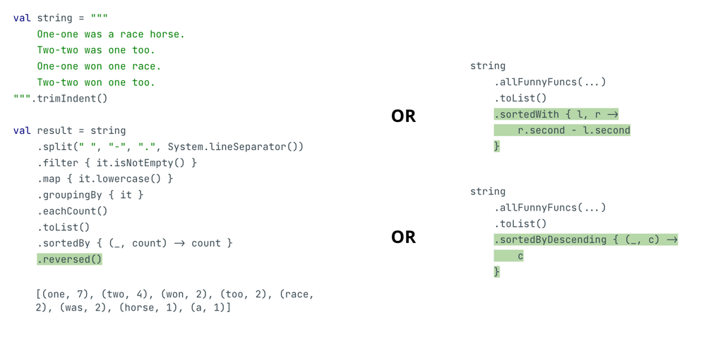

# [Functional Programming](https://docs.google.com/presentation/d/19C10TZM1kT0AzEjqSfLZs1_HC3Ye0E9h6muVDikl4uo/edit#slide=id.p1)

## What?
- 関数型プログラミングの概念も入っているから確認せな

## Our approach
- 長所だけ見るよ
- Haskell は扱わないよ

## We already know that...
- Kotlinでは、関数を他の関数の引数として渡すことができる
- 関数の最後の引数が関数の場合は、括弧の外に書くことができる
- 関数の唯一の引数が関数の場合はカッコを完全に省略できる
- Lamda val で定義できるし、var 変数に代入もできる
- ラムダ式は関数構文に置き換えられる
- 関数の中で関数宣言が許される

## 高階関数
- 他の関数を引数に取る関数のこと
- コレクションを扱う時によく遭遇する
- Kotlin でできることは全て関数でできる、Kotlin の関数は一級市民であるということ
- 関数型では関数は純粋であるように設計されている
- 簡単にいえば状態を持たない
- ループはitエレーラインデックスを持ち、インデックスは状態

- 純粋関数型プログラミングにおける関数はすべて数学的な意味での関数とみなされる、入力に対していつも同じ値を返すということだね
- 
- 今はよくわかってない。。

- 関数型の文脈では map ,filter, fold といった関数を使う必要がある
- map ではコレクション内の各要素に対して関数を実行できる

- 関数を組み合わせることで両方の操作を実行できる
```kotlin
val list = listOf(1, 2, 3)
list.map { it * it }.map { it + 1 }. // [2, 5, 10]
```

- filterは、与えられた述語にマッチする要素だけを含むリストを返す
- foldは、処理を折りたためるよってこと、以下の例だと acc,x は以下のようになる
- acc = 0, x = 1 --> acc = acc + x --> acc = 1, x = 2 --> acc = acc + x --> acc = 3 , x = 3 --> acc = acc + x --> acc = 6, x = indexout なので acc = 6 が出力
- 逆かもしれんけどまあそういうこと
```kotlin
val list = listOf(1, 2, 3)
list.fold(0) { acc, x -> acc + x } // 6
```

- こんなのもできるやでって例
```kotlin
val string = """
    One-one was a race horse.
    Two-two was one too.
    One-one won one race.
    Two-two won one too. 
""".trimIndent()

val result = string
    .split(" ", "-", ".", System.lineSeparator())
    .filter { it.isNotEmpty() }
    .map { it.lowercase() }
    .groupingBy { it }
    .eachCount()
    .toList()
    .sortedBy { (_, count) -> count }
    .reversed()
```















- 他の関数を期待する関数に引数として渡すことができるのはラムダだけではありません：
```kotlin
fun isEven(x: Int) = x % 2 == 0

val isEvenLambda = { x: Int -> x % 2 == 0 }

// Same results, different calls:
list.partition { it % 2 == 0 }
list.partition(::isEven) // function reference
list.partition(isEvenLambda)  // pass lambda by name
```
- `partition` について
```kotlin
val array = intArrayOf(1, 2, 3, 4, 5)
val (even, odd) = array.partition { it % 2 == 0 }
println(even) // [2, 4]
println(odd) // [1, 3, 5]
```

## Lazy computations
- 直訳すると、`「怠惰な計算」`なんやこれ
```kotlin

fun <F> withFunction(
    number: Int, even: F, odd: F
): F = when (number % 2) {
    0 -> even
    else -> odd
}

fun main() {
    withFunction(4, println("even"), println("odd"))
}
```
- これを実行したら、even と odd が両方 print されまっせって話やな
- なぜこれが起こるのか？って話やな
- それはなんや知らんけど遅延計算のせいらしいな、なんやそれは
- こう書いてあげると想定の挙動をしてくれる

```kotlin
fun <F> withLambda(
    number: Int, even: () -> F, odd: () -> F
): F = when (number % 2) {
    0 -> even()
    else -> odd()
}
fun main() {
    withLambda(4, { println("even") }, { println("odd") })
}
```
- 要するに、ちゃんと関数渡してんでっていうのを定義してあげれば想定通りになるっちゅうことやんな

## Operator overloading
- Kotlinには、例えばイテレータのような演算子をオーバーライドするために使える拡張関数がある
- つまり、OOPコードのようにIterableインターフェイスを継承した新しいエンティティを作成する必要はない

## One last thing…
```kotlin 
/// this code correct?

enum class Color {
    WHITE,
    AZURE,
    HONEYDEW
}

fun Color.getRGB() = when (this) {
   Color.WHITE -> "#FFFFFF"
   Color.AZURE -> "#F0FFFF"
   Color.HONEYDEW -> "F0FFF0"
}
```
- Yes, because the compiler knows all of the possible values.

```kotlin
/// What is about this example?

sealed class Color

class WhiteColor: Color()
class AzureColor: Color()
class HoneydewColor: Color()

fun Color.getRGB() = when (this) {
   is WhiteColor -> "#FFFFFF"
   is AzureColor -> "#F0FFFF"
   is HoneydewColor -> "F0FFF0"
}
```
- しかし、Kotlinにはシールドされたクラスやインターフェースもある
- これらのサブクラスは、親と同じモジュールで定義されたものに限られる
- これらのサブクラスは、enumに適用されるのと同じ効果を受けるか？
- この例はどうだろう？
```kotlin
sealed class Color

class WhiteColor: Color()
class AzureColor: Color()
class HoneydewColor: Color()

fun Color.getRGB() = when (this) {
   is WhiteColor -> "#FFFFFF"
   is AzureColor -> "#F0FFFF"
   is HoneydewColor -> "F0FFF0"
}
```
- コンパイラーはコンパイルの段階で、Colorクラスのすべての可能な子クラスを知っているので、新しいクラスは出現しない
- 要は　sealed class を使うと、when で考慮もれがあればビルドエラーで落ちてくれるちゅう話やな、enum だとそうならんけども
- ん？違うかも。。
- この辺の英語のスライドってようわからんよなあ。。

まあいいか、以上。