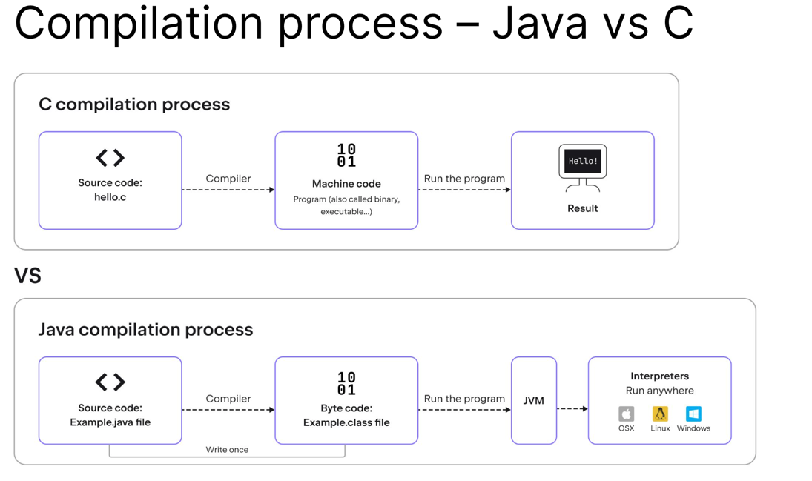
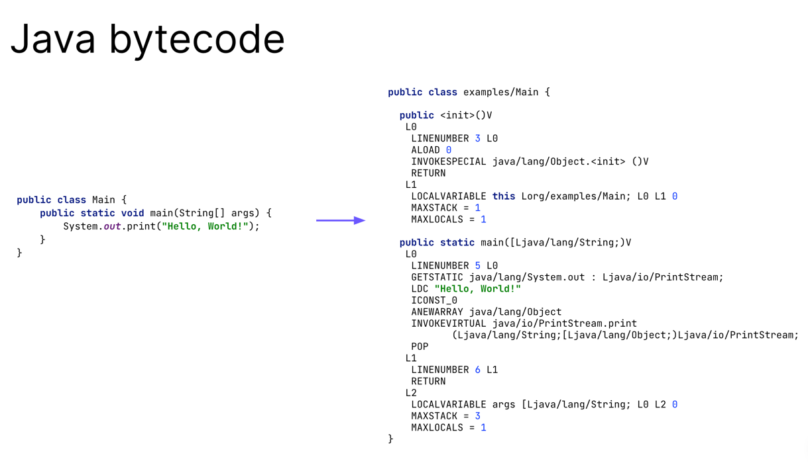
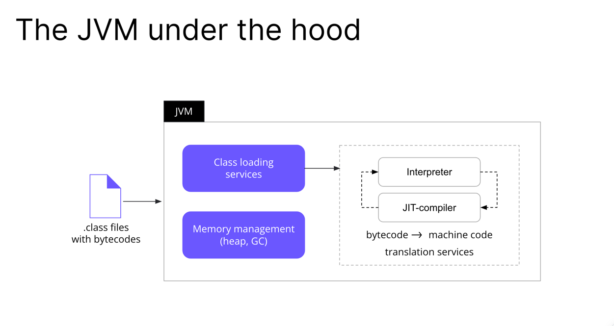
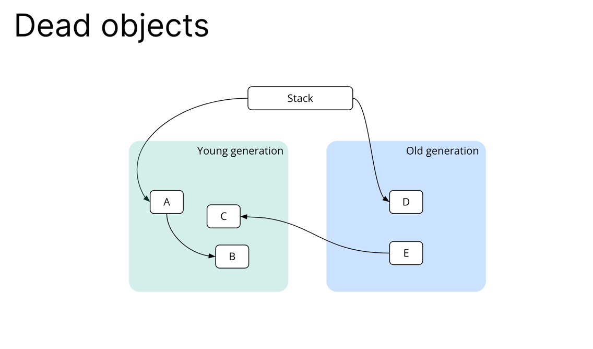
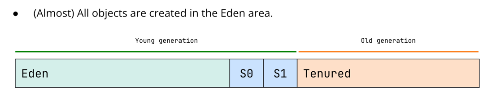
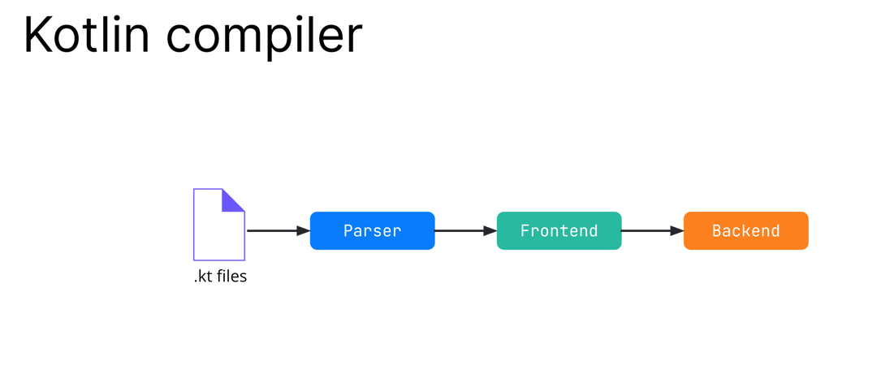
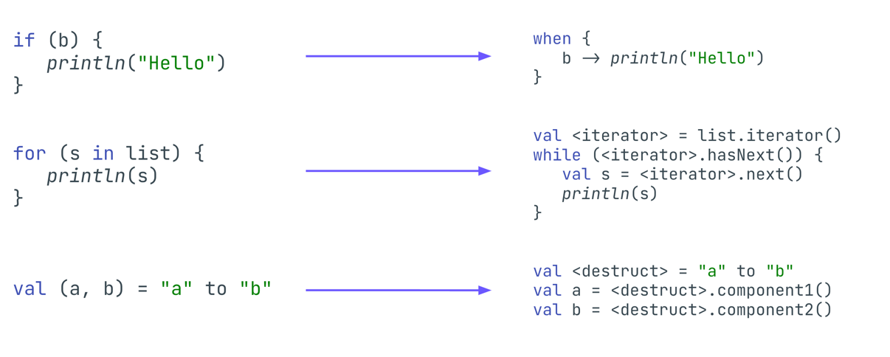
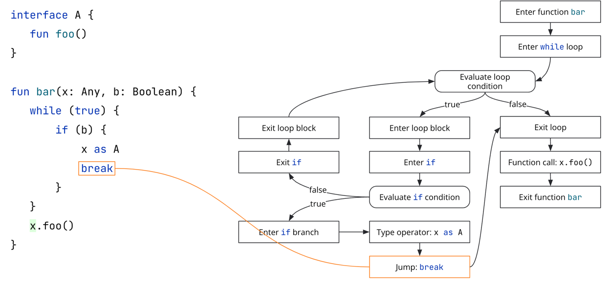

## The Java Virtual Machine & the Kotlin Compiler

## The Java language
- 1995年製
- 強力な静的型付けを持つOOP言語
- ジャストインタイム（JIT）コンパイルが可能
- Java仮想マシン（JVM）を使用
- ガベージ・コレクターがあり、メモリを割り当てると自動的に解放される

## Compilation process – Java vs C
- 

## Java bytecode
- 

## The JVM under the hood
- 

## Memory organisation
- JVMのメモリーは2つの部分に分かれている
  - スタティック・メモリー（非ヒープ・メモリー）は、JVMの起動時に作成され、主にクラス構造、フィールド、メソッド・データ、メソッドとコンストラクターのコードを格納する
    - ロードされたクラス 
    - すべてのスレッドのスタック
    - JVM自体のサービス・メモリー
    - 小さい - スタック用におよそ1024 KB 
  - ヒープ・メモリーは、すべてのJVMスレッド間で共有される実行時データ領域で、すべてのJavaオブジェクトのメモリーを割り当てるために使用される
    - プログラムの実行中に作成されるすべてのオブジェクト
    - 大 - 数MBから数TBまで

## Weak generational hypothesis 
- 弱い世代仮説によれば、オブジェクトは若くして死ぬ傾向がある
- 関連する仮説として、オブジェクトが長生きすればするほど、その物体が生き続ける可能性が高まるというものがある

## Generations
- 日本語訳を読んだけどよくわからんな

## Dead objects
- 
- E はどこからも参照されていないのでまあ死んでいるよねと

## Serial garbage collector
- 最初に作られたガベージコレクタはシングルスレッドのシリアルガベージコレクタで、パラレルガベージコレクタとCMSガベージコレクタはこれをベースにしている
- シリアルガベージコレクタでは、ヒープは4つの領域に分割される
  - エデン - 若い世代のおよそ8/10
  - 生存者0 - 若い世代のおよそ1/10
  - サバイバー1 - 若い世代のおよそ1/10
  - テニュアード - おおむねヒープの2/3
- (ほぼ）すべてのオブジェクトはエデン地区で作成される。
- 

## How garbage collection works
- みてもあんま勉強にならんな

## Just in time compilation
- プログラムのプロファイリングは実行時に行われる
- コードの断片は、実行時間を最適化するために特定のプラットフォーム用にコンパイルされる 
- コマンドを解釈するのは、プロセッサ上で直接実行するよりもはるかに遅い

- 全てのプログラミング言語はその場で解釈されるか、静的に何らかのコードのコンピアルされ、ハードウェアか特別に設計されたソフトウェアによってその場で解釈される
- このようなコンパイルは AOT コンパイルと呼ばれる
- Python, JS, Ruby では使われてない

- さらに優れた実行速度を得るために、JVM プラットフォームはダイナミックコンパイルを積極てに使用している
- この辺読んでも、うーんって感じやな

- チューリングっぽい写真の説明読んだ感じだと
  - コンパイルをする際にどこをコンパイルするべきか決定するための、明白ではないメトリクスがいくつかあり、コードを効率的にコンパイルするためのあまり明白ではないヒューリスティックがたくさんある
  - ヒューリスティック: 必要ない部分まで全てコンパイルする、と、必要な部分まで何もコンパイルしない、のバランスを探すために我々が行う仮定
- JVM が実行されると、コード解釈とプロファイリングを同時に開始する
- これをJVM ウォームアップと呼ぶ
- とか何たらかんたら...ふーんという感じ

## The Kotlin language
- JVMバイトコードにコンパイルできる
- Javaと相互運用可能
- Javaプロジェクトで動作
- Javaライブラリを使用できる
- 安全で簡潔
- コンパイルプロセスに統合する機能（コンパイラ・プラグイン）を提供す
- Googleによると、Androidアプリケーションの主要開発言語

## Kotlin compiler

- 第一近似として、Kotlinコンパイラーは3つの主要な部分で構成されている
  - ひとつはパーサー 
    - ソースコード（コンパイラーにはプレーンテキストのように見える）を受け取り、残りの処理に便利な形式に変換する
    - パーサーはコードの構造を表すだけで、コードの意味を理解しようとしたり、変数や型をコード内の名前で解決しようとしたりはしない
  - フロントエンドは、パーサーによって解析されたソースコードと、コードのコンパイル時の依存関係（KotlinやJavaのコンパイル済みライブラリのような）を受け取り、コードの意味を判断して、さらにコードを渡して最終的な形式にコンパイルできるようにする
  - たとえば、ライブラリ用のKLibファイル（klibはKotlinのライブラリ表現のフォーマット）、JVM用のJavaバイトコード、JSプラットフォーム用のJSファイルやTSファイル、ネイティブプラットフォーム用の実行ファイルなどです。コンパイラの中で最も重い部分
  - FIR? の章も読んだけど、プログラムで書かれている内容をどう解釈していくか、みたいなところはおもろいかもな、理解したいとは別に思わんけどな

## FIR: desugaring

- ほえええ
- フロントエンドはデシュガーも行う
- デシュガーとは、高レベルの構文を同等の低レベルのコードに置き換えること
- 簡単に言うと、デシュガーは構文上の糖分を「糖分のない」等価なものに置き換える
- これによって、コンパイラー・コード中の定型文（if式やwhen式に似たようなコードを書くなど）を排除し、コードをプラットフォーム操作に変換できるようにすることができる

## Kotlin compiler: control- and data-flow analysis

- ほお

まあ色々とほええとはなった、直接実務にという部分は特にない