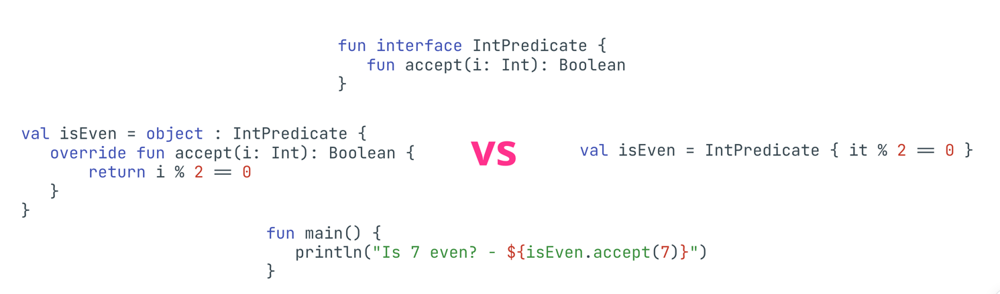
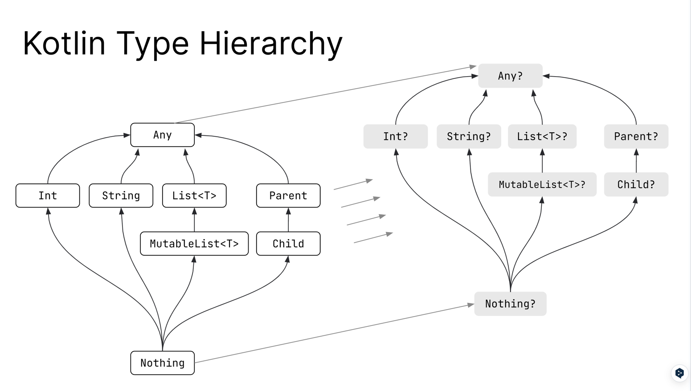

# [Object Oriented programming](https://docs.google.com/presentation/d/1RvnmqWM-Q_hYi1dWwqN1ieK2pZAwlThOkLI9j5yqViU/edit?usp=drive_link)

### Encapsulation
- internal: モジュールのなかで利用可能

### Constructors
- コンストラクタがprimaryとsubで2つあるよ
- init もあるよ
- init でバリデーションかけられるよ
以上

```kotlin
open class Pointer(private val stg: String, private val name: String) {
    constructor(other: Point): this(other.x, other.y) {...}
    
    init {
        this.stg + this.name
    }
}
```

### Inheritance
- 継承させたいクラスは open つけようね

### Properties
- プロパティはオプションでイニシャライザ、ゲッター、セッターをもてる
- ゲッターやセッタ内の値にアクセするには field キーワードを使用する
  - 使用しないと無限再帰が発生する可能性がある
- ゲッター、セッターは継承先でオーバーライドされる可能性がある
- インターフェースはプロパティをもてるけど常に抽象プロパティ
- final をつければオーバーライドを禁止できる

### Operator overloading
- この章ちょっとよくわからんな

### Extensions
- 継承、リフレクションを用いずにクラスやインターフェースを拡張できる機能を持っている
```kotlin
fun <T> MutableList<T>.swap(index1: Int, index2: Int) {
    val tmp = this[index1] // 'this' is the given MutableList<T>
    this[index1] = this[index2]
    this[index2] = tmp
}
```

### Extensions under the hood
```kotlin
open class Shape
class Rectangle: Shape()

fun Shape.getName() = "Shape"
fun Rectangle.getName() = "Rectangle"

fun printClassName(s: Shape) {
  /// s が Shape or Rectangle によるけど、ちゃんとそれぞれのメソッドを呼べるね
  println(s.getName())
}

/// ただし、このメソッドを使った場合は Rectangle.getName が呼ばれるわけではないよ
printClassName(Rectangle()) // "Shape", not Rectangle
```

### Infix Functions
- infix記法
  - . と () を省略して呼び出せる関数
  - infix 関数は以下の条件を満たす必要がある
    - メンバ変数 or 拡張関数であること
    - パラメータが一つであること
    - パラメータは下変数の引数を受け入れてはならず、デフォルト値を守ってはならない
```kotlin
data class Person(val name: String, val surname: String)

infix fun String.with(other: String) = Person(this, other)

fun main() {
   val realHero = "Ryan" with "Gosling"
  println(realHero.name + " " + realHero.surname)
  
  /// こっちは infix 関係なくね？違うの？
  val (real, bean) = realHero
   println(real)
   println(bean)
}
```

出力
```text
Ryan Gosling
Ryan
Gosling
```

### ComponentN operator
```kotlin
class SomeData(val list: List<Int>) {
   operator fun component1() = list.first()
   operator fun component2() = SomeData(list.subList(1, list.size))
   operator fun component3() = "This is weird"
}

fun main() {
   val sd = SomeData(listOf(1, 2, 3))
   val (head, tail, msg) = sd
   println(head.toString() + " " + tail.toString() + " " + msg.toString())
   val (h, t) = sd
   println(h.toString() + " " + t.toString())
   val (onlyComponent1) = sd
   println(onlyComponent1.toString())
}
```
- どのクラスも、破壊的宣言で使用できる componentN メソッドをいつくでもオーバーロードできる
- データクラスはデフォルトでこれらのメソッドを持っているよ
  - 使っているところを見たことはあんまりないけどね

### Data classes
- equals, hashCode, toString, componentN, copy などをデフォルトでもつよ
- 標準ライブラリに Pair, Triple クラスが用意されているけどデータクラスの方がよりよいよ

### Inline (value) classes
- プライマリコンストラクタ、パラメータを持たないといけない
- インターフェースの実装、プロパティの宣言、init ブロックをもてる
- inline class はクラス改装に参加できない、自動的に final キーワードがつけられる

ぶっちゃけそこまで使用するイメージがわかないんだよな

[例](https://kotlinlang.org/docs/inline-classes.html#members)

```kotlin
@JvmInline
value class Person(private val fullName: String) {
    init {
        require(fullName.isNotEmpty()) {
            "Full name shouldn't be empty"
        }
    }

    constructor(firstName: String, lastName: String) : this("$firstName $lastName") {
        require(lastName.isNotBlank()) {
            "Last name shouldn't be empty"
        }
    }

    val length: Int
        get() = fullName.length

    fun greet() {
        println("Hello, $fullName")
    }
}

fun main() {
    val name1 = Person("Kotlin", "Mascot")
    val name2 = Person("Kodee")
    name1.greet() // the `greet()` function is called as a static method
    println(name2.length) // property getter is called as a static method
}
```

この例だと、greet メソッドが static になるし、getter も static になるんだね

ぶっちゃけ有用性がよくわかってない、、出てきたら確認するレベルで良さそう

### Enum classes
```kotlin
enum class Color(val rgb: Int) {
    RED(0xFF0000),
    GREEN(0x00FF00),
    BLUE(0x0000FF)
}
```

はいはい、というやつ

### Sealed classes
- enum と同じように使用できる
それ以外は一旦いいかな。。

### Functional interfaces(SAM)


7が奇数か偶数か判定するやつ、ラムダ式で定義するのか？ object(シングルトン) で受けて、ちゃんとオーバーライドを明示的に書くか？
で VS ということね。

### Kotlin Singleton
- object

```kotlin
object DataProviderManager {
    fun registerDataProvider(provider: DataProvider) {
        // ...
    }

    val allDataProviders: Collection<DataProvider>
        get() = // ...
}

DataProviderManager.registerDataProvider(...)
```

### Companion objects
- companion object {} で定義できる
- 以下の static メンバをおくといい
  - Factory method (viewmodel)
  - Constants (定数)
  - など

### Kotlin Type Hierarchy


お疲れ様！！！