# [Parallel & Concurrent Programming](https://docs.google.com/presentation/d/1n8rTULotZHei3ktajyupwRpKdPDACBAZeBo2GqwYhHY/edit#slide=id.p1)

## Definition
- ウィキペディアによれば、並列コンピューティングとは、「多くの計算や処理が同時に実行される」コンピューティングの一種
- コンカレント・コンピューティングとは、複数の計算を逐次的に実行するのではなく、時間的に重なりながら同時に実行するコンピューティングの一形態
- 同時並行性なしに並列性を持たせることも、並列性なしに同時並行性を持たせることも可能

## Parallelism vs concurrency
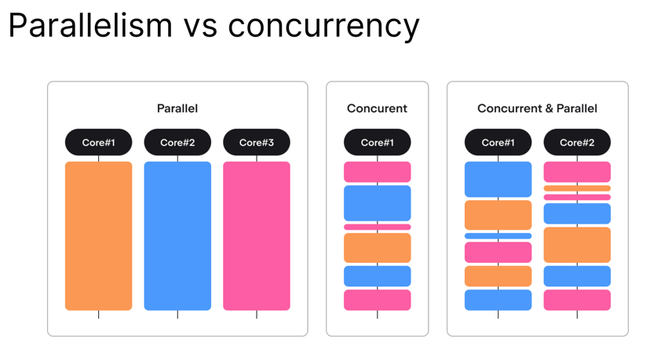

## Concurrency: processes vs threads
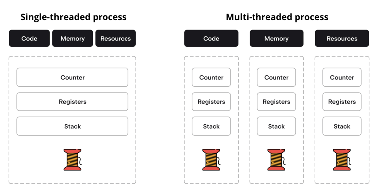

## Preemptive vs cooperative scheduling
- 割り込み型と協調型があるみたい
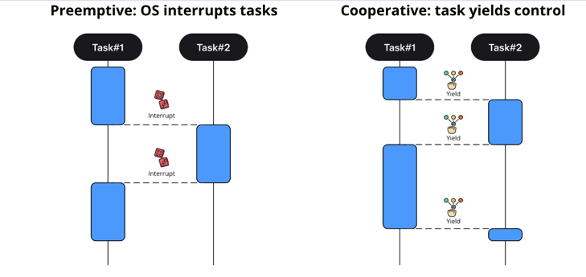

## Parallel and concurrent Programming in the JVM
- JVMは独自のスケジューラを持っている
- OSのスケジューラから独立しているJVMスレッド != OSスレッド
- => マルチスレッドのJVMアプリは、シングルスレッドOS上で実行できる
- (DOS）JVMスレッドはデーモンかユーザースレッド

- すべてのユーザー・スレッドが終了するとアプリは停止
- JVMはデーモンスレッドの終了を待たない

## Parallel programming in the JVM
- Java
  - java.langには基本的なプリミティブが含まれています： Runnable、Threadなど 
  - java.util.concurrentには同期プリミティブと並行データ構造が含まれる
- Kotlin
  - kotlin.concurrent - Javaクラスのラッパーと拡張

## Throwback: Single abstract method interfaces
```kotlin
@FunctionalInterface
public interface Runnable {
   public abstract void run();
}

class RunnableWrapper(val runnable: Runnable)

val myWrapperObject =
   RunnableWrapper(
       object : Runnable {
           override fun run() {
               println("I run")
           }
       }
   )
val myWrapperLambda = RunnableWrapper { println("yo") }
```
- 前回の講義で取り上げた単一抽象メソッド・インターフェースについて考える
- これらは、その単一の抽象メソッドの実装だけをラムダとして提供することで、インスタンス化することができる
- 次のトピックであるRunnableは、JVM並列プログラミングで広く使われている非常に一般的なインターフェース

## Ways to create threads
- スレッドはJVMのクラスで、個別のスレッドで実行できる作業を表すためのもの
- Threadは前のスライドで述べたRunnableインターフェースを実装
- Threadクラスを継承し、runメソッドを実装し、アプリケーション全体で使用することができる
```kotlin
class MyThread : Thread() {
   override fun run() {
       println("${currentThread()} is running")
   }
}

fun main() {
   val myThread = MyThread()
   myThread.start()
}
```

## run vs start
- スレッドはRunnableを実装しているので、runを呼び出すことはできるが、呼び出すべきではない
- スレッドで動作すべきコードに過ぎないが、それを呼び出すと、呼び出したスレッドでそのコードが実行されてしまう（並列性がない）
- その代わりに、スレッドはstartを使用して起動する必要がある
- startは、runの実行を別のスレッドに移し、startを呼び出したスレッドをブロックしない
```kotlin
fun main() {
   val myThread1 = MyThread()
   myThread1.start() // OK
   val myThread2 = MyThread()
   myThread2.run() // Current thread gets blocked
}
```

## Ways to create threads
- Runnableインターフェイスを実装し、それをスレッドに渡すことができる
- 同じRunnableを複数のスレッドに渡すことができる
```kotlin
fun main() {
   val myRunnable = Runnable { println("Sorry, gotta run!") }
   val thread1 = Thread(myRunnable)
   thread1.start()
   val thread2 = Thread(myRunnable)
   thread2.start()
}
```
- もっと簡単な方法は、Runnableインターフェイスを実装し、できたクラスをスレッドに渡すこと
- Threadはクラスなので、Threadを継承しても他のクラスを継承することはできない
- インターフェースなので、実装したクラスは他のどの階層にも参加することができる
- ここでもうひとついいのは、同じRunnableインスタンスを複数のスレッドに渡せること
- ただし、これらのrunnableや/threadが共有する可能性のあるリソースには（いつものように）注意しなければならない

- Kotlinには、スレッドを作成するさらにシンプルな方法があるが、ボンネットの下では、昔と同じスレッドが作成され、開始される
- 
```kotlin
import kotlin.concurrent.thread

fun main() {
   val kotlinThread = thread {
       println("I start instantly, but you can pass an option to start me later")
   }
}
```
- これがスレッドを作成する望ましい方法
- スレッドはKotlinの高次関数で、ラムダ（実行メソッドの実装）を受け取って新しいスレッドを作成し、即座に開始される
- 詳しくはこちらのドキュメントを参照
- threadはいくつかの引数も受け取りますが、それらはスレッドのプロパティに対応
- thread(start = false, name = "Threadripper") { ... } は、即座には開始されず、 "Threadripper" という名前を持つスレッドを作成

## Thread properties
- スレッドのプロパティは、開始後に変更することはできない
```text
スレッドの主なプロパティ
id： Long - これはスレッドの識別子です。
name: 文字列
priority: 文字列： Int - 1から10の範囲で、値が大きいほど優先度が高いことを示す。
デーモン： ブール値
状態： スレッド状態
isAlive： ブール値
```
- Priorityは、与えられたスレッドに対してより多くの、あるいはより少ないプロセッサ時間を割り当てるようにスケジューラに要求する方法

## State of a thread
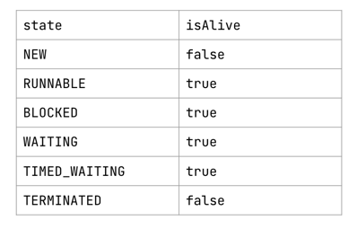
- Stateは特殊で、isAliveは理解しやすいフラグで、スレッドが何かを実行していることを知らせるだけ
- スレッドが作成されたが開始されていない場合、スレッドは何も実行できず、生きていない
- もちろん、スレッドがすべての処理を終了したときや、エラーに遭遇したときも、スレッドは生きていない
- スレッドはさまざまな理由でブロックされるため、さまざまな「ブロックされた」状態がある
- ブロックされた状態とは、ソケットへの書き込みなど、OSのイベントを待っている状態
- 待機中とは、ロックや条件など、何らかのリソースを待っている状態を意味する
- 時間待ちとは、スレッドがスリープしているか、タイムアウトを伴うブロッキング処理を実行していることを意味する
- 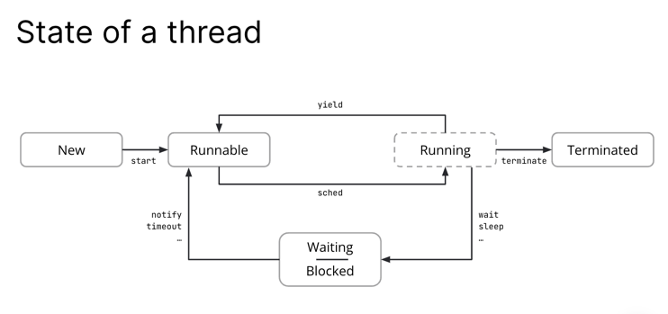
- Runnableは、スレッドが実行可能であることを示す状態であり、実行するかどうかはスケジューラ次第であることを意味する
- スケジューラは、コードの任意のタイミング／ステートメントで、スレッドをプロセスから離す（パークする）ことができる
- 実行中のボックスが破線になっているのは、仮想状態と考えることができるから
- Running "のために別のThread.stateを持つのは意味がない
- なぜなら、この情報を得るまでに、スケジューラはすでにスレッドをRunnableに戻している可能性が高いから
- スレッドがWaiting状態やBlocked状態に移行できるのは、Running状態からだけ

## Ways to manipulate a thread's state
```kotlin
val myThread = thread { ... } — Creates a new thread
myThread.start() — Starts a thread
myThread.join() — Causes the current thread to wait for another thread to finish
sleep(...) —  Puts the current thread to sleep 
yield() — Tries to step back `
myThread.interrupt() — Tries to interrupt a thread
myThread.isInterrupted() — Checks whether thread was interrupted 
interrupted() — Checks and clears the interruption flag
```
- ここで重要なのは、sleepはThreadクラスのスタティック・メソッドだということ
- こう書きたくなるかもしれない
```kotlin
val myThread = thread { ... }
// some work
myThread.sleep(...)
```
- しかし、これは静的メソッドなので、myThreadではなく、現在のスレッドをスリープさせることになる
- yield()とinterrupted()も静的メソッド
- yield()は、指定されたスレッドを実行から移すようスケジューラに助言するが、スケジューラはこの助言を無視する自由がある

## sleep, join, yield, interrupt
- sleepメソッドとyieldメソッドは現在のスレッドにのみ適用されるため、他のスレッドを中断することはできない
- すべてのブロッキング・メソッドと待機メソッドはInterruptedExceptionを投げることができる
- ブロッキング・メソッドと待機メソッドには、sleepとjoin、そして後で説明するリソースを待機するさまざまなメソッドがある

## Classic worker
```kotlin
class ClassicWorker : Runnable {
   override fun run() {
       try {
           while (!Thread.interrupted()) {
               // do stuff
           }
       } catch (e: InterruptedException) {} // absolutely legal empty catch block
   }
}
```
- InterruptedExceptionは、ループ内で待機またはブロックしている操作がある場合にスローされる
- ここでの要点は、スレッドの割り込みに対応するのは我々の責任だということ
- 誰かが割り込みシグナルを送ったからといって、スレッドが動作を停止することはない

## Parallelism and shared memory: Examples of problematic interleaving
- 並列スレッドは同じ共有メモリにアクセスできる
- このため、シングルスレッド環境では起こりえない問題がしばしば発生する
```kotlin
class Counter {
   private var c = 0

   fun increment() {
       c++
   }
   fun decrement() {
       c--
   }
   fun value(): Int {
       return c
   }
}
```
- cに対する操作はどちらも単一の単純なステートメント
- しかし、単純なステートメントであっても、仮想マシンによって複数のステップに変換され、それらのステップをインターリーブすることができる
  - interleave: 閉じ込む、差し込む、挟む

- 共有メモリーを使った並列実行は、非常にエラーを起こしやすいアプローチ
- 以下は、この方法を使用した場合に起こりうる問題の簡単な例
  - 変数cに対する両方の操作は、単一の単純なステートメントのように見える
  - しかし、単純なステートメントであっても、仮想マシンによって複数のステップに変換され、スケジューラがスレッドの実行を切り替えて、それらの操作がインターリーブすることがある
  - その結果、この例のように、アプリケーションのロジックに対して有効でない状態に遭遇することがある
  - この例では、incrementを2回呼び出すと、cの値が期待される2ではなく1になる
    - え？まじ？
  - このような問題は、共有された変更可能な状態があるときに発生する
- スレッド#1とスレッド#2が同時にインクリメントを実行したとする
- 初期値が0である場合、両者のインタリーブ動作は次のようになる
  - 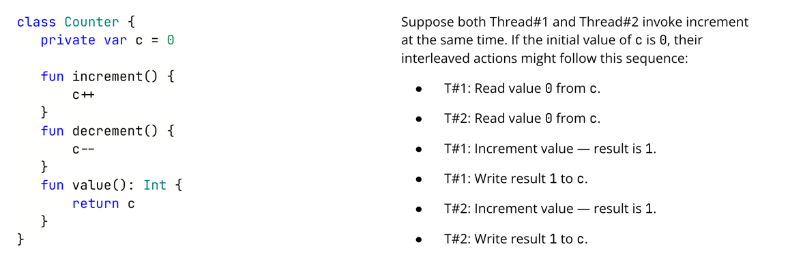
  - 文章で書かれるとアレだけど、これは直感でわかるね
  - 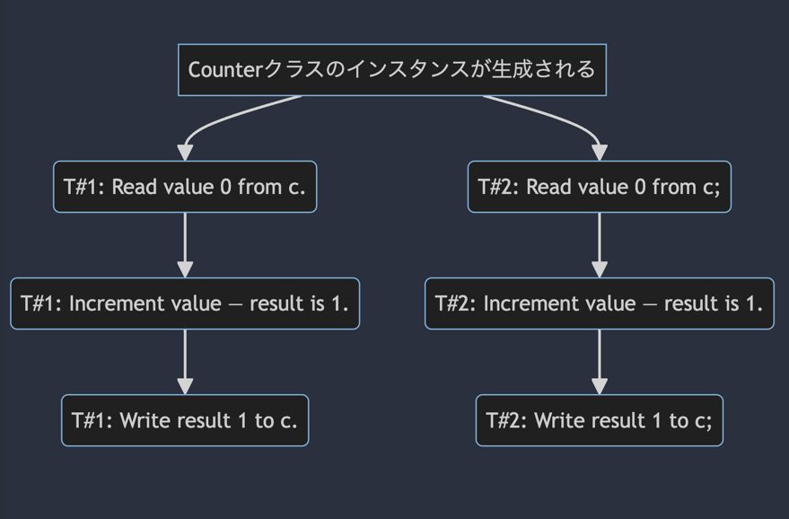
  - mermaid で書くとこんな感じやな

## Synchronization mechanisms
- Lockやsynchronizedキーワードなどの相互排除
- 並行データ構造と同期プリミティブ
- 共有メモリを直接扱うアトミック（危険地帯）

## Locks
```kotlin
class LockedCounter {

   private var c = 0

   private val lock = ReentrantLock()

   fun increment() {
       lock.withLock { c++ }
   }

   // same for other methods
   …
}
```
- オラクルのドキュメントより：ロックは、複数のスレッドが共有するリソースへのアクセスを制御するためのツール
- 通常、ロックは共有リソースへの排他的なアクセスを提供する
- 一度に1つのスレッドだけがロックを取得でき、共有リソースへのすべてのアクセスは最初にロックを取得する必要がある、1つのスレッドのみ⇒相互排他
```kotlin
lock.withLock { block }
```
- とほぼ同じで、Kotlinの便利な高階関数
```kotlin
lock.lock()
block
lock.unlock()
```
- ロックを獲得し、それを解放していないコードは「クリティカルセクション」と呼ばれ、プログラムの中で他のスレッドと同期されるべき部分

## The lock interface
- 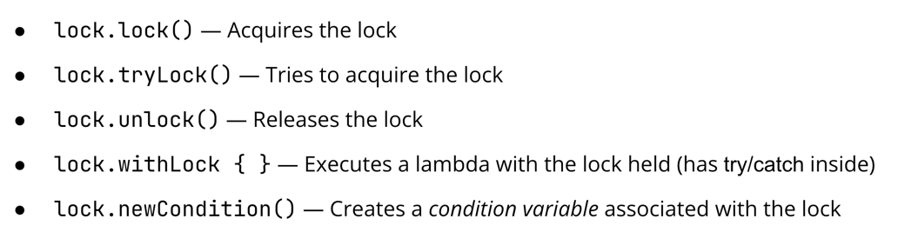
- ロックの取得は、そのロックが他のスレッドによって保持されていない場合にのみ可能
- 他のスレッドがすでにロックを保持している場合、現在のスレッドはロックを取得できるまで（または割り込まれるまで）ブロックされる（割り込まれた場合はInterruptedExceptionがスロー)
- tryLockは、ロック取得に失敗してもスレッドをブロックしない

## Conditions
```kotlin
class PositiveLockedCounter {
   private var c = 0
   private val lock = ReentrantLock()
   private val condition = lock.newCondition()

   fun increment() {
       lock.withLock {
           c++
           condition.signal()
       }
   }

   fun decrement() {
       lock.withLock {
           while (c == 0) { 
               condition.await() 
           }
           c--
       }
   }

   fun value(): Int {
       return lock.withLock { c }
   }
}
```
- 条件によって、ロックを保持しているスレッドは、他のスレッドが特定のイベントに関してシグナルを送るまで待つことができる
- 内部的には、awaitメソッドは呼び出しと同時に関連するロックを解放し、最後に再びロックを返す前にそれを取得する
  - await: ロックの解放と、あと何かやるんだね
- Cがロックに接続されている場合、ロックを保持しているスレッドだけがcondition.await()またはcondition.signal()を呼び出すことができる
  - condition.signal と condition.await は withLoack の中だけでしか使えない
- decrement関数で何が起こるか見てみよう：
  - あるスレッドTがdecrement()を呼び出したとする
  - スレッドTがdeclment()を呼び出すと、まずロックの取得を試み、成功するまでブロックされる
  - ロックを獲得した後、cの値をチェックし、それがゼロであることを確認し、condition.await()を呼び出す
  - これは、Tがロックを解放して待ち状態に入ることを意味する
  - ある時点で、他のスレッドがincrement()を呼び出し、そこでcondition.signal()を実行するかもしれない
  - これによりTは目覚めるが、クリティカル・セクションにあるため、すぐには実行されない
  - 続行するには、ロックを再度取得しなければならない
  - signalを呼び出したスレッドはロックを保持している（そうでなければ、そもそもsignalを呼び出すことはできない）
  - そのスレッドはロックを解放するが、他のスレッドがTより先にロックを獲得するかもしれない
  - ある時点で、Tはロックを取り戻し、Cをデクリメントする
    - 使うかこれ？？？

## The ReentrantLock class
- ReentrantLock - 同じスレッドが複数回ロックを取得できるようにする
- lock.getHoldCount() - 現在のスレッドがこのロックを保持している数を取得 
- lock.queuedThreads() - このロックを待機しているスレッドのコレクションを取得する 
- lock.isFair() - ロックの公平性をチェックする

## The synchronized statement
- JVMでは、すべてのオブジェクトに固有のロックが関連付けられている（別名モニター）
```kotlin
class Counter {
   private var c = 0

   fun increment() {
       synchronized(this) { c++ }
   }

   …
}
```
- JVMでは、すべてのオブジェクトはその内部に「隠された」ロック（intrinsic lock）を持っている
- このロックに直接アクセスすることはできないが、synchronized高次関数（Javaのキーワード）を使って操作することができる
- synchronized(...)の中では、どんなオブジェクトでも使用できる

## Synchronized method
- 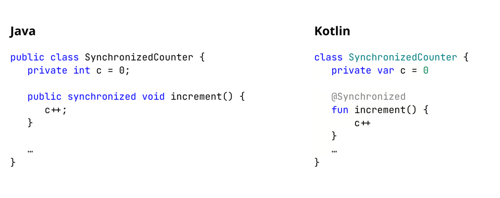
- クラスのsynchronizedメソッドは、synchronized(this)でラップされたメソッドである

## The ReadWriteLock class
- ReadWriteLockは、複数のリーダが同時にリソースにアクセスすることを許可しますが、単一のライタのみがそのリソースを変更することを許可
- 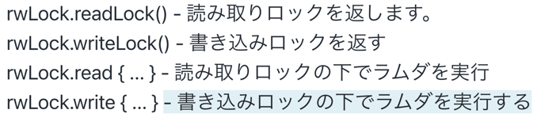

## The ReadWriteLock Class
```kotlin
class PositiveLockedCounter {
   private var c = 0
   private val rwLock = ReadWriteReentrantLock()

   fun increment() {
       rwLock.write { c++ }
   }

   fun decrement() {
       rwLock.write { c-- }
   }

   fun value(): Int {
       return rwLock.read { c }
   }
}
```
- これは、ReadWriteLockを使ってスレッドセーフなカウンターを作る例
- 値 `c` の取得には何の変更も必要ないので、read { ... } で行うことができ、複数のスレッドが一度に value() を呼び出すことができる

## Concurrent blocking collections
- java.util.concurrentは、以下のようなブロッキングおよびノンブロッキングの並行コレクションを実装するJavaパッケージ
- 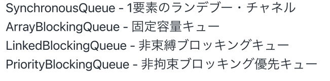
- スレッド間の情報共有の問題を解決するのにロックだけでは不十分な場合は、java.util.concurrent.Collectionが提供する並行（スレッドセーフ）コレクションを使用することができる
- このスライドでは、このパッケージから人気のあるコレクションをいくつか紹介する
- "ブロッキング "とは、例えば、スレッドが空のコレクションから何かを取り出そうとしたり、すでに最大容量に達しているコレクションに何かを入れようとしたりすると、目的の操作を正常に実行できるようになるまでブロックされることを意味する

## Concurrent non-blocking collections
- jdk.util.concurrent は、以下のようなブロッキングおよびノンブロッキングの並行コレクションを実装するJavaパッケージ
- 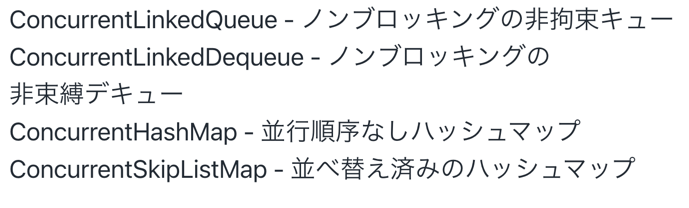
- Java.util.concurrentには、いくつかのノンブロッキングコレクションもある
- これらのコレクションは、スレッドが空のコレクションから何かを取り出そうとしても、実行をブロックしない
- 待ちのないアルゴリズムを使用することで、これを可能にしている
- 例えば、ConcurrentLinkedQueueから要素を取得するには、誰かがキューに何かを入れるのを待つのではなく、キューが空の場合にnullを返すpoll()を呼び出す必要がある
- nullはコレクションが空であることを意味するため、nullをキューに入れることは禁止されている
- ConcurrentSkipListMapはTreeMapに似ていますが、ツリーの代わりにスキープリストをベースにしている
- 

## Synchronization primitives
- java.util.concurrentは、並行データ構造と同期プリミティブも実装している
- Exchanger - ブロック交換
- Phaser - バリア同期
- Exchangerは次のような単一のメソッド交換を提供
  - Phaserは、複数のスレッドを登録できる再利用可能な同期バリア
  - スレッドが(arriveまたはarriveAndAwaitAdvanceを介して)その到着をphaserに通知するたびに、そのフェーズ(intカウンタ)がインクリメントされる
  - スレッドが arriveAndAwaitAdvance を呼び出すと、フェイザーは、登録されている他のすべてのスレッドがこのフェーズに到達するまで待機 (ブロック) 
  - スレッドはフェイザーから登録を解除することができる
  - CountDownLatchは同様の「バリア」同期プリミティブで、より単純で一般的ですが、柔軟性も劣る

## Java Memory Model: Weak behaviors
```kotlin
class OrderingTest {
   var x = 0
   var y = 0
   fun test() {
       thread {
           x = 1
           y = 1
       }
       thread {
           val a = y
           val b = x
           println("$a, $b")
       }
   }
}
```
- 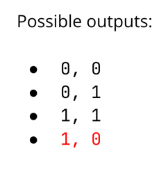
- 言いたいことはこれだけで大体わかる

```kotlin
class ProgressTest {
   var flag = false
   fun test() {
       thread {
           while (!flag) {}
           println("I am free!")
       }
       thread { flag = true }
   }
}
```
- 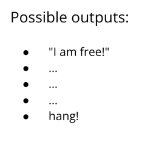
- デフォルトの設定では、スレッド1がフラグの変化を見る保証はない
- コンパイラーは、スレッド1が決してフラグを変更しないことを見るかもしれないので、while(!flag)をwhile(!false)に変更し、またwhile(true)に変更するかもしれない

```kotlin
class ProgressTest {
   var flag = false
   fun test() {
       thread {
           while (true) {}
           println("I am free!")
       }
       thread { flag = true }
   }
}
```
- 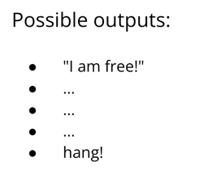

## JMM: Data-Race-Freedom Guarantee
- しかし、JMMは何を保証しているのだろうか？
- うまく同期されたプログラムは単純なインターリーブ・セマンティクスを持つ
- ロビン・ミルナーの言葉に "Well typed programs cannot go wrong "というのがある
- これは、型推論が成功したプログラムは予期せぬエラーを投げないという意味
- JMMも同様の概念を保証している
- 「よく同期されたプログラムは単純なインターリーブ・セマンティクスを持つ

## JMM: Data-Race-Freedom Guarantee
- しかし、JMMは何を保証しているのだろうか？
- よく同期されたプログラムは単純なインターリーブ・セマンティクスを持つ
- よく同期している = データ・レースがない
- 単純なインターリーブ・セマンティクス = 順次一貫したセマンティクス
- データ・レース・フリーのプログラムは逐次一貫したセマンティクスを持つ
- この場合の "同期がとれている "とは、非同期の共有非原子変数への同時アクセスがないことを意味する

## JMM: Volatile fields
- 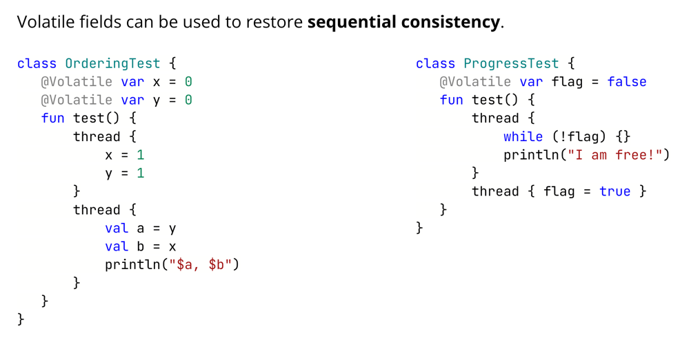
- Volatileは、変数の値が処理されるたびにメモリから再読み込みを強制する
- このおかげで、while(!flag)がwhile(!false)になることはない
- なぜなら、スレッドはwhileの状態をチェックするためにアクセスするたびにフラグを読まなければならないから

## JMM: Volatile fields
- 揮発性フィールドってタイトルなので、y がどこかのタイミングでメモリというか主記憶装置から消える可能性があるってことなのか？
```kotlin
class OrderingTest {
   var x = 0
   @Volatile var y = 0
   fun test() {
       thread {
           x = 1
           y = 1
       }
       thread {
           val a = y
           val b = x
           println("$a, $b")
       }
   }
}
```

## JMM: Happens-before relation
```kotlin
class OrderingTest {
   var x = 0
   @Volatile var y = 0
   fun test() {
       thread {
           x = 1
           y = 1
       }
       thread {
           val a = y
           val b = x
           println("$a, $b")
       }
   }
}
```
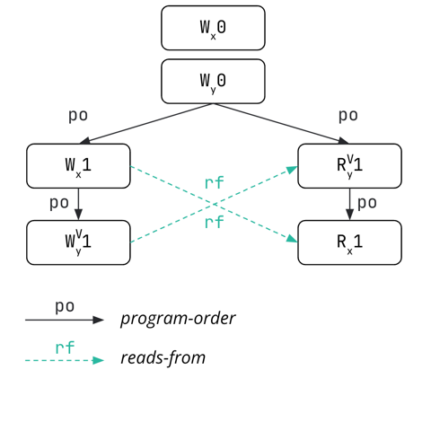

- このグラフは、左側のコードの実行可能性を表している
- 他の実行も可能であり（例えば、Rx1の代わりにRx0）、別のグラフで表される
- WxV 「は 」VをXに書き込む「、」RxV 「は 」Vをxから読み出す "という意味
- 書き込みや読み出しに添えられた上付き文字のVは、アクセスされる変数が揮発性であることを意味する
- プログラム・オーダーとは、コード内のステートメントの順序のことで、あるスレッドの実行に対応する
- Reads fromは、read操作が何らかのwrite操作の結果を見るときに起こる関係
- 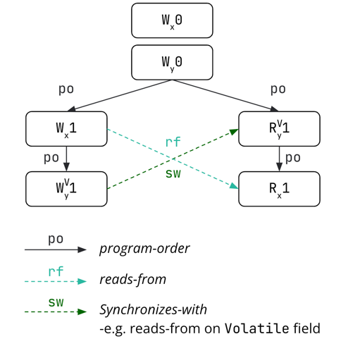
- Synchronizes withは、2つの操作がスレッドに同期を強制するときに現れる関係を示す
- 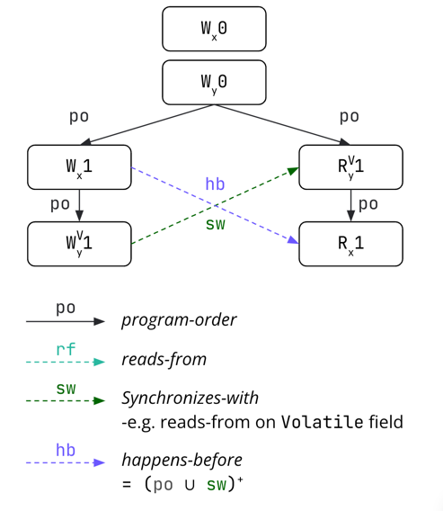
- Happens beforeは、プログラム順序の推移的閉包であり、関係と同期する
- つまり、異なるスレッド間の同期や、特定のスレッド内のプログラムを一緒に実行することは、ある実行を不可能にする
- これらの制限により、データ・レース・フリーのプログラムを書くことができる
- このスライドに描かれている実行（前回のシナリオに戻る）では、スレッド2がyから1を読み出している
- これは、スレッド1でyに1が書き込まれた（yへの1の書き込みはこれだけである）後にこの命令が実行されたことを意味し、スレッド1がxに1を書き込んだ後に起こるはずである
- 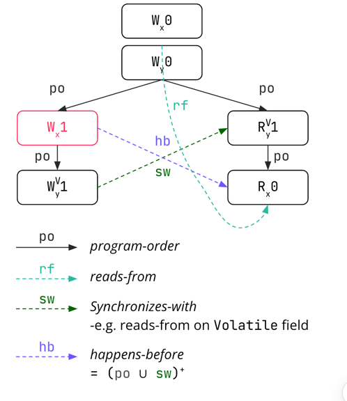
- Wx1とRx1のhappens beforeの関係は、スレッド2が揮発性のyから1を読む場合、スレッド1と同期し、その前のすべての作業を見なければならないことを意味する

## JMM: Synchronizing actions
- 揮発性フィールドの読み取りと書き込み 
- ロックとアンロック 
- スレッドの実行と開始、終了と結合
- これらは、リレーションとの同期を提供するいくつかのアクション

## JMM: DRF-SC again
- 次の2つのイベントがデータレースを形成
- 両方とも同じフィールドへのメモリーアクセスである
- 両方ともプレーン（非アトミック）アクセスである
- 少なくとも一方が書き込みイベントである
- これらのイベントは、以前に起こった出来事によって関連していない
- データ・レース・フリーのプログラムはシーケンシャルに一貫したセマンティクスを持つ
- あるプログラムがデータ・レース・フリーであるのは、このプログラムのあらゆる可能な実行に対して、2つのイベントがデータ・レースを形成しない場合である


## JMM: Atomics
- しかし、共有変数のアトミック演算子についてはどうだろうか？
```kotlin
class Counter {
   private val c = AtomicInteger()

   fun increment() {
       c.incrementAndGet()
   }

   fun decrement() {
       c.decrementAndGet()
   }

   fun value(): Int {
       return c.get()
   }
}
```
- Volatileアノテーションは、Counterクラスの例のバグを修正しない
- 2つの異なるスレッドで同じ値を読み、それぞれのスレッドで別々にインクリメントし、新しい値をフィールドに書き込む
- カウンターは、普通のIntegerの代わりにAtomicIntegerを使うことで修正できる
- アトミックは、あたかも1つのCPU命令で何らかの演算が実行されているかのように実行を強制するため、自明でない演算を自明であるかのように見せる

- java.util.concurrent.atomic パッケージのアトミッククラス↓
- AtomicInteger
- AtomicLong
- AtomicBoolean
- AtomicReference

- 配列対応↓
- AtomicIntegerArray
- AtomicLongArray
- AtomicReferenceArray

- `get()` - 値を揮発性セマンティクスで読み込む
- `set(v)` - volatileなセマンティクスで値を書き込む
- `getAndSet(v)` - 原子的に値を交換する
- `compareAndSet(e, v)` - 原子変数の値を期待値 e と原子的に比較し、等しい場合は原子変数の内容を期待値 v で置き換える
- `compareAndExchange(e, v)` - 値と期待値 e をアトミックに比較し、それらが等しい場合は、期待値 v で置換
- `getAndIncrement()``addAndGet(d)` など - 数値アトミック（AtomicInteger、AtomicLong）のアトミック演算を実行
- `compareAndSet` は、ブロック・ロックの代わりにロック・フリーのデータ構造で広く使われている。ロックフリーのスタックの非常に単純な例は次のようになる
```kotlin
class Node(
    var next: Node,
    val data: Int
)

var head: AtomicReference<Node> = AtomicReference(Node(...)) // simple example => no idea what should be in the first node’s `next`

fun push(newValue: Int) {
  val newNode = Node(head.get(), newValue)
  do {
    newNode.next = head.get()
  } while (!head.compareAndSet(newNode.next, newNode))
}

fun pop(): Int { // this will fail if there is only one node left, the head itself, but this is a simple example
  var current = head.get()
  while(!head.compareAndSet(current, current.next)) {
    current = head.get()
  }
  return current.data
}
```
- Atomic Class
- `getXXX()`
- `setXXX(v)`
- `weakCompareAndSetXXX(e, v)`
- `compareAndExchangeXXX(e, v)`
- これらの場合、XXXはアクセスモードである： Acquire、Release、Opaque、Plain
- Javaのアクセス・モードについては、こちらを参照
  - https://gee.cs.oswego.edu/dl/html/j9mm.html


## JMM: Atomics Problem
```kotlin
class Node<T>(val value: T) {
   val next = AtomicReference<Node<T>>()
}
```
- アトミックの主な問題は、本格的なオブジェクト
- AtomicIntegerは4バイトや8バイトの整数ではなく、ヘッダと多くの追加データを持つオブジェクトであり、アプリケーションのパフォーマンスに悪影響を及ぼす可能性がある

使わねえだろこの辺は絶対に、と思ってしまうよ、、、、いつ役に立つんだよおこれえ

## JMM: Atomic field updaters
- AtomicXXXFieldUpdater クラスを使用して、揮発性フィールドを直接変更
```kotlin
class Counter {
   @Volatile private var c = 0
   companion object {
       private val updater = AtomicIntegerFieldUpdater.newUpdater(Counter::class.java, "c")
   }
   fun increment() {
       updater.incrementAndGet(this)
   }
   fun decrement() {
       updater.decrementAndGet(this)
   }
   fun value(): Int {
       return updater.get(this)
   }
}
```
- JDK9 からは、同様の目的を果たす VarHandle クラスもある
- 追加の不要なデータがたくさんあるという問題を解決するために、目的のクラス・フィールドを操作するために別のアップデータ・クラスを使用することができる

## Kotlin: AtomicFU
- AtomicFUライブラリは、Kotlinでアトミック演算を使うための推奨方法
- https://github.com/Kotlin/kotlinx-atomicfu

```kotlin
class Counter {
   private val c = atomic(0)
   fun increment() {
       c += 1
   }
   fun decrement() {
       c -= 1
   }
   fun value(): Int {
       return c.value
   }
}
```
- Javaのatomicに似たAPIでAtomicXXXクラスを提供
- コンパイラのプラグインにより、atomicXXXFieldUpdater や VarHandle に置き換わる
- また、c.update { it + 1 }のような便利な拡張関数も提供
- AtomicFUはアトミックを扱う推奨の方法を提供するライブラリ

完了！結構しんどい回ではあったな。。