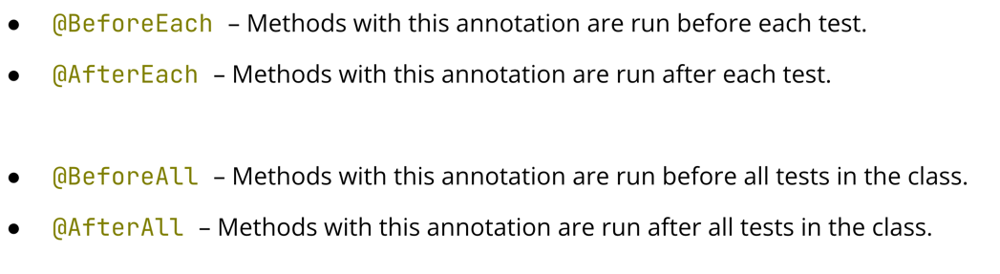

## Testing
- 私たちが長年蓄積してきたソフトウェア開発の経験は、残念ながら次のことを教えてくれる
- すべてのプログラムにはバグが含まれている
- プログラムにバグが含まれていない場合、そのプログラムが実装するアルゴリズムにバグが含まれている
- もしプログラムにもアルゴリズムにもバグが含まれていなければ、誰もそのプログラムを必要としない
- しかし、すべては相対的なもの
- ウェブサイトのバグは誰も傷つけないかもしれない
- ロケットの打ち上げ計算にバグがあれば、ひどい結果や出費につながる
- 放射線治療装置のバグが死者を出すこともある

## Testing: history
- 60s: 徹底的なテスト
- 70代前半 プログラムが正しく動作することを示す
- 70年代後半 プログラムが正しく動作しないことを示す
- 80s: 開発全体を通して不具合を防ぐ

## Testing: goals
- あらゆる条件下で製品が正しく動作すること
- 要求事項への適合
- 製品の現在の状態に関する情報
- エラーの防止と検出
- 開発コストの削減

## Testing: principles
- テストは欠陥の存在を示すが、欠陥がないことを証明するものではない
- 早ければ早いほどよい
- バグがないことが絶対的な目標ではない
- 他にもたくさんある

## Testing: types
- 機能的 - 仕様書に示された動作をチェックする
- 負荷 - 実際の負荷（例えば、サーバー上の一定数のユーザー）をシミュレート
- Functional - 仕様書に記載された動作をチェックする
- 負荷 - 実際の負荷をシミュレートする
- ストレス - 異常な条件下（例えば、停電や1秒間に膨大な数のオペレーションなど）でのシステムの動作をチェック
- コンフィギュレーション - さまざまなシステムコンフィギュレーションを使用してソフトウェアをチェックする
- リグレッション（回帰） - 新しい変更が、それまで機能していたものを壊さないようにすること
- Others, e.g. security, compliance, etc.

それぞれのテストタイプの説明が書いてあったが、Android 開発にいますぐ適用できるような情報はなかったかな


## Testing: levels
- ユニットテスト - コンポーネントを個別にテストする（モジュール、クラス、関数をチェックする）
  - どうしてもこの辺だよね、、、Android は magicpod とかもここら辺に入ってくる感じかな。。
  - ソフトウェアテストにはさまざまな種類があるだけでなく、さまざまなレベルで実施することができ
  - 基本的な（そしてある意味で最も重要な）レベルは、ユニットテスト
  - これは、プログラムの個々のコン ポーネント（関数、クラス、モジュール）をチェックすること
  - このレベルでは、アプリケーションの原始的な構成要素が、分離された状態で正しく動作するかどうかをテストすることに 焦点を当てる
- 統合テスト - コンポーネントとプログラムモジュールの相互作用をチェック
  - 統合テストとは、複数の異なるコンポーネント間の相互作用をテストすること
  - たとえば、あるウェブサービスが、システム内の別のサービスと通信するために使用するデータフォーマットに同意しているかどうかを検証するような場合
- システムテスト - システム全体をチェック
  - システムに入力を与え、それがどのように機能するか（場合によっては機能しないか）を見ることによって、システム全体をテストするのであれば、それはシステムテスト（またはエンドツーエンドテスト）である
  - エンドツーエンドのテストは、手動または自動化された方法で、ユーザーが実際に使用するのと同じようにシステムを使用することで、社内でさまざまな種類のテストを行うことがよくある
  - アルファテストやベータテスト（リリース前にソフトウェアの早期アクセス版をユーザーに提供すること）も、このレベルのテストに該当する
- 受入テスト - システムが顧客のすべての要件に準拠していることを検証
  - どのレベルにおいても、テスト対象のモジュール、統合、あるいはシステムが、エンドユーザー（クライアント）の要求を満たしているかどうかを追加的にチェックすることができる
  - これは受け入れテストとも呼ばれる
  - 多くの場合、システムレベルのテストと組み合わされますが、これは難しい要件ではない

## Unit testing
- 自明でない関数ごとに、そのメソッドが正しく動作するかどうかをチェックする独自のテストが書かれている
- 頻繁な起動が期待される⇒高速に実行されるべきである
- 1つのテスト⇒1つのユースケース
  - 今説明したことを見てみると、最も基本的なタイプのテストは、機能ユニットテスト
  - これは、すべての重要な関数が、すべての重要な入力に対して正しく動作することをチェックすることに重点を置いている
  - 多くのソフトウェア開発アプローチでは、単体テストは非常に頻繁に実行される
  - エラーが発生した場合に）何が間違っていたのかを特定するプロセスを単純化するために、 単体テストは単一の機能ケース（たとえば、ある関数がある特定の入力に対してどのように動作するか）をチェックする
  - そうだね

## Unit testing in Kotlin
- JUnit5 が最も有名なテストフレームワーク
```kotlin
dependencies {
	/// ...
testImplementation(platform("org.junit:junit-bom:5.8.2"))
testImplementation("org.junit.jupiter:junit-jupiter:5.8.2")
}

tasks.test {
   useJUnitPlatform()
}

// To run tests: ./gradlew test
```
- JVM上のKotlinでユニット・テストを行うには、通常、JUnitテスト・フレームワークを使用
- 現在、JUnit5がこのフレームワークの最新バージョン
- JUnitをGradleプロジェクトに追加するには、以下の手順が必要
  - テスト実装の依存関係としてJUnitを追加
  - Gradleが使用するテストフレームワークとしてJUnitプラットフォームを登録する
  - （tasks.test設定ブロックでJUnitPlatformを使用する）

- 単純なテストは次のようになる
```kotlin
class MyTests {
    @Test
    @DisplayName("Check if the calculator works correctly")
    fun testCalculator() {
    	Assertions.assertEquals(3, myCalculator(1, 2, "+"), "Assertion error message")
    }
}
```


```kotlin
class MyParametrizedTests {
    companion object {
        @JvmStatic
        fun calculatorInputs() = listOf(
            Arguments.of(1, 2, "+", 3),
            Arguments.of(0, 5, "+", 5),
        )
    }
    @ParameterizedTest
    @MethodSource("calculatorInputs")
    fun testCalculator(a: Int, b: Int, op: String, expected: Int) {
        Assertions.assertEquals(expected, myCalculator(a, b, op), "Assertion error message")
    }
}
```
- パッと見た感じだと要はインプットを使いまわしたいってことだね
- ダミーデータとして別のクラスあたりに定義しちゃうのもありだとは思うけどね。。
- テストをカスタマイズするための多くの注釈がある
- 
  - JUnit には、テストのカスタマイズに使えるオプションがたくさんある
  - テストのライフサイクル中 (たとえば、ひとつのテストやテストスイートの実行前や実行後) に何らかの処理を行う必要がある場合、たとえばテストの前にファイルを開き、テストの後でそれを閉じるといった処理を行うには、JUnit で提供されているアノテーションを使用してライフサイクルにフックすることができる
  - JUnit で使用できる機能の詳細については、JUnit のドキュメントを参照することをお勧めします

## Code quality
- 多くの場合、テストには機能の正しさだけでなく、コード自体の品質もチェックすることが含まれる
- detekt、ktlint、diktatのような静的コード・アナライザは、これを手作業で行う手間を省くために存在する
- 静的アナライザーのビルドもグリーンであるべき
  - コードが正しく動くかどうかをチェック
  - ソフトウェア・テストのほかに、静的解析のさまざまな 「フレーバー 」を使うこともできる
  - 例えば、コードの品質を測定することができる
  - コードに既知の問題パターンが含まれていないか、適切にフォーマットされているか、など
  - そのためのさまざまなツールがある

以上。